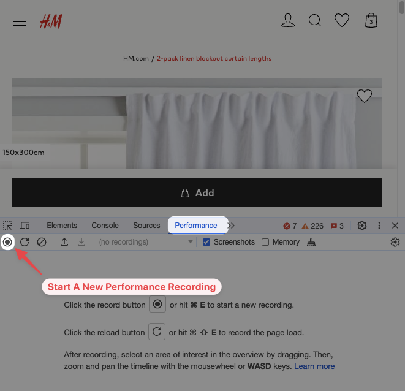
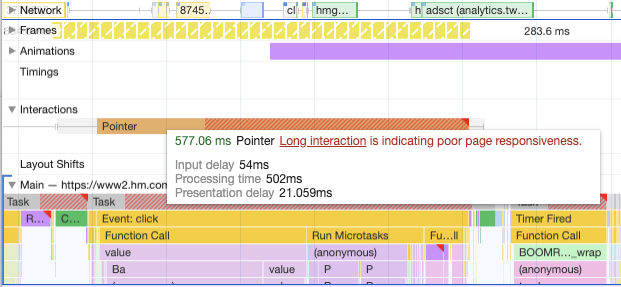
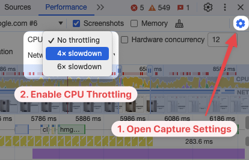
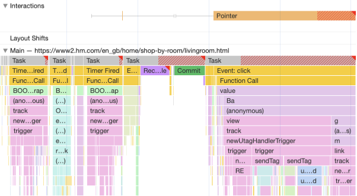
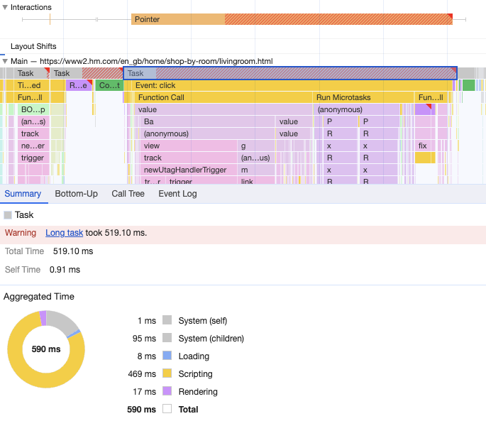
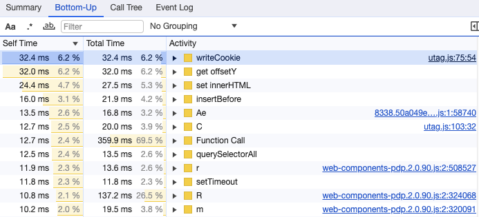
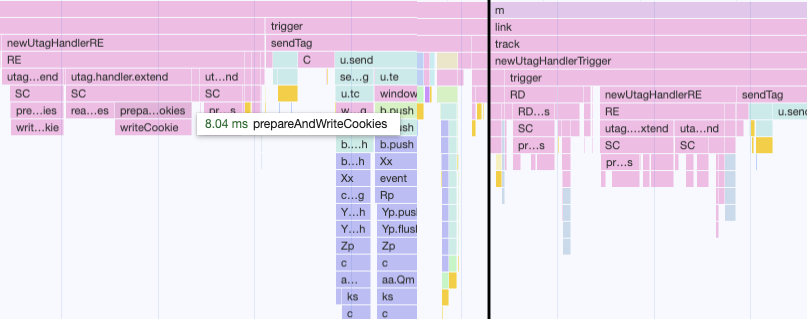
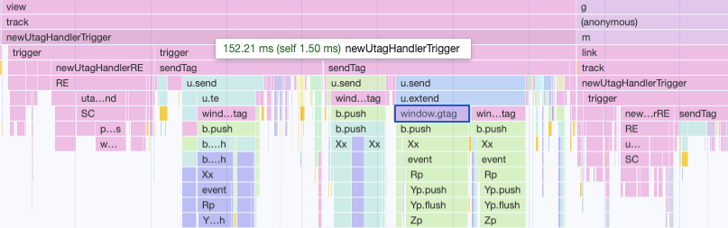
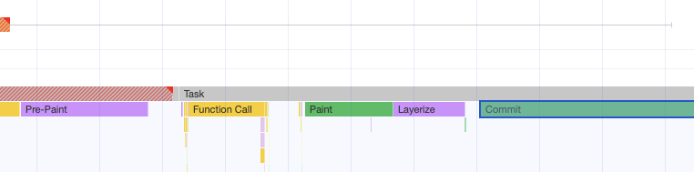
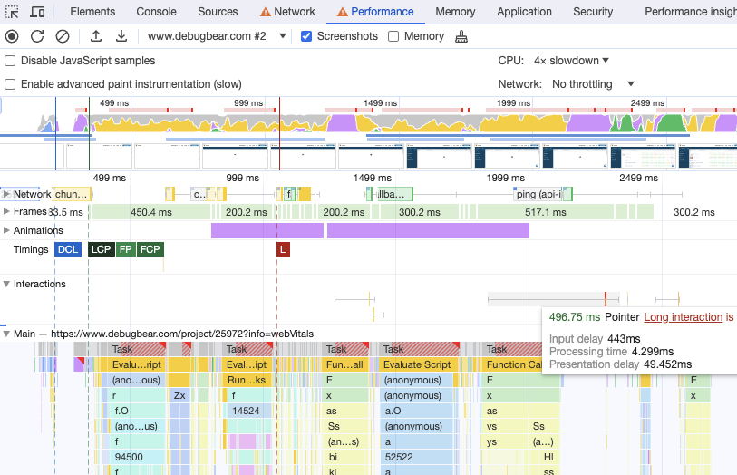

> 원문 : [How To Improve INP With Chrome DevTools](https://www.debugbear.com/blog/inp-chrome-devtools)

[INP(Interaction to Next Paint)](https://www.debugbear.com/docs/metrics/interaction-to-next-paint)는 2024년 3월에 세 가지 Google 핵심 [웹 바이탈](https://www.debugbear.com/docs/metrics/core-web-vitals) 중 하나가 될 성능 지표입니다.

INP는 다른 페이지 속도 지표들보다 개선하기 어려운 경향이 있습니다. 왜냐하면 측정을 위해 페이지 인터랙션이 필요하고, 이를 최적화하기 위해서는 종종 복잡한 자바스크립트 로직을 디버깅해야 하기 때문입니다.

이 글은 크롬 개발자 도구를 사용하여 페이지 인터랙션을 분석하고 사이트의 반응 속도를 더 빠르게 만드는 방법을 설명합니다.

## 크롬 개발자 도구에서 페이지 인터랙션의 INP를 측정하는 방법

개발자 도구 성능(Performance) 탭을 사용하여 다음 페인트에 대한 인터랙션 지표를 측정할 수 있습니다.

1. 페이지를 마우스 오른쪽 버튼으로 클릭하고 **검사(Inspect)** 를 선택하여 개발자 도구를 엽니다.
2. **성능(Performance)** 탭을 엽니다.
3. 왼쪽 상단의 기록 버튼을 클릭하여 새 기록을 시작합니다.
4. 버튼을 클릭하거나 텍스트 필드에 입력하는 등 페이지와 상호 작용합니다.
5. 완료되면 개발자 도구에서 **중지** 버튼을 클릭하고 기록이 처리될 때까지 기다립니다.

기록이 완료되면 개발자 도구에 많은 데이터가 표시됩니다. 왼쪽부터 기록이 시작되며 오른쪽에는 기록의 끝이 표시됩니다. 일단 지금은 다른값보다는 INP 값에 집중해보겠습니다.

**상호작용(Interactions)** 항목을 찾아 확장한 다음 관심 있는 인터랙션 위로 마우스를 올려보세요. 그러면 인터랙션의 지속 시간과 인터랙션 유형(아래 이미지의 경우 마우스 포인터)이 표시됩니다. (요소를 클릭해도 개발자 도구가 포인터 인터랙션에 초점을 맞추는 것을 볼 수 있습니다.)

빨간색 빗금 영역은 인터랙션 지속 시간이 200 밀리초를 초과하는 경우를 나타냅니다. 200 밀리초 임계값을 초과하면 개발자 도구에 "긴 인터랙션은 페이지 응답성이 좋지 않음을 나타냅니다(Long interaction is indicating poor page responsiveness)"라는 메모도 표시됩니다.

또한 INP 지표를 세 가지 부분으로 나누어 확인할 수 있습니다.

- 입력 지연(Input delay) 시간이 긴 것은 페이지의 백그라운드 활동이 페이지의 인터랙션 처리를 방해하고 있음을 나타냅니다.
- 처리 시간(Processing time)이 긴 것은 인터랙션을 위한 이벤트 핸들러를 실행하는 데 시간이 오래 걸린다는 것을 의미합니다.
- 표시 지연(Presentation delay) 시간이 긴 것은 업데이트된 UI의 스타일링, 레이아웃 및 페인팅이 다음 페인팅을 지연시키고 있음을 나타냅니다.

회색 수염 같은 왼쪽과 오른쪽의 영역은 입력 및 표시 지연을 나타냅니다.

> ℹ️ **INFO**  
> 2024년 1월부터 INP 분석은 곧 출시될 크롬 버전에서만 사용할 수 있습니다.

### CPU 스로틀링을 활성화 해보세요

빠른 데스크톱 컴퓨터를 사용하는 경우 실제 사용자가 경험하는 느리고 지연되는 환경을 재현하는 데 어려움을 겪을 수 있습니다.

우리의 웹사이트에 접속하는 성능이 낮은 기기를 모방하기 위해 크롬 개발자 도구에서 CPU 스로틀링을 설정할 수 있습니다.

1. 개발자 도구에서 오른쪽 상단의 톱니바퀴 아이콘을 클릭하여 **캡처 설정**을 엽니다.
2. 드롭다운에서 '4배' 또는 '6배' CPU 스로틀링을 선택합니다.

이렇게 하면 CPU 처리 시간이 기존보다 4배 또는 6배 더 오래 걸리게 만들 수 있습니다.

## 개발자 도구를 이용해 INP 분석하기

위에서 살펴본 성능 기록을 살펴보고 이것이 우리에게 알려주는 내용을 확인해 봅시다.

> ℹ️ **INFO**  
> 실제 운영 환경에서는 `aHg`와 같은 의미 없는 함수 이름을 종종 볼 수 있습니다. 데이터를 더 쉽게 해석하려면 소스맵을 사용하거나 코드를 압축하지 않고 로컬 서버에서 테스트하는 것이 좋습니다.

브라우저 메인 스레드는 페이지의 콘텐츠를 렌더링하고 인터랙션을 처리하는 역할을 담당합니다. "기본(Main)" 항목에서 메인 스레드가 어떤 작업을 수행하는지 확인할 수 있습니다.

여기서 메인 스레드가 사용자 인터랙션 이전에도 사용 중이어서 입력 지연이 발생한다는 것을 알 수 있습니다. 여러 개의 "타이머 실행됨(Timer Fired)" 이벤트는 브라우저가 페이지에서 예약된 작업을 실행하고 있음을 보여줍니다. 이 백그라운드 작업이 진행되는 동안 사용자 인터랙션이 발생하면 브라우저는 입력 이벤트를 처리하기 전에 먼저 예약된 작업을 완료해야 합니다.

백그라운드에서 실행되는 예약된 작업의 양을 줄이면 입력 지연을 줄일 수 있습니다. 또한 이러한 작업의 속도를 높여 지연을 줄일 수도 있습니다.

이 경우에는 처리 시간이 INP 값의 대부분을 차지합니다. 자바스크립트 압축으로 인해 무슨 일이 일어나고 있는지 파악하기 어렵지만, 그래도 CPU 활동을 분석해 보겠습니다.

메인 스레드 항목 상단의 "작업(Task)"을 클릭하면 화면 하단에서 **요약(Summary)** 탭을 볼 수 있습니다. 이 경우 작업의 지속 시간이 스타일 재계산과 같은 다른 유형의 처리보다는 대부분 자바스크립트 처리로 인한 것임을 알 수 있습니다.

개별 자바스크립트 함수 또는 자바스크립트 코드 컴파일과 같은 작업에 얼마나 많은 시간이 소요되는지 보여주는 **상향식(Bottom-Up)** 탭으로 전환해 봅시다. 이상적으로는 다른 함수보다 훨씬 더 시간이 많이 걸리는 함수를 찾는 것이 좋습니다. 이 경우 해당 함수를 최적화하는 데 집중하여 호출 횟수를 줄이거나 [더 빠르게 실행되도록](https://www.debugbear.com/blog/front-end-javascript-performance) 만들 수 있습니다.

아쉽게도 지금의 경우는 이에 해당되지 않는 것으로 보입니다. 그렇지만 브라우저가 가장 많은 시간을 소비하는 함수가 `writeCookie` 함수임을 확인할 수 있습니다.

메인 스레드 항목에서 `writeCookie` 함수를 검색할 수 있습니다(ctrl+f 또는 cmd+f 를 사용하세요). 이를 통해 한 번 길게 호출된 것이 아니라 페이지가 이 함수를 여러 위치에서 24번 호출하고 있음을 알 수 있습니다. `prepareAndWriteCookies` 함수는 아마도 하나로 통합되어 한 번만 호출될 수 있을 것으로 보입니다.

분석 수준을 한 단계 올려보면 `newUtagTriggerHandler` 함수의 일부로 많은 시간이 소요되는 것을 알 수 있습니다. 이는 이 코드의 상당 부분이 UI를 업데이트하는 데 필요한 핵심 애플리케이션 코드가 아니라 추적 코드(예: `window.gtag`로 구글 태그를 호출하는 코드)임을 시사합니다.

이러한 작업은 새 페이지 콘텐츠를 표시하는 데 필요하지 않으므로 UI 업데이트가 완료된 이후로 연기할 수 있습니다.

표시 지연 시간 동안 메인 스레드에서 무슨 일이 일어나고 있는지 살펴보면 프리 페인트(Pre-Paint), 페인트(Paint), 레이어화(Layerize), 커밋(Commit)과 같은 다양한 렌더링 관련 작업을 볼 수 있습니다. 그러나 이러한 작업들은 적절한 시간 내에 완료되며 브라우저 렌더링 작업은 최적화하기 어려운 경우가 많습니다.

## 초기 페이지 로딩 중 입력 지연 개선하기

웹사이트의 인터랙션 대부분은 빠르지만, 가끔 초기 로딩 프로세스에는 주요한 오랜 CPU 차단 작업이 포함되어 있는 경우가 있습니다. 예를 들어 사용자가 페이지의 아무 곳이나 클릭하여 텍스트를 강조 표시하는 경우 높은 입력 지연과 함께 다음 페인트에 대한 인터랙션 점수가 높아집니다.

이를 테스트하려면 크롬 개발자 도구에서 **프로파일링 시작 및 페이지 새로고침** 아이콘을 클릭하고 페이지를 몇 초에 한 번씩 클릭해 보세요. 그러면 이러한 인터랙션이 느린지 확인할 수 있습니다.

기록의 맨 위를 보면 새 데이터가 로드되는 동안 CPU가 로딩 프로세스 내내 상당히 바쁘게 움직이며 UI의 비트를 렌더링 하는 것을 볼 수 있습니다.

이러한 지연을 줄이려면 `requestIdleCallback`을 사용하는 등 처리 과정을 더 작은 청크로 나눌 수 있습니다. 이렇게 하면 각 차단 작업이 더 짧아지므로, 브라우저가 이러한 작업 사이에 사용자 인터랙션을 처리할 수 있습니다.

UI가 준비되기 전에 사용자가 UI와 상호 작용하려는 경우 페이지가 완료될 때까지 UI 컴포넌트가 비활성화되었음이 명확히 표시되도록 디자인을 변경할 수도 있습니다.

## 최적화를 위해 실제 사용자 데이터를 확보하세요

최적화의 효과를 극대화하려면 사용자 인터랙션 지연을 가장 자주 유발하는 요소를 파악해야 합니다. 이를 파악하려면 사람들이 웹사이트를 사용할 때 직접 데이터를 수집해야 합니다.

[DebugBear의 real user 모니터링](https://www.debugbear.com/real-user-monitoring)을 통해 INP 요소를 포함한 핵심 웹 바이탈에 대한 인사이트를 얻고 INP를 입력 지연, 처리 시간, 표시 지연으로 세분화할 수 있습니다.

> 🚀 한국어로 된 프런트엔드 아티클을 빠르게 받아보고 싶다면 [Korean FE Article](https://kofearticle.substack.com/)을 구독해주세요!
