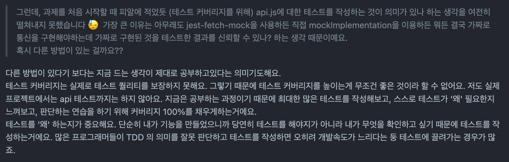

## Facts (사실, 객관)

- 리액트에서 `redux-thunk`를 이용해 비동기 로직을 관리하고 그에 대한 테스트를 작성해보는 과제를 진행했다.

## Feelings (느낌, 주관)

### 터미널만 보고 프론트엔드 개발하기...가능?

교육을 시작하기 전에 씨툐님이 '프론트에서도 터미널만 보고 개발을 하는 것이 가능할 거라 생각한다'는 말씀을 하신 적 있다. 사실 그 말씀을 듣고 크로스 브라우징 작업이나 퍼블리싱 작업을 제외하고 생각하더라도 가능할까? 하는 생각을 했던 것 같다. 터미널만 보고 개발을 하더라도 중간중간 불안해서 브라우저를 보지 않을까? 생각했다.

그러나 4주차에 이어, 5주차에도 과제를 진행하며 진짜로 터미널만 보고 작업을 하고 있다. 물론 주어진 과제는 아주 간단한 기능 구현이기 때문에 가능한 것일지도 모른다. 하지만 작더라도 그런게 가능하다는 것을 맛봤다는 게 중요하다 ! 개인적으론 굉장히 신기하고 재미있었다. '일단 냅다 브라우저부터 켜!'가 그동안의 코딩 패턴 중 하나였는데 이젠 그러기가 귀찮아졌다. 마지막 e2e 테스트 점검 때를 제외하고는 브라우저를 키지 않고 터미널만 보고 과제를 수행하고 있다.

### 당당하게 리팩토링이라고 말할 수 있어졌다

이건 진짜 개인적인 느낌인데 ㅋㅋㅋㅋㅋㅋ 개발자 커리어를 시작하기 전에 (그러니까 돈 받고 일하는 개발자가 되기 전에) 개발자로 일하고 계시는 이모부랑 대화를 하다, 테스트코드와 리팩토링에 대한 이야기를 나눈적 있다. 그때 이모부가 하신 말씀은 '어떻게 테스트코드 없이 리팩토링을 해?' 였다. (이모부의 표정과 말투에서 진짜 순수한 궁금증이 느껴졌었다.) 그래서 내심 그동안은 '리팩토링'이라는 단어를 쓰는 것을 꺼려왔었지만ㅎㅎ... 이번 과제를 진행하면서는 테스트코드가 있으므로, 당당하게 썼다 ㅎ

### fetch

fetch api에 대해서도 테스트를 해야하나? 하는 생각을 했다.

### 중복?

과제에서 두 ui가 똑같이 생겨서 공통 컴포넌트로 빼야하나 말아야 하나 고민을 했었다. 컴포넌트를 만드는 데에는 관심사의 분리도 있고 여러 이유가 있겠지만 사실 **입문자들이 가장 흔하게 알고 있는 이유**는 중복을 줄인다, 즉 'ui를 재사용하기 위함'일 것이다.

근데 그 중복의 기준이란 무엇일까? 하는 생각을 했다. 사실 이건 지금 실무에서도 고민을 하고 있는 부분이었다. 예를들면 중복이라 하여 무조건 공통 컴포넌트로 빼서 재사용하는 것보다 중복이어도 각자 가지고 있는 게 좋을 때가 있고 아닐 때가 있다는 거? 과제에서의 중복 Ui는 거대하지 않기 때문에 이런 고민을 하는 게 투머치일수도 있지만 어쨌든 실무에서의 상황이 오버랩되었었다.

## Findings (배운 점)

### fetch

사실은 fetch를 굳이 테스트할 필요는 없다고 생각해 처음엔 테스트를 작성하지 않았다. 하지만 과제 조건인 커버리지 100을 달성하기 위해서는 fetch를 모킹해서 테스트를 작성해야 했기 때문에... 일단 작성하고 트레이너분께 조언을 구했다!

테스트 커버리지 100에 꼭 집착할 필요가 없다는 부분이 이번 주 교육의 또다른 포인트인듯?!? 하지만 '테스트를 왜 하는지, 무엇을 확인하고 싶은지'에 대한 명확한 기준을 정하기란 아직 어렵게 느껴진다. 이 부분은 말씀하셨듯 남은 과제들에서 테스트 커버리지 100을 채워야 하는 조건을 만족하려고 이것저것 삽질하다가 점점 선명해질 것 같다.

어쨌거나 말씀대로 지금은 학습을 하는 과정이니 fetch를 모킹해서 커버리지 100을 달성했다. fetch를 모킹하는 방법은 또 여러가지가 있는데 [How To Mock Fetch in Jest](https://www.leighhalliday.com/mock-fetch-jest) 라는 글에서 잘 설명해주고 있어 참고하였다.

### 진짜 중복과 우발적 중복을 구분하자

그래서 어찌어찌 검색을 해보다가 [주니어 개발자의 클린 아키텍처 맛보기](https://techblog.woowahan.com/2647/) 라는 글을 읽게 되었는데, 이런 내용이 나온다.

> <클린 아키텍처> 책에서 이에 대한 좋은 내용을 언급하는데, 그 내용은 중복에도 종류가 있다는 것이다.
>
> - 진짜 중복  
>   한 인스턴스가 변경되면, 동일한 변경을 그 인스턴스의 모든 복사본에 반드시 적용해야한다.
> - 우발적 중복(거짓된 중복)  
>    중복으로 보이는 두 코드의 영역이 각자의 경로로 발전한다면, 즉 서로 다른 속도와 다른 이유로 변경된다면 이 두 코드는 진짜 중복이 아니다.

글에서 예제로 사용되는 스택이 나의 스택은 아니지만 저기서 말하는 중복을 판별하는 기준은 어느 기술이라도 상관없이 쓸 수 있는 개념이라는 생각이 들었다. ~~그리고 저 책도 조용히 카트에 담았다~~

## Affirmation (자기선언)

- '테스트를 왜 하는지, 무엇을 확인하고 싶은지'를 선명하게 다듬어 나가기
