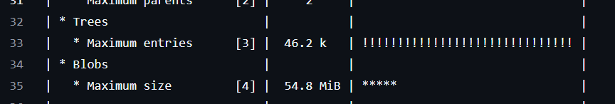
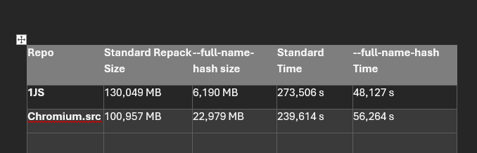
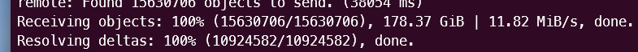
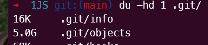
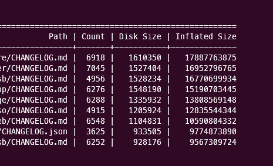

> 원문: [How we shrunk our Javascript monorepo git size by 94%](https://www.jonathancreamer.com/how-we-shrunk-our-git-repo-size-by-94-percent/)

이건 낚시가 아닙니다. 진짜로 해냈습니다! 우리는 마이크로소프트에서 1JS라고 부르는 _대규모_ 자바스크립트 모노레포에서 작업하고 있습니다. 이는 단순한 GB 크기의 문제가 아니라, 코드의 양과 기여된 작업의 규모 면에서도 방대한 양을 자랑합니다. 최근에는 월간 활동 사용자가 1,000명을 넘었고, 약 2,500개의 패키지와 2천만 줄의 코드가 있습니다! 제가 최근에 저장소를 복제했을 때 크기가 무려 178GB였습니다.

이렇게 큰 저장소는 여러 문제가 있습니다. 유럽에 있는 팀원들 중에서는 이 크기 때문에 저장소를 복제조차 할 수 없는 경우도 있습니다.

도대체 어떻게 이런 일이 발생했을까요?

## 첫 번째 교훈

몇 년 전 이 저장소에 처음 참여했을 때, 몇 개월 만에 저장소가 점점 커지고 있다는 것을 느꼈습니다. 처음 복제할 때는 1~2GB 정도였지만, 몇 달 후에는 이미 약 4GB에 도달했죠. 정확히 왜 그런지 알기 어려웠습니다.

그때 `git-sizer`라는 도구를 사용해 보니, 몇 가지 blob이 너무 크다는 것을 알 수 있었습니다. 대형 blob은 일반적으로 누군가 실수로 바이너리 파일을 커밋할 때 발생합니다. 이는 커밋 할 때 크기 제한을 설정하는 것 말고는 별다른 방법이 없습니다. 이를 방지하기 위해 Azure DevOps에서는 커밋 파일 크기를 제한하는 기능을 제공합니다. 하지만 파일이 이미 커밋된 후에는 기록에 남아있는 상태라 삭제하기 어려웠습니다.

두 번째로, 그 도구는 우리가 삭제하지 않았던 [Beachball 변경 파일](https://github.com/microsoft/beachball/?ref=jonathancreamer.com)에 대해 경고하였습니다.
우리는 이 파일들을 [Changesets](https://github.com/changesets/changesets?ref=jonathancreamer.com)의 동작 방식과 유사하게 사용하여, 패키지의 semver 범위를 자동으로 업데이트 하는 [semantic-release](https://github.com/semantic-release/semantic-release?ref=jonathancreamer.com)와 유사한 목적을 달성하고자 하였습니다.

한 폴더에 이런 파일들이 최대 4만 개까지 쌓이면서, 새 파일을 추가할 때마다 큰 트리 객체가 생성되는 문제가 발생했습니다.

그래서 첫 번째로 배운 교훈은 바로…

_**하나의 폴더에 수천 개의 파일을 쌓아 두지 말자.**_

이를 위해 우리는 두 가지 방법을 직접 구현해 도입했습니다. 하나는 [Beachball에 대한 풀 리퀘스트](https://github.com/microsoft/beachball/pull/584?ref=jonathancreamer.com)를 제출한 것으로, 여러 패키지의 변경 사항을 하나의 변경 파일로 처리하는 것입니다.

두 번째로는 변경 파일을 주기적으로 자동 정리하는 파이프라인을 작성하여 이 폴더가 너무 커지지 않도록 했습니다.

하하! 이렇게 깃이 비대해진 문제를 해결했습니다!

## 두 번째 교훈

우리의 대규모 버전 관리 흐름에선 패키지의 실제 버전을 저장하는 `main`의 미러된 버전인 `versioned`이 유지됩니다. 이를 통해 `main`이 깃 충돌에서 자유로워지고, 어떤 깃 커밋이 NPM 패키지를 통해 배포하는 semver 버전과 일치하는지 정확히 볼 수 있습니다. (이것은 다른 블로그 게시물이 필요하지만, 넘어가겠습니다...)

`versioned` 브랜치의 크기가 점점 더 커지고 있기에 복제하기 어려워지고 있다는 것을 알게되었습니다. 그러나 이전에 언급한 변경 파일 문제는 이미 해결했었고, 그 `versioned` 브랜치에 들어가는 유일한 커밋은 `CHANGELOG.md`와 `CHANGELOG.json` 파일에 대한 추가뿐이었습니다.

시간이 지나면서, 우리의 저장소는 약간 느린 속도로 성장하긴 했지만 여전히 계속 성장했습니다. 그러나 이 성장이 단지 규모 때문인지, 아니면 완전히 다른 이유 때문인지 알기 어려웠습니다. 우리는 2021년 이후로 매년 수십만 줄의 코드를 추가하고 수백 명의 개발자를 추가했기 때문에 자연히 성장한 것이라고 주장 할 수 있었습니다. 그러나 우리가 마이크로소프트에서 가장 큰 모노레포 중 하나인 Office 모노레포의 성장 속도를 초과했다는 것을 깨달았을 때, 무언가가 잘못되었다는 것을 깨달았습니다!

그렇게 우리는 지원 요청을 했습니다...

Office 모노레포 크기 문제 때문에 [git shallow checkout](https://github.blog/open-source/git/bring-your-monorepo-down-to-size-with-sparse-checkout/?ref=jonathancreamer.com), [git sparse index](https://github.blog/open-source/git/make-your-monorepo-feel-small-with-gits-sparse-index/?ref=jonathancreamer.com)와 같은 [다양한 기능](https://devblogs.microsoft.com/devops/exploring-new-frontiers-for-git-push-performance/?ref=jonathancreamer.com)을 만든 사람이 잠시 깃허브에 머물면서 **세계**에 그 기능을 선보인 후 우리 조직에 다시 합류했습니다.

그가 살펴보더니, 이 성장 속도에 뭔가 확실히 문제가 있다는 것을 바로 알아챘습니다. 버전 관리된 브랜치를 가져오면 CHANGELOG.md와 CHANGELOG.json 파일만 변경되었음에도, 125GB의 _추가_ 깃 데이터를 가져오고 있었습니다?! **어떻게 이런 일이?!**

자, 깃을 깊게 디깅한 끝에, 리눅스 토발즈(들어보신 적 있을거예요🤷‍♂️)가 커밋한 [오래된 패킹 코드](https://github.com/git/git/commit/ce0bd64299ae148ef61a63edcac635de41254cb5?ref=jonathancreamer.com#diff-d3b31a15a4dfd94e1201658d9bfc496a8c606d1ae7083cdbbc05e55c615f89ddL495)가 파일을 압축하여 차이점을 푸시하기 전에 파일 이름의 마지막 16자만 검사하고 있었다는 사실이 밝혀졌습니다. 참고로, _보통_ 깃은 변경된 파일의 _차이점만_ 푸시하는데, 이 패킹 문제로 인해 깃은 두 개의 다른 패키지에서 CHANGELOG.md 파일을 비교하고 있었습니다! Stolee가 [여기서](https://lore.kernel.org/git/pull.1785.git.1725890210.gitgitgadget@gmail.com/?ref=jonathancreamer.com) 이 문제를 잘 설명해줍니다.

예를 들어, `repo/packages/foo/CHANGELOG.json`을 변경하면, 깃이 푸시를 준비할 때 `repo/packages/bar/CHANGELOG.json`과의 차이점을 생성하고 있었습니다! 이런 경우 우리는 많은 경우에 파일 전체를 다시 푸시하고 있었고, 경우에 따라 파일 하나당 수십 MB의 크기를 차지할 수도 있었습니다. 우리 저장소의 규모를 생각해보면, 이게 얼마나 큰 문제인지 상상이 될 것입니다.

그래서 우리는 깃이 저장소의 패킹 파일을 더 잘 압축하여 저장소의 크기를 줄일 수 있도록 `git repack -adf --window=250` 명령어로 더 큰 window를 사용해 저장소를 다시 패킹하도록 했습니다. 이는 저장소의 크기를 상당히 줄여주었지만, 여전히 더 개선할 여지가 있습니다!

이 PR [https://github.com/git-for-windows/git/pull/5171](https://github.com/git-for-windows/git/pull/5171) 은 커밋 이력을 추적하는 기본 방식 대신, 깃 경로를 직접 탐색하여 저장소를 패킹하는 새로운 방법을 추가했습니다.

결과는 놀라웠습니다...

어제 저의 컴퓨터에서 마이크로소프트의 깃 포크를 사용해 새로운 버전의 깃을 시도하기 위해 새로운 git clone을 실행했습니다(깃 버전 2.47.0.vfs.0.2)...

그리고 새로운 `git repack -adf --path-walk`를 실행한 후...

엄청났습니다. 178GB에서 5GB로 줄어들었습니다. 😱

다른 새로운 설정 옵션도 추가되어, `git push`시 올바른 유형의 델타가 생성되도록 보장할 수 있습니다.

`git config --global pack.usePathWalk true`

이렇게 하면 `git push` 명령어가 정상적으로 압축하게 할 수 있습니다.

이제 깃 2.47.0.vfs.0.2 버전을 사용하는 모든 개발자는 로컬에 복제된 저장소를 재패킹할 수 있고, 이 깃 경로를 직접 탐색하는 알고리즘을 사용하여 저장소의 크기 증가를 억제할 수 있습니다.

깃허브에서는 주기적으로 리패킹(re-packing)과 깃 가비지 컬렉션이 자동으로 실행되지만, 깃허브의 기본 패킹 방식으로는 CHANGELOG.md나 CHANGELOG.json 같은 파일, 또는 16자 이상의 이름을 가지며 자주 수정되는 파일(예: i18n 대용량 문자열 파일 등)의 델타를 올바르게 계산하지 못할 수 있습니다.

우리가 사용하는 Azure DevOps는 아직 이런 재패킹을 지원하지 않습니다. 그래서 서버 측에서도 저장소의 크기를 줄일 수 있게 작업 중입니다.

이러한 변경 사항들은 모두 깃의 업스트림 코드에도 반영될 예정입니다! 오픈소스 만세!

## 마무리

대규모 모노레포에서 작업 중이고, 반복적으로 업데이트되는 CHANGELOG.md 파일이나 상대적으로 긴 이름(16자 이상)의 파일을 가지고 있다면, 이 경로 탐색 방식에 주목할 필요가 있습니다.

또한 새로운 `git survey` 커맨드를 사용하여 디스크 크기별 상위 파일, 압축되지 않은 크기별 상위 디렉터리 또는 압축되지 않은 크기별 상위 파일과 같은 다양한 새로운 휴리스틱을 확인할 수 있습니다.

이러한 휴리스틱은 경로 탐색 방식이 여러분의 저장소 크기에 어떤 영향을 줄지 가늠하는 데 도움을 줄 것입니다.

무엇보다, 우리의 목표가 마이크로소프트에서 대규모 저장소를 효율적으로 관리하는 솔루션을 만드는 데 그치지 않고, 이 솔루션을 전 세계에 전한다는 점에 대해 정말 흥미롭고 기쁩니다.

> 🚀 한국어로 된 프런트엔드 아티클을 빠르게 받아보고 싶다면 [Korean FE Article](https://kofearticle.substack.com/)을 구독해주세요!
