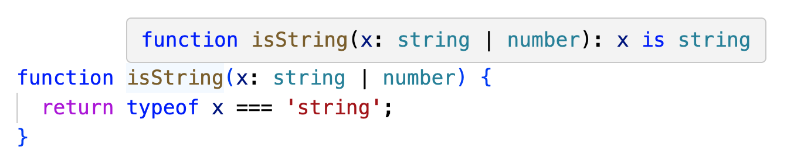

> 원문: [Infer type predicates from function bodies using control flow analysis](https://github.com/microsoft/TypeScript/pull/57465)

[#16069](https://github.com/microsoft/TypeScript/issues/16069) 해결  
[#38390](https://github.com/microsoft/TypeScript/issues/38390) 해결  
[#10734](https://github.com/microsoft/TypeScript/issues/10734) 해결  
[#50734](https://github.com/microsoft/TypeScript/issues/50734) 해결  
[#12798](https://github.com/microsoft/TypeScript/issues/12798) 해결

이 PR은 타입스크립트의 기존 제어 흐름 분석을 사용하여 적절한 곳에서 불리언(boolean) 값을 반환하는 함수에 대한 타입 서술어(type predicates)를 추론합니다. 예를 들면 다음과 같습니다.

```ts
function isString(x: string | number) {
  return typeof x === 'string';
}
```

이 함수는 현재 버전에서는 `boolean`에 대한 추론된 반환 타입을 가지고 있지만 이 PR이 적용된다면 타입 서술어가 됩니다.


저는 7년 전(!) [#16069](https://github.com/microsoft/TypeScript/issues/16069) 이슈를 작성했는데, 이를 해결해 보면 재미있을 것 같았습니다. 생각보다 더 깔끔하고 간단하게 해결할 수 있었습니다. 새로운 함수 하나에 약 65줄의 코드 정도만 추가되었습니다. 이것은 좋은 성과라고 생각합니다!

## 작동 방식

타입 가드를 추론할 수 있는 함수 후보의 조건은 다음과 같습니다.

1. 명시적인 반환 타입이나 타입 서술어가 없어야 합니다.
2. 추론된 반환 타입이 불리언이어야 합니다.
3. 하나의 `return` 문이 있어야 하며 암시적인 반환이 없어야 합니다 (나중에 느슨해질 수 있습니다).
4. 매개변수를 변형하지 않아야 합니다.

이 조건을 만족한다면, 함수는 다음과 같은 형태를 가질 것입니다.

```ts
function f(p: T, p2: T2, ...) {
  // ...
  return expr;
}
```

이 PR에서는 각 매개변수에 대해, 함수가 다음과 같다고 가정할 때 각 분기에서의 흐름에 따라 타입을 결정합니다.

```ts
function f(p: T, p2: T2, ...) {
  // ...
  if (expr) {
    p1;  // trueType
  }
}
```

만약 `trueType != T`라면, 타입 서술어 _후보_ 를 갖게 됩니다.

그러나 타입 서술어의 의미 때문에 `false` 반환 값이 무엇을 의미하는지 확인해야 합니다. 다음과 같은 코드가 있다고 해봅시다.

```ts
declare function isString(x: string | number): x is string;
```

이 함수가 `true`를 반환하면 `x`는 `string`입니다. 그러나 `false`를 반환하면 `x`는 _반드시_ `number`여야 합니다. 다시 말하자면, 타입 서술어가 되려면, 함수는 서술어가 _성립할 때만_ `true`를 반환해야 합니다.

우리는 합성된 `if`문에 `trueType`을 대입하고 `else` 분기에 무엇이 남아있는지 확인하여 직접 테스트할 수 있습니다.

```ts
function f(p: trueType, p2: T2, ...) {
  // ...
  if (expr) {
    p1;  // trueType
  } else {
    p1;  // never?
}
```

만약 이것이 `never`라면 "only if" 조건을 증명한 것입니다.

이 PR의 이전 버전은 약간 다른 검사를 수행했음을 참고하세요. 원래 버전은 [하위 형식(subtypes)에 문제](https://github.com/microsoft/TypeScript/pull/57465#issuecomment-1957867140)가 있었고 초기 수정은 필요 이상으로 `getFlowTypeOfReference`를 더 많이 호출했습니다. 이 버전은 우리가 원하는 조건을 직접 테스트합니다.

## 성과

이제 타입스크립트는 `filter` 호출과 같이 편리한 여러 곳에서 타입 가드를 추론할 수 있습니다.

```ts
const nums = [12, 'foo', 23, 'bar'].filter((x) => typeof x === 'number');
//    ^? const nums: number[]
```

이는 기존의 flow type 코드의 장점을 활용하기 때문에 타입스크립트가 이해할 수 있는 모든 형태의 타입 좁히기가 가능합니다.

```ts
const foos = [new Foo(), new Bar(), new Foo(), new Bar()].filter(
  (x) => x instanceof Foo
);
//    ^? const foos: Foo[]
```

그 외에도 몇 가지 뜻밖의 성과들이 있습니다.

### 앞으로 타입 가드는 흐릅니다.

```ts
const isString = (o: string | undefined): o is string => !!o;

// - (o: string | undefined) => boolean
// + (o: string | undefined) => o is string
const secondIsString = (o: string | undefined) => myGuard(o);
```

새로운 방식으로도 결합될 수 있습니다.

```ts
// const isFooBar: (x: unknown) => x is Foo | Bar
const isFooBar = (x: unknown) => isFoo(x) || isBar(x);
```

### truthy 값에 의한 잠재적인 문제(truthiness footguns)를 피할 수 있습니다.

만약 `truthy`한지를 확인하는 경우에는 타입 가드를 추론하지 않습니다. 단지 null이 아님을 확인하는 경우에만 추론합니다.

```ts
const numsTruthy = [0, 1, 2, null, 3].filter((x) => !!x);
//    ^? const numsTruthy: (number | null)[]
const numsNonNull = [0, 1, 2, null, 3].filter((x) => x !== null);
//    ^? const numsNonNull: number[]
```

이렇게 하는 이유는 `false`인 경우 때문입니다. 만약 `truthy`한지를 확인해서 `false`를 반환하면, `x`는 `0`이 될 수 있습니다. 타입스크립트가 "0 이외의 숫자"를 나타낼 수 있거나, `true`와 `false`에 해당하는 경우에 대해 구분된 타입 서술어를 반환할 수 있는 방법이 없다면, `truthy`한지를 확인하는 것에서 추론할 수 있는 것은 없습니다.

반면에, 객체 타입을 다루는 경우 잠재적인 문제가 없으며, `truthy`한지 확인하는 것으로 서술어를 추론합니다.

```ts
const datesTruthy = [new Date(), null, new Date(), null].filter((d) => !!d);
//    ^? const datesTruthy: Date[]
```

이는 그럴 필요가 있는 곳에서 `truthy`한지를 확인하는 것 대신 `null`이 아닌지 확인하도록 유도하므로 저는 이것 또한 성과라고 생각합니다. 특히 원래 이슈의 예제는 `null`이 아닌지 확인하는 것 대신 `truthy`한지를 테스트합니다.

### 타입 가드를 더 쉽게 찾을 수 있습니다.

타입 서술어는 매우 유용한 기능이지만, 문서를 읽거나 선언 파일에서 타입 가드를 볼 때만 알 수 있습니다. 이제 자신의 코드에서 심볼을 검사함으로써 타입 서술어를 찾을 수 있습니다.

```ts
const isString = (x: unknown) => typeof x === 'string';
//     ^? const isString: (x: unknown) => x is string
```

이것은 언어의 일부인 것처럼 느끼게 만듭니다.

### 인터페이스에서 추론된 타입 가드가 확인됩니다.

이 PR은 명시적인 타입 서술어를 우선하지만, 이런 경우에는 추론된 서술어도 확인할 것입니다.

```ts
interface NumberInferrer {
  isNumber(x: number | string): x is number;
}
class Inferrer implements NumberInferrer {
  isNumber(x: number | string) {
    // 이것도 확인됩니다!!!
    return typeof x === 'number';
  }
}
```

## 흥미로운 사례들

이론상으로, 불리언 값에 대한 항등 함수(identity function)는 타입 가드입니다.

```ts
// boolId: (b: boolean): b is true?
const boolId = (b: boolean) => b;
```

이런 방식은 정확해 보이지만 그다지 유용하지 않습니다. 왜 직접 불리언을 테스트하지 않을까요? 저는 이 PR에서 특히 불리언 매개변수에 대한 타입 서술어 추론을 명시적으로 금지했습니다. 이것만으로도 diff 수를 상당히 줄일 수 있습니다.

여기 또 다른 흥미로운 사례가 있습니다.

```ts
function flakyIsString(x: string | number) {
  return typeof x === 'string' && Math.random() > 0.5;
}
```

이 함수가 `true`을 반환하면 `x`는 `string`입니다. 그러나 `false`를 반환하면 `x`는 여전히 `string`일 수 있습니다. 따라서 이 경우 타입 서술어를 추론하는 것은 유효하지 않습니다. 이것이 바로 `trueType`을 확인할 수 없는 이유입니다. 일반적으로 이와 같은 조건을 결합하면 타입 서술어를 추론할 수 없습니다. 함수가 참과 거짓의 경우에 대해 서로 다른 타입 서술어를 반환하는 방법이 있으면 좋을 것 같습니다([#15048](https://github.com/microsoft/TypeScript/issues/15048)). 이렇게 하면 추론이 훨씬 더 강력해질 것입니다. 그러나 그것은 더 큰 변화일 것입니다.

RyanC^[(역) [타입스크립트 팀 Development lead](https://github.com/RyanCavanaugh)]가 타입 시스템에서 함수의 반환 타입은 그 구현을 다시 말하는 것이 되어서는 안 된다고 말한 적이 있습니다. 어떤 경우에는 이런 방향으로 움직이는 것처럼 느껴질 수도 있습니다.

```ts
// function hasAB(x: unknown): x is object & Record<"a", unknown> & Record<"b", unknown>
function hasAB(x: unknown) {
  return x !== null && typeof x === 'object' && 'a' in x && 'b' in x;
}
```

다른 함수와 마찬가지로 타입 가드는 선언된 매개변수 타입의 하위 타입으로 호출될 수 있습니다. 타입 가드를 추론할 때 이 점을 고려해야 합니다.

```ts
function isShortString(x: unknown) {
  return typeof x === 'string' && x.length < 10;
}
```

여기서 문제는 `if` / `else`에서 이 검사를 인라인하면 `x`가 `string`과 `unknown`으로 좁혀지고 `Exclude<unknown, string> = unknown`이 된다는 것입니다. 그러나 여기서 타입 서술어를 추론할 수는 없습니다. 왜냐하면 `isShortString`이 `string`으로 호출될 수 있기 때문입니다. 이것은 원래 이 PR에서 사용되었던 테스트를 깨뜨렸습니다 ([이 코멘트](https://github.com/microsoft/TypeScript/pull/57465#issuecomment-1957751656)를 참조하세요).

함수는 어썰션을 통해 `return`에 도달하기 전에 매개변수 타입을 좁힐 수 있습니다.

```ts
function assertAndPredicate(x: string | number | Date) {
  if (x instanceof Date) {
    throw new Error();
  }
  return typeof x === 'string';
}
```

여기서 `x is string`을 추론하는 것은 잘못된 것은 아니지만 `else` 분기에는 (`Date`를 포함한) 부정확한 타입이 생성될 것입니다. 이 PR은 이런 경우 `getFlowTypeOfReference`를 추가 호출하는 비용을 지불하고 타입 서술어를 추론하지 않음으로써 안전하게 처리합니다.

## 기존 코드가 깨지는 사례

기존 코드의 새로운 오류는 대부분 [#38390 (comment)](https://github.com/microsoft/TypeScript/issues/38390#issuecomment-626019466)의 다소 정교한 변형입니다.

```ts
const a = [1, 'foo', 2, 'bar'].filter((x) => typeof x === 'string');
a.push(10); // 지금은 괜찮지만 이 PR에서는 에러가 발생합니다.
```

다시 말해, 이 PR을 사용하면 TS가 배열이나 기타 변수에 대해 타입을 좁혀 추론한 다음 더 넓은 타입이 필요한 작업(푸시, 재할당, `indexOf` 호출)을 수행할 수 있습니다. @typescript-bot과 제가 발견한 변경 사항에 대한 자세한 내용은 [이 댓글](https://github.com/microsoft/TypeScript/pull/57465#issuecomment-1960271216)을 참조하세요.

## 성능

타입 서술어를 추론하기 위해 추가 작업을 수행하고 있으므로 성능은 확실히 우려되는 부분입니다. @typescript-bot은 Compiler-Unions에서 검사 시간이 +1.25% 증가하는 중대한 속도 저하를 [발견](https://github.com/microsoft/TypeScript/pull/57465#issuecomment-1964484345)했습니다.

속도 저하의 일부는 `getTypePredicateFromBody`에서 수행되는 (제가 추가한) 추가 작업으로 인한 것이지만, 일부는 새로 감지된 타입 가드 덕분에 타입스크립트가 더 많은 위치에서 더 정확한 타입을 추론하고 있기 때문이기도 합니다.

현재 구현에 성능 문제가 있는 경우 범위를 줄일 수 있는 몇 가지 옵션이 있습니다.

- 화살표 함수에서만 실행
- 문맥적으로 타입이 지정된 화살표 함수에서만 실행
- 타입 서술어를 사용할 문맥에서 문맥적으로 타입이 지정된 화살표 함수에서만 실행 (예: `Array.prototype.filter`)

## 확장 가능성

이 PR의 범위에서 제외하기로 한 몇 가지 확장 가능한 사항들이 있습니다.

- 명시적 타입 서술어 확인. 이 PR은 명시적 타입 서술어를 당장은 사용하지 않지만 대신 검사하는 것을 상상할 수는 있습니다. 이렇게 하면 현재로서는 타입 어썰션보다 안전하다고 할 수 없는 사용자 정의 타입 가드에 약간의 타입 안전성을 가져올 수 있습니다.
- 어썰션 함수 추론. 불리언을 반환하는 대신 던지는 경우 유사한 형태의 추론을 수행할 수 있어야 합니다.
- 만약 [이 제안(일방적 또는 세분화된 타입 가드)](https://github.com/microsoft/TypeScript/issues/15048)이 구현된다면, 훨씬 더 많은 상황에서 타입 서술어를 추론할 수 있습니다.
- `this`에 대한 타입 서술어 추론. 불리언을 반환하는 메서드가 `this` 서술어가 될 수 있습니다. 이것은 이 PR의 간단한 확장일 것입니다.
- `boolean` 이외의 값을 반환하는 함수에 대한 타입 서술어 추론. 만약 `dates`가 `(Date|null)[]`이라면 `dates.filter(d => d)`는 `null`을 필터링하는 좋은 방법입니다. 이 PR은 `dates.filter(d => !!d)`를 작성하게 합니다. 이는 일반적으로 타입 서술어의 한계이지 이 PR의 한계가 아니라고 생각합니다.
- 다중 반환 처리. 예를 들어, 이 함수에 대한 타입 가드를 추론하는 것은 가능할 테지만 더 많은 작업이 필요할 것입니다.
  ```ts
  function isString(x: string | number) {
    if (typeof x === 'string') {
      return true;
    }
    return false;
  }
  ```

> 🚀 한국어로 된 프런트엔드 아티클을 빠르게 받아보고 싶다면 [Korean FE Article](https://kofearticle.substack.com/)을 구독해주세요!
