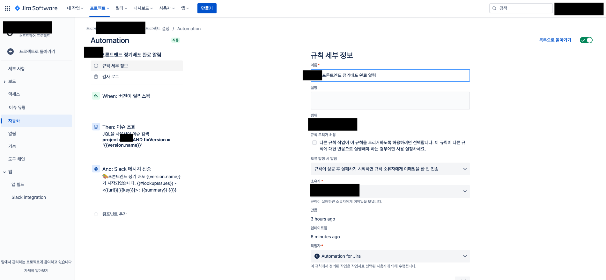
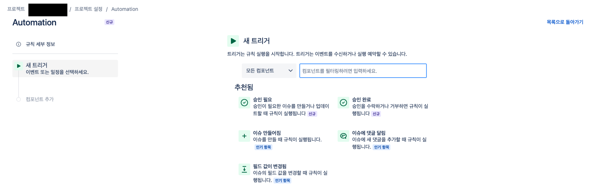
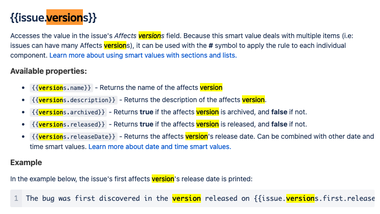
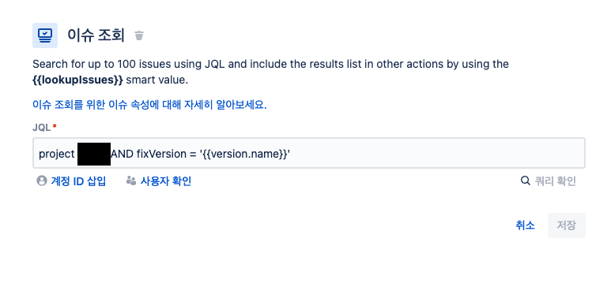
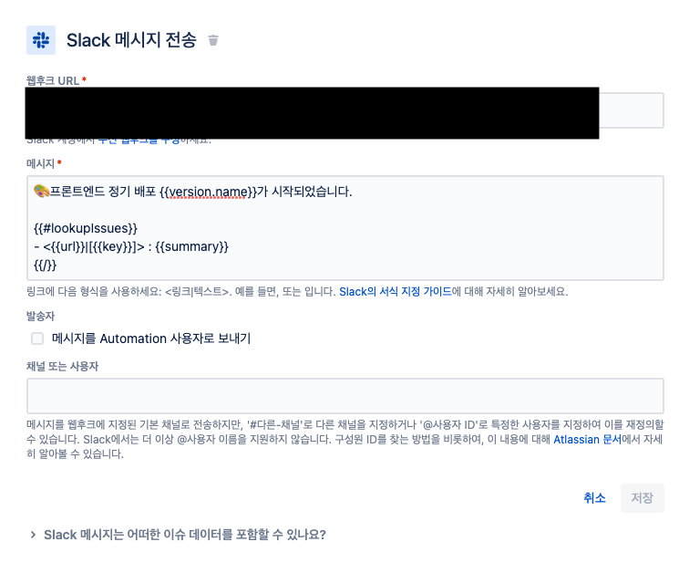

## 배경

현재 근무하고 있는 회사에서 프론트엔드 파트는 주 2회 정기배포를 하고 있는데, 그때마다 한 분이 수동으로 배포가 완료되었음을 알리는 메세지를 채널에 입력해주고 계셨다. 이 부분을 자동화해서 귀찮음을 줄이고, 어떤 티켓에 배포되었는지도 함께 알려 백엔드 - PO - 디자이너 직군이 프엔 파트에 문의하지 않고도 인지가 가능하게 하고 싶었다.

## 방법

팀 리더가 알려주신 방법 중 ‘JIRA에서 직접 발송’ 을 써보기로 했다.  
[지라 커뮤니티에 올라온 글](https://community.atlassian.com/t5/Jira-Software-questions/Automation-when-version-released-post-release-notes-to-slack/qaq-p/1415084)을 참고했다.

프로젝트 환경 설정에 가보면 좌측에 ‘자동화’라는 메뉴가 있는데, 여기서 특정 트리거 발생시 일어날 액션들을 정의할 수 있다. 우측의 ‘규칙 만들기’를 눌러 다음과 같이 세팅해준다.



세팅방법은 다음과 같다.



맨 처음 설정할 **‘새 트리거’, 초록색 When**은 언제 이 규칙을 실행할 것인지에 대한 이야기이다. 지라에서 기본으로 제공해주는 옵션들이 쓸만해서, 이중에서 골라도 큰 문제는 없다. 목적이 정기 배포시 슬랙 메세지를 보내는 것이므로 ‘버전이 릴리스됨’ 또는 ‘배포 성공’을 이용해볼 수 있겠다. 다만 ‘배포 성공’을 이용하려면 circle ci와의 연동이 필요한데 우리 팀은 이게 아직 되어있지 않아서 ‘버전이 릴리스됨’으로 진행했다.

> 정확히 말하자면 circle ci와의 연동은 지금도 가능하지만, circle ci에서 배포가 완료되었다고 보는 시점이 실제로 배포가 완료된 시점과 다르기 때문에 연동하지 않았다. 현재는 circle ci에서 배포가 완료되었다고 알림이 오고 약 5분 후에 운영서버에서 확인이 가능하기 때문에 Devops 파트에서 개선을 진행해주고 계시다. 이 부분이 완료되면 circle ci와 연동하는 과정도 글로 정리해보겠다.

이 트리거에서는 버전에 대한 스마트 값을 사용할 수 있다. 스마트 값은 지라에서 제공하는 변수같은 걸 말하는데, 대부분의 정보에 접근할 수 있다고 한다. 어떤 스마트 값들이 있는지는 [이 문서](https://support.atlassian.com/cloud-automation/docs/jira-smart-values-issues/)를 통해 확인 가능하다. 정리가 아주 잘 되어있다.

지금 이용할 버전 관련 스마트 값 정보는 다음과 같다.



트리거를 설정했으니 그 다음 컴포넌트로 **새 작업**을 추가한다. 어떤 티켓들이 이번 릴리즈에 추가되었는지 보여줄 것이기 때문에 **이슈 조회**를 선택하고 다음 쿼리를 입력한다.

```
project = 보드코드 AND fixVersion = '{{version.name}}'
```



JQL (지라 쿼리 언어) 쿼리인데, 이걸로 이슈 조회에서 이슈를 검색할 수 있다.  
쿼리를 해석해보자면 특정 프로젝트 보드에서 이번 릴리즈에 포함된 이슈를 찾기 위해 fixVersion으로 버전을 필터링한다는 것이다.

이 다음 컴포넌트 액션으로는 **Slack 메시지 전송**을 진행한다.

먼저 팀 슬랙에서 수신 웹후크를 만들고 (슬랙의 어떤 채널에 메세지를 보낼 건지, 보내는 봇의 프로필 이미지나 이름은 뭘로 할 건지 설정이 가능하다), 주소를 웹후크 URL 인풋에 입력한다.



그리고 메세지 쪽에는 다음과 같이 입력한다. 지라의 스마트 값을 이용한 구문이다.

```
🎨 프론트엔드 정기 배포 {{version.name}}가 시작되었습니다.

{{#lookupIssues}}
- <{{url}}|[{{key}}]> : {{summary}}
{{/}}
```

이전 액션인 ‘이슈 조회’에서 JQL을 이용해 조회했던 이슈들을 `{{#lookupIssues}}` 로 받아와, 그 안의 이슈 하나하나를 map 돌린다고 생각하면 된다.

lookupIssues와 관련된 스마트 값은 [요 문서에 모두 정리되어 있다.](https://support.atlassian.com/cloud-automation/docs/jira-smart-values-issues/#--lookupIssues--)

티켓 번호에 티켓 링크를 걸기 위해 `url`, `key를` 사용했고 어떤 티켓인지 알리기 위해 `summary`를 사용했다.

그리고 몇 버전의 배포인지 알리기 위해 `version.name`을 사용했다. 이 값도 역시 맨 처음 트리거인 ‘버전이 릴리스됨’에서 받아온 스마트 값이다.

마지막으로 자동화 규칙을 저장 하면 끝이다.

## 결과

이후 배포가 완료되었음을 확인하고 지라에서 버전을 릴리즈해주면, 릴리즈 될 때마다 다음과 같이 슬랙 메세지가 발송된다 ㅎㅁㅎ


