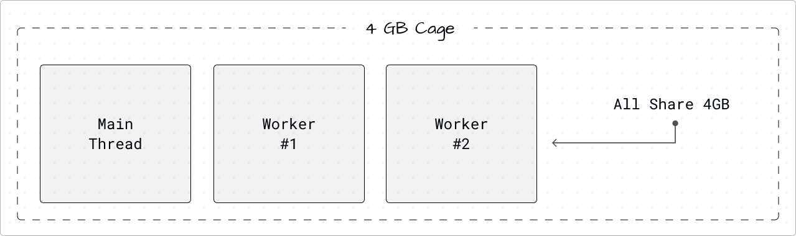
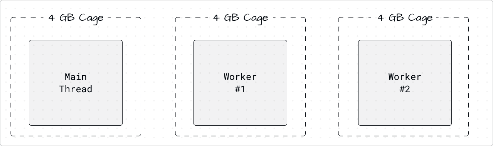
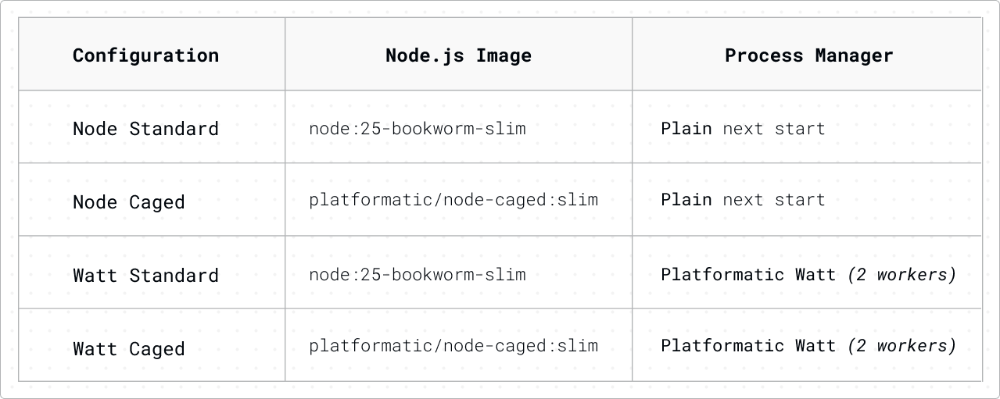
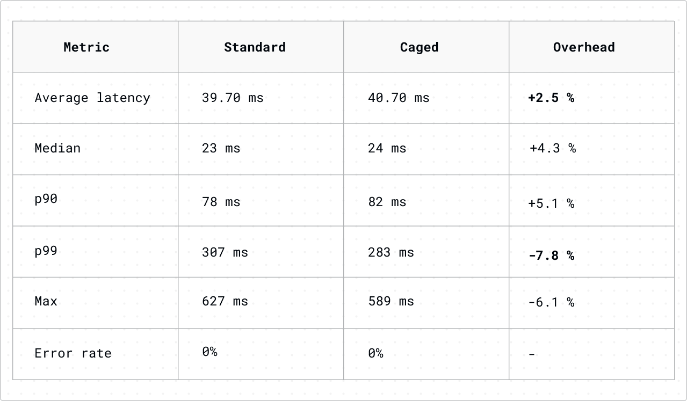
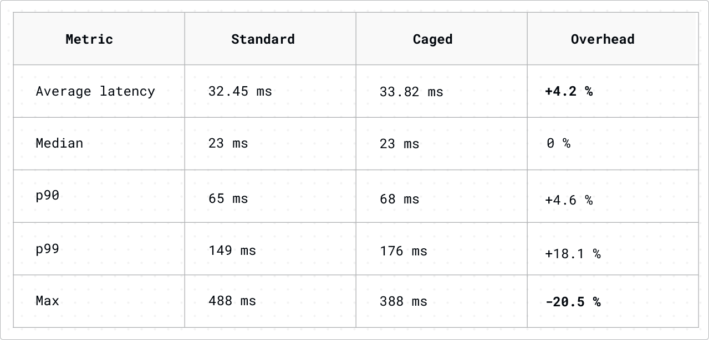
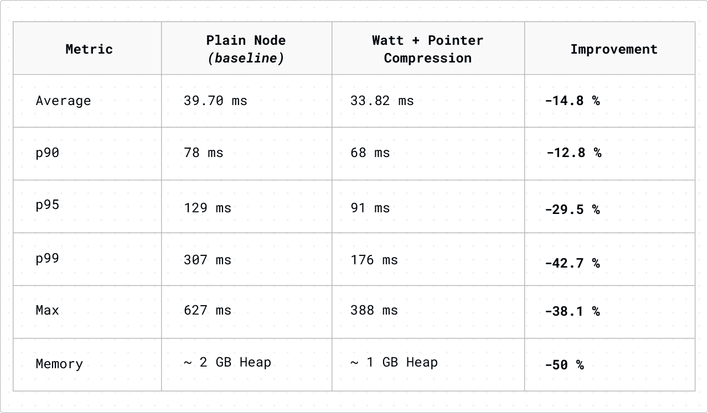

(여러분이 직접 고민할 필요가 없도록 말이죠)

> 원문: [We cut Node.js memory in half](https://blog.platformatic.dev/we-cut-nodejs-memory-in-half)


자바스크립트 내부 C++ 엔진인 V8은 많은 Node.js 개발자들이 잘 알지 못하는 기능을 포함하고 있습니다. 이 포인터 압축 기능은 자바스크립트 힙에서 더 작은 메모리 참조(포인터)를 사용하여 각 포인터를 64비트에서 32비트로 줄이는 기술입니다. 결과적으로 코드를 변경하지 않고도 동일한 애플리케이션에서 메모리 사용량을 약 50% 줄일 수 있습니다. 정말 멋지지 않나요?

하지만 완벽하기만 한 것은 아닙니다. Node.js가 기본적으로 포인터 압축을 활성화하지 않은 데에는 두 가지 역사적인 이유가 있습니다. 

첫째, '4GB 케이지' 제한이 있었습니다. 이는 포인터 압축을 활성화하려면 전체 Node.js 프로세스가 메인 스레드와 모든 워커 스레드 간에 단일 4GB 메모리 공간을 공유해야 함을 의미했습니다. 이는 심각한 문제였습니다. [Cloudflare](https://www.cloudflare.com/)와 [Igalia](https://www.igalia.com/)는 케이지를 V8 엔진의 개별 인스턴스인 아이솔레이트 단위로 할당할 수 있도록 이 문제를 해결하기 위해 파트너십을 맺었습니다.

다음으로, 일부에서는 각 힙 접근마다 포인터를 압축하고 해제하면 성능 오버헤드가 발생할 것이라고 우려했습니다. Cloudflare, Igalia 및 Node.js 프로젝트는 정확히 어떤 종류의 오버헤드가 존재하는지 파악하고 이것이 실제 애플리케이션에 영향을 미칠지 평가하기 위해 협력했습니다.

이를 테스트하기 위해 우리는 포인터 압축이 켜진 Node.js 25 도커 이미지를 사용하여 [node-caged](https://hub.docker.com/r/platformatic/node-caged)를 만들었고, AWS EKS에서 프로덕션 수준의 벤치마크를 실행했습니다.

요약하자면, **실제 워크로드 전반에서 평균 지연 시간이 2~4% 증가하는 데 그치면서 50%의 메모리 절감을 달성했으며, P99 지연 시간을 7% 줄였습니다.** 대부분의 팀에게 이러한 트레이드오프는 쉬운 선택입니다.

## 포인터 압축의 작동 방식

모든 자바스크립트 객체는 V8의 힙에 저장됩니다. 내부적으로 객체는 64비트 시스템에서 64비트 메모리 주소를 사용하여 서로를 참조합니다. 예를 들어, `{ name: "Alice", age: 30 }`과 같은 객체는 여러 내부 포인터를 가지고 있습니다. 하나는 숨겨진 클래스를 가리키고, 하나는 프로퍼티가 저장된 위치를 가리키며, 다른 하나는 힙에 있는 "Alice" 문자열을 참조합니다.

예상할 수 있듯이, 일반적인 Node.js 애플리케이션에서 이러한 모든 포인터가 합쳐지면 소중한 힙 공간을 많이 차지할 수 있습니다. 64비트 시스템에서 각 포인터는 8바이트를 사용하지만, 대부분의 V8 힙은 사용할 수 있는 거대한 주소 공간보다 훨씬 작습니다.

포인터 압축은 이 점을 활용합니다. 전체 64비트 메모리 주소를 저장하는 대신, V8은 32비트 오프셋(기본 주소라고 하는 고정된 시작점으로부터의 상대적인 거리)을 저장합니다. 힙(객체가 저장되는 메모리 영역)에서 읽을 때, 기본 주소와 오프셋을 더하여 전체 포인터를 다시 구성합니다. 쓸 때는 전체 주소에서 기본 주소를 빼서 포인터를 압축합니다.

트레이드오프는 간단합니다.

* **메모리**: 각 포인터가 8바이트에서 4바이트로 줄어듭니다. 객체, 배열, 클로저, Map 및 Set과 같이 포인터가 많은 구조의 경우 메모리 소비를 약 50%까지 줄일 수 있습니다.
* **CPU**: 이제 각 힙 접근에는 하나의 추가적인 덧셈(읽기용) 또는 뺄셈(쓰기용)이 필요합니다. 관점을 달리 보자면, 이 추가 연산은 연산 비용 측면에서 레벨 1 캐시 적중과 유사합니다. 이는 엄청나게 빠른 연산이며, 매초 수백만 번 발생하더라도 그 영향은 방대한 처리 작업의 바다에서 일어나는 잔물결과 같이 미미합니다.
* **힙 제한**: 32비트 오프셋은 고유한 메모리 및 실행 상태를 가진 자바스크립트 엔진의 독립된 인스턴스인 V8 아이솔레이트당 4GB 메모리까지만 접근할 수 있습니다. 일반적으로 1GB 미만을 사용하는 대부분의 Node.js 서비스의 경우 이는 문제가 되지 않습니다.

Chrome은 2020년부터 포인터 압축을 사용해 왔지만, Node.js는 그렇지 않았습니다. 이전에는 이 기능을 사용하려면 컴파일 시에 플래그(`--experimental-enable-pointer-compression`)를 설정해야 했으며, 이는 종종 많은 개발자에게 '전문가 전용' 옵션처럼 느껴졌습니다. 하지만 node-caged의 도입은 이를 변화시켜, 간단한 한 줄의 도커 이미지 교체만으로 포인터 압축을 활성화할 수 있게 되었습니다. 이러한 상당한 단순화는 훨씬 더 많은 사용자가 이 기능을 더 즉각적으로 실험해 볼 수 있는 길을 열어줍니다.

## 무엇이 달라졌나: IsolateGroups

포인터 압축은 수년 동안 V8의 일부였습니다. Node.js가 이전에 이를 사용하지 않은 이유는 CPU 오버헤드 때문이 아니라 메모리 케이지 제한 때문이었습니다.

원래 V8의 포인터 압축은 프로세스의 모든 아이솔레이트가 단일 "포인터 케이지"(모든 압축된 포인터를 위한 4GB 메모리 블록)를 공유하도록 만들었습니다. 이는 메인 스레드와 모든 워커 스레드가 동일한 4GB에 맞아야 함을 의미했습니다. 각 탭이 자체 프로세스에서 실행되는 Chrome에서는 이것이 잘 작동했습니다. 하지만 워커가 프로세스를 공유하는 Node.js에서는 큰 문제였습니다.

2024년 11월, [James Snell](https://github.com/jasnell)은 이 과제를 해결하기 위한 노력을 시작했습니다. Cloudflare는 Igalia의 엔지니어인 [Andy Wingo](https://github.com/wingo)와 [Dmitry Bezhetskov](https://github.com/dbezhetskov)를 후원하여 각 포인터에 고유한 압축 케이지를 제공하는 새로운 V8 기능인 **IsolateGroups**를 도입했습니다. (이 기능과 작업에 대한 자세한 내용은 https://dbezhetskov.dev/multi-sandboxes/ 에서 읽을 수 있습니다.)

핵심적인 수정 사항은 이제 단일 프로세스 내에 여러 IsolateGroups가 존재할 수 있으며, 각각 고유한 4GB 케이지를 가지므로 프로세스 전체의 메모리 제약이 없어진다는 것입니다. 이 작업은 오픈소스 생태계의 강점을 보여주는 조직 간의 의미 있는 협력을 상징합니다. 이 작업 덕분에 [Node.js](http://node.js/)에서 포인터 압축을 활성화하는 방식이, 기존의 '공유 케이지' 모델에서 다음과 같이 변경되었습니다.



'IsolateGroups'로 변경



V8에서 C++ 변경 사항은 간단합니다. `v8::Isolate::New(...)` 대신 `v8::Isolate::New(group, ...)`를 사용하면 됩니다. 이제 각 워커 스레드는 고유한 4GB 힙을 갖게 됩니다. 유일한 제한은 시스템의 가용 메모리입니다.

Snell의 [Node.js 통합](https://github.com/nodejs/node/pull/60254)은 2025년 10월에 적용되었습니다. 8개 파일에 걸쳐 62줄이 변경되었습니다. 이는 대부분의 모듈에서 '작은 커밋 하나에도 못 미치는 수준'의 변경에 해당하며, 그만큼 유지 관리 측면에서 부담이 적다는 점을 보여줍니다. 이 코드는 [Joyee Cheung](https://github.com/joyeecheung)[Igalia], [Michael Zasso](https://github.com/targos)[Zakodium], [Stephen Belanger](https://github.com/Qard)[Platformatic] 그리고 저의 리뷰와 승인을 받았습니다. Cheung은 Node.js 22 이후로 손상되었던 포인터 압축 빌드 자체도 수정했습니다. 저는 승인 전에 실제 Next.js 서버 사이드 렌더링 애플리케이션으로 테스트를 진행하여 힙 사용량이 약 50% 감소함을 확인했습니다.

이 기능은 여전히 컴파일 타임 플래그가 필요하며 아직 공식 Node.js 빌드에는 없습니다. 이것이 우리가 node-caged를 만든 이유입니다.

## 실험

4가지 구성 중 2가지는 우리의 오픈소스 Node.js 애플리케이션 서버인 [Platformatic Watt](https://docs.platformatic.dev/watt)를 사용합니다. Watt는 단일 프로세스 내에서 여러 Node.js 애플리케이션을 워커 스레드(독립적인 실행 스레드)로 실행합니다. 또한 Linux 커널의 'SO_REUSEPORT' 기능을 사용해, 여러 프로세스가 동일한 네트워크 포트에서 동시에 수신 대기할 수 있도록 합니다. 마스터 프로세스도, 프로세스 간 통신 조정도 없습니다. 이전 벤치마크에서 이는 프로세스 간 통신 기반 로드 밸런싱을 통해 PM2와 'cluster' 모듈이 부과하는 약 30%의 성능 저하를 제거했습니다.

우리는 10,000개의 카드, 100,000개의 목록, 서버 사이드 렌더링, 검색, 시뮬레이션된 데이터베이스 지연이 있는 트레이딩 카드 마켓플레이스인 Next.js 이커머스 애플리케이션을 쿠버네티스 클러스터에 설정했습니다. 우리는 동일한 하드웨어와 애플리케이션 코드를 사용하여 4가지 설정을 테스트했습니다.




**인프라**: 우리는 m5.2xlarge 노드(8 vCPU, 32GB RAM)가 있는 AWS EKS를 사용했고, 일반 Node의 경우 6개의 레플리카를, Watt의 경우 3개의 레플리카(각각 2개의 워커가 있어 총 6개의 프로세스)를 사용했습니다. 두 이미지 모두 동일한 Debian bookworm-slim 베이스와 Node.js 25를 사용했기 때문에 유일한 차이점은 포인터 압축을 사용했는지 여부뿐이었습니다.

**워크로드**: 60초의 램프업 후 120초 동안 초당 400개의 요청을 실행하는 ramping-arrival-rate 실행기와 함께 k6를 사용했습니다. 트래픽은 다음과 같이 혼합되었습니다.
  * 20% 홈페이지 (추천 카드, 최근 목록을  포함한 서버 사이드 렌더링)
  * 25% 검색 (페이지네이션이 있는 전체 텍스트 검색)
  * 20% 카드 상세 정보 (개별 상품 페이지 서버 사이드 렌더링)
  * 15% 게임 카테고리 페이지
  * 10% 게임 목록
  * 5% 판매자 목록
  * 5% 세트 상세 페이지

각 요청은 서버 사이드 렌더링 경로를 따릅니다. 디스크에서 JSON 데이터를 로드하고, 쿼리 필터를 적용하고, 리액트 컴포넌트를 HTML로 렌더링하고, 응답을 보냅니다. 실제 데이터 접근을 모방하기 위해 시뮬레이션된 1~5ms의 데이터베이스 지연을 추가했습니다.

## 결과

### 일반 Node.js: 표준 대 포인터 압축



평균 오버헤드는 2.5%였습니다. 이는 40ms의 중앙값 레이턴시에 약 1ms의 추가 지연 시간으로 환산됩니다. 이는 메모리 사용량을 절반으로 줄이는 것에 대한 사소한 트레이드오프입니다. 하지만 p99와 최대 지연 시간을 보면, 포인터 압축을 사용했을 때 실제로 _더 낮습니다_. 힙이 작다는 것은 가비지 컬렉터가 수행할 작업이 적다는 것을 의미하므로 GC 일시 중지가 더 적고 짧아집니다. 이러한 경우 포인터 압축은 단순히 뒤처지지 않고 더 나은 성능을 발휘합니다.

## Platformatic Watt(워커 2개 구성): 표준 대 포인터 압축



여기에서도 비슷한 결과가 나타납니다. 평균 오버헤드는 약간 더 높지만(4.2%), 중앙값은 변경되지 않은 상태로 유지되며 감소된 가비지 컬렉션 압력으로 인해 최대 지연 시간이 20% 단축됩니다.

## 전체적인 모습: Watt + 포인터 압축 대 기준선



이게 프로덕션에서 의사결정을 내릴 때 가장 중요한 비교입니다. Watt와 포인터 압축을 모두 채택하면 무엇을 얻을 수 있을까요?

다음을 고려해 보세요. 평균적으로 15% 더 빠르며 코드 수정 없이 상당한 속도 향상을 제공합니다. 이러한 종류의 개선은 C++과 같이 더 최적화된 언어로 시스템의 주요 부분을 다시 작성하여 얻을 수 있는 일반적인 이점과 비유될 수 있습니다. p99 지연 시간을 43%까지 낮춰줄 뿐만 아니라 메모리 사용량을 절반으로 줄여주며, 이 모든 것을 최소한의 노력으로 무료로 얻을 수 있습니다.

## Hello-World 벤치마크가 오해를 불러일으킨 이유

기본 Next.js 스타터 애플리케이션에서 포인터 압축에 대한 초기 테스트는 56%의 성능 오버헤드를 보여주었습니다. 이 결과는 예상치 못한 것이었습니다.

하지만 단순한 hello-world 서버 사이드 렌더링 페이지는 주로 템플릿 컴파일, 가상 DOM 비교, 문자열 연결과 같은 V8 내부 작업을 수행합니다. I/O도, 데이터 로딩도, 실제 애플리케이션 로직도 없습니다. 모든 연산은 포인터 압축 해제를 거칩니다.

실제 애플리케이션은 다릅니다. 일반적인 요청은 시간의 대부분을 다음 작업에 소비합니다.

1. **I/O 대기**: 데이터베이스 쿼리, 캐시 조회, 다운스트림 서비스에 대한 API 호출
2. **데이터 마샬링**: JSON 파싱, 응답 본문 구성
3. **프레임워크 오버헤드**: 라우팅, 미들웨어 체인, 헤더 처리
4. **OS/네트워크**: TCP 처리, TLS, 커널 스케줄링

포인터 압축 해제를 발생시키는 V8 힙 접근은 전체 요청 시간에서 차지하는 비중이 아주 적은 구성 요소에 불과합니다. "순수한 V8 포인터 체이싱"에 대한 "실제 작업"의 비율이 증가함에 따라 포인터 압축의 오버헤드는 비례하여 줄어듭니다.

우리의 이커머스 애플리케이션에는 1~5ms의 시뮬레이션된 데이터베이스 지연, 10,000개 이상의 레코드가 있는 데이터셋의 JSON 파싱, 검색 필터링, 페이지네이션 및 리액트를 사용한 전체 서버 사이드 렌더링이 포함되어 있습니다. 그러한 맥락에서 포인터 압축 해제 오버헤드는 노이즈 수준에 불과합니다.

**결론: 벤치마킹에는 항상 현실적인 워크로드를 사용해야 합니다. 마이크로벤치마크는 잘못된 아이디어를 줄 수 있습니다. 이러한 결과를 검증하기 위한 도전으로, 가장 무거운 엔드포인트를 시도해보고 결과를 공유해 주시기를 바랍니다. 이러한 협력적 노력은 관찰을 적극적인 참여로 바꾸고, 신뢰를 구축하며, 포인터 압축의 효율성에 대한 커뮤니티의 검증을 촉진할 수 있습니다.**

## 기술적 세부 사항: GC가 더 좋아지는 이유

개선된 테일 레이턴시(tail latency)에 대해서는 더 깊은 설명이 필요합니다. V8의 가비지 컬렉터(Orinoco)는 몇 가지 유형의 컬렉션을 수행합니다.

* **마이너 GC (Scavenge)**: Young Generation 힙에서 살아있는 객체를 복사합니다. 시간은 살아있는 객체의 수와 크기에 비례합니다.

* **메이저 GC (Mark-Sweep-Compact)**: 접근 가능한 모든 객체를 표시하고, 죽은 객체를 쓸어내며, 선택적으로 압축합니다. 시간은 전체 힙 크기와 파편화 수준에 따라 다릅니다.

포인터 압축을 사용하면 모든 객체가 더 작아집니다. 이는 도미노 효과를 가져옵니다.

1. **객체가 더 적은 캐시 라인에 들어갑니다.** 압축된 객체가 2개 대신 단일 64바이트 캐시 라인에 들어간다는 것은 GC의 마킹 단계에서 객체 그래프를 순회하는 동안 캐시 미스가 절반만 발생함을 의미합니다.
2. **Young Generation 힙이 더 천천히 채워집니다.** 객체가 작다는 것은 마이너 GC가 트리거되기 전에 더 많은 할당이 발생함을 의미합니다. 작업 단위당 마이너 GC가 더 적습니다.
3. **메이저 GC가 스캔할 대상이 줄어듭니다.** 압축된 포인터가 있는 1GB 힙은 압축되지 않은 2GB 힙과 동일한 논리적 데이터를 포함합니다. GC는 동일한 애플리케이션 상태를 처리하기 위해 절반의 바이트만 스캔합니다.
4. **압축 시 이동하는 바이트가 줄어듭니다.** 파편화를 줄이기 위해 GC가 힙을 압축할 때 객체가 작을수록 복사할 데이터가 줄어듭니다.

최종 결과는 GC 일시 중지가 더 짧아지고 빈도도 줄어든다는 것입니다. 이는 p99 및 최대 지연 시간 수치에서 본 것과 일치합니다. 롱테일 요청이 GC 일시 중지와 겹칠 때, 이제 그 일시 중지가 더 짧아집니다.

## 이것이 비즈니스에 갖는 의미

### 쿠버네티스 비용 절감
포드당 메모리 제한을 2GB로 두고 쿠버네티스에서 Node.js를 실행하는 경우, 포인터 압축을 사용하면 이를 1GB로 줄일 수 있습니다. 동일한 애플리케이션과 성능을 얻으면서도 노드당 두 배 많은 포드를 실행하거나 절반의 노드만 사용할 수 있습니다. 포드 메모리 한도를 절반으로 줄이면 클러스터 비용에 어떤 영향을 미칠까요? 현재 설정을 기반으로 잠재적인 절감액을 잠시 계산해 보고, 포인터 압축을 구현함으로써 조직이 얼마나 많은 이점을 얻을 수 있는지 확인해 보세요.

6개 노드의 m5.2xlarge EKS 클러스터(노드당 시간당 `$0.384`)는 연간 약 `$16,600`의 비용이 듭니다. 3개 노드로 줄이면 연간 `$8,300`를 절약할 수 있습니다. 50개 이상의 노드가 있는 실제 프로덕션 환경에서는 코드를 변경하지 않고도 절감액이 연간 `$80,000`에서 `$100,000`에 달할 수 있습니다.

수백 개의 Node.js 마이크로서비스를 운영하는 플랫폼 팀에게 이러한 절감액은 누적됩니다. 각 서비스는 V8 힙, 프레임워크 및 모듈에서 발생하는 기본 메모리 부하를 갖습니다. 포인터 압축은 모든 서비스에서 동시에 이 기준선을 낮춥니다.

### 테넌트 밀도 두 배로 향상
각 테넌트가 격리된 Node.js 프로세스에서 실행되는 멀티 테넌트 SaaS 플랫폼은 밀도에 대한 제약 조건으로 메모리 문제에 직면합니다. 각 테넌트의 워커가 512MB를 사용하는 경우 포인터 압축은 이를 약 256MB로 줄입니다. 이는 호스트당 2배의 테넌트에 해당합니다.

대규모 환경에서 이는 비용을 변화시킵니다. 각 테넌트의 인프라 비용이 월 `$5`이고 테넌트가 10,000명인 경우 메모리를 절반으로 줄이면 월 `$25,000`, 즉 연간 `$300,000`를 절약할 수 있습니다.

### 엣지 배포 가능
Lambda@Edge, Cloudflare Workers, Deno Deploy와 같은 엣지 런타임은 아이솔레이트당 일반적으로 128MB에서 512MB라는 엄격한 메모리 제한이 있습니다. Cloudflare가 V8에서 IsolateGroups 작업을 후원한 이유는 더 많은 아이솔레이트를 지원하기 위해 워커 런타임에 포인터 압축이 필요했기 때문입니다. 포인터 압축은 애플리케이션이 엣지에서 실행될 수 있는지, 아니면 원본 서버로 돌아가야 하는지를 결정짓는 차이를 만들 수 있습니다.

이는 수익에 직접적인 영향을 줍니다. 100ms의 지연 시간마다 측정 가능할 정도로 전환율이 감소합니다. 서버 사이드 렌더링을 엣지로 이동하는 이커머스 사이트는 사용자 위치에 따라 TTFB에서 50~200ms를 단축합니다. 연간 5천만 달러 규모의 비즈니스의 경우 이러한 지연 시간 개선은 연간 수십만 달러의 점진적인 수익 증대로 이어질 수 있습니다.

### 더 많은 동시 연결 처리
웹소켓 기반 애플리케이션(채팅, 협업, 실시간 대시보드, 게임)의 경우 각 지속적 연결은 메모리에 상태를 유지합니다. 연결당 약 10KB 힙으로 50,000개의 연결을 처리하는 서버는 500MB를 사용합니다. 포인터 압축을 사용하면 이는 약 250MB로 줄어들어 동일한 서버가 100,000개의 연결을 처리할 수 있게 하거나 웹소켓 서버 플릿을 절반으로 줄일 수 있습니다.

## 호환성 제약 사항

엄격한 제한이 하나 있습니다. 각 V8 IsolateGroup의 포인터 케이지는 4GB입니다. 32비트 압축 포인터는 최대 4GB까지만 주소를 지정할 수 있습니다. IsolateGroups를 사용하면 이 제한은 전체 프로세스가 아니라 각 아이솔레이트에 적용됩니다. 메인 스레드는 4GB를 얻고, 각 워커 스레드는 4GB를 얻으며, 전체는 시스템의 메모리에 의해서만 제한됩니다.

대부분의 Node.js 서비스의 경우 아이솔레이트당 4GB는 무관합니다. 대다수의 프로덕션 프로세스는 1GB 미만의 힙에서 잘 실행됩니다. 서비스가 아이솔레이트당 4GB 이상의 힙을 진정으로 필요로 하는 경우(예: 대규모 ML 모델 추론, 대규모 인메모리 캐시 또는 무거운 ETL 파이프라인), 포인터 압축은 옵션이 아닙니다. V8 자바스크립트 힙만 케이지 내부에 존재한다는 점에 유의하세요. 네이티브 애드온 할당 및 ArrayBuffer 백업 저장소는 4GB 제한에 포함되지 않습니다.

호환성 제약 사항이 하나 더 있습니다. 레거시 NAN으로 빌드된 네이티브 애드온은 포인터 압축이 활성화된 상태에서 작동하지 않습니다. [NAN](https://github.com/nodejs/nan)은 V8 내부를 직접 노출하며, 포인터 압축은 V8 객체의 내부 표현을 변경합니다. 다시 컴파일할 때 ABI가 다릅니다. [Node-API](https://nodejs.org/api/n-api.html)(이전의 N-API)를 기반으로 빌드된 애드온은 Node-API가 V8의 포인터 레이아웃을 완전히 추상화하기 때문에 영향을 받지 않습니다. 가장 인기 있는 네이티브 패키지들은 이미 마이그레이션되었습니다. `sharp`, `bcrypt`, `canvas`, `sqlite3`, `leveldown`, `bufferutil` 및 `utf-8-validate`는 오늘날 모두 Node-API를 사용합니다. 주요 예외는 여전히 NAN에 의존하는 `nodegit`입니다. 확실하지 않은 경우 `npm ls nan`으로 의존성 트리를 확인하세요. 아무것도 나타나지 않으면 괜찮습니다.

그 외 모든 사람들(대부분의 Node.js 배포)에게는 잃을 것이 없습니다.

## 시도해 보기

그대로 갈아끼우면 됩니다. 코드를 변경할 필요가 없습니다.

```dockerfile
# Before
FROM node:25-bookworm-slim
# After
FROM platformatic/node-caged:25-slim
```

`platformatic/node-caged` 이미지는 `--experimental-enable-pointer-compression`과 함께 Node.js v25.x 브랜치에서 빌드되었습니다. 동일한 Node.js, 동일한 API 및 기타 모든 것이 동일하며 힙만 더 작습니다.

사용 가능한 태그: latest, slim, 25, 25-slim.

스테이징에서 테스트하는 것으로 시작하세요. 메모리 사용량이 감소하는 것을 지켜보세요. p99 지연 시간이 SLO 내에 유지되는지 확인하세요. 그런 다음 배포하세요.

언제나 그렇듯, 우리는 여러분의 의견을 듣고 싶습니다! 결과를 공유하거나 [hello@platformatic.dev](hello@platformatic.dev)로 메모를 남겨 경험을 공유하거나 구축 중인 항목에 대해 채팅하고 싶다면 소셜 미디어에 참여하세요.

-------

__벤치마크는 400 req/s가 지속되는 ramping-arrival-rate와 함께 k6를 사용하여 AWS EKS(m5.2xlarge 노드, us-west-2)에서 실행되었습니다. 애플리케이션은 서버 사이드 렌더링 및 JSON 기반 데이터 레이어가 있는 Next.js 16 이커머스 마켓플레이스입니다. 전체 벤치마크 인프라 및 결과는 [node-caged 저장소](https://github.com/platformatic/node-caged)에서 확인할 수 있습니다. 업스트림 V8 IsolateGroups 기능은 Cloudflare의 후원으로 Igalia에서 구현했습니다. Node.js 통합은 [James Snell](https://github.com/nodejs/node/pull/60254)이 수행했으며 빌드 수정은 [Joyee Cheung](https://github.com/joyeecheung)이 수행했습니다. 전체 내역은 [추적 이슈](https://github.com/nodejs/node/issues/55735)를 참조하세요.__


> 🚀 한국어로 된 프런트엔드 아티클을 빠르게 받아보고 싶다면 [Korean FE Article](https://kofearticle.substack.com/)을 구독해주세요!
