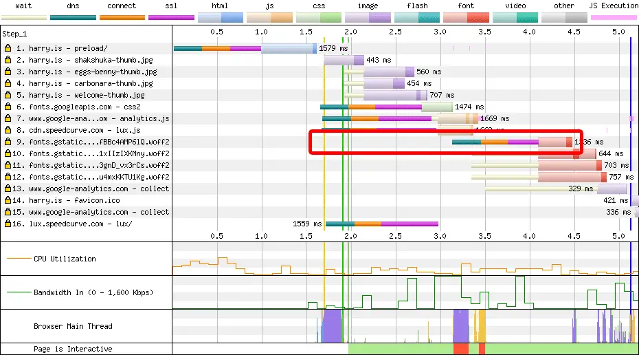

> 원문: [Optimising for High Latency Environments](https://csswizardry.com/2024/09/optimising-for-high-latency-environments)

지난주에 CrUX에 새롭게 포함된 RTT 데이터 항목에 대해 [링크드인에 짧은 업데이트](https://www.linkedin.com/feed/update/urn:li:activity:7240018342948835328/)를 게시했습니다. 간단히 읽어보시면 도움이 될 것입니다.

크롬은 [최근 크롬 사용자 경험 보고서(CrUX)에 왕복 시간(RTT) 데이터를 추가하기 시작했습니다](https://groups.google.com/a/chromium.org/g/chrome-ux-report/c/mPbK5zD8Ym4/m/3Lz9oEUgAAAJ). 이는 방문자들의 네트워크 토폴로지와 높은 지연 시간이 있는 지역에서 우리가 얼마나 영향을 받을 수 있는지에 대한 흥미로운 인사이트을 제공합니다.

## RTT란 무엇인가요?

왕복 시간(RTT)은 기본적으로 지연 시간을 측정한 것으로, 한 엔드 포인트에서 다른 엔드 포인트로 갔다가 다시 돌아오는데 걸린 시간을 의미합니다. 기내 와이파이로 `www.google.com`을 `핑`해본 적이 있다면, RTT를 측정한 것입니다.

웹에서 지연 시간은 주요 제약 요소 중 하나입니다. 웹 페이지가 가져오는 대부분의 자원은 상대적으로 작기 때문에(소프트웨어 업데이트를 다운로드하거나 영화를 스트리밍하는 것과 비교하면), 대부분의 경험이 대역폭보다는 지연 시간에 의해 제한된다는 것을 알 수 있습니다.

또한 왕복 시간은 전파 지연, 전송 지연, 처리 지연과 같은 여정의 중간 단계를 측정하기도 합니다. 이러한 중간 단계들은 이 글의 범위를 벗어나지만, 만약 `traceroute`를 실행해본 적이 있다면, 이미 제대로 접근하고 계신 겁니다.

## CrUX의 RTT 데이터 출처는 어디인가요?

RTT는 더 정밀한 타이밍 정보로 [유효 연결 타입](https://developer.mozilla.org/en-US/docs/Glossary/Effective_connection_type)(ECT)을 대체하도록 설계되었습니다. 이를 위해, RTT 데이터는 방문자의 사이트에 대한 지연 시간을 측정하는 것이 아니라, 그들의 지연 시간 자체를 측정한다는 점을 이해하는 것이 중요합니다. 즉, RTT는 사이트의 특성이 아니라 방문자의 특성입니다. _'이 사람이 나이지리아에서 왔다'_ 는 것과 _'이 사람이 모바일을 사용했다'_ 는 것과 _'지연 시간이 긴 연결을 사용했다'_ 는 것은 다를 바 없습니다.

누군가가 나이지리아에서 온 사실을 바꿀 수 없고, 그 사람이 모바일을 사용했다는 사실을 바꿀 수 없으며, 그들의 네트워크 상태를 바꿀 수 없습니다. RTT는 여러분이 통제할 수 있는 것이 아니라 방문자의 특성입니다.

RTT 데이터는 지표가 아니라 인사이트로 간주되어야 합니다. 지연 시간이 긴 연결을 사용하는 사용자가 많다는 것을 알게 된다면, 애플리케이션을 그들에게 맞춰 설계해야 합니다. 이것이 바로 이 글의 주제입니다.

### RTT 정보를 어떻게 볼 수 있나요?

RTT 데이터를 포함하는 것이 아직 초기 단계이기 때문에, 이를 확인하는 것이 다른 CrUX 인사이트처럼 아직 간단하지는 않습니다. 하지만 몇 가지 방법을 사용할 수 있으며, 그 중 일부는 다른 방법보다 더 쉽고 무료입니다.

#### CrUX API

특정 오리진에 대한 상위 25% (75th 퍼센타일)에 해당하는 RTT 데이터를 확인하려면 CrUX API를 사용할 수 있습니다.

```curl
curl "https://chromeuxreport.googleapis.com/v1/records:queryRecord?key=<KEY>" \
 --header 'Content-Type: application/json' \
 --data '{"origin": "https://website.com", "formFactor": "DESKTOP", "metrics": ["round_trip_time"]}'
```

`<KEY>`, `https://website.com`, `DESKTOP`을 적절한 입력값으로 대체하세요. 저의 사이트의 경우, 모바일 RTT가 144ms, 데스크톱 RTT가 89ms임을 확인할 수 있습니다. 놀랄만한 차이는 아닐 것입니다.

#### Treo

[Treo](https://treo.sh/) 계정이 아직 없다면, 정말 큰 기회를 놓치고 계신 겁니다. 지금 당장 가입하세요. 이 도구는 성능 엔지니어의 삶을 훨씬 더 쉽게(그리고 훨씬 더 재미있게) 만들어 줍니다. Treo는 URL 수준에서 RTT 데이터를 추가하기 시작했으며, 이는 매우 흥미로운 일입니다.


다시 말하지만, RTT는 지표가 아니라 특성이기 때문에, Treo는 현명하게도 이를 _로딩(Loading)_ 대시보드가 아닌 _디바이스(Devices)_ 대시보드에 포함시킵니다.

#### 봇 길들이기

[Dave Smart](https://tamethebots.com/about-dave)는 자신의 사이트 _Tame the Bots_ 에 [훌륭한 CrUX History 시각화 도구](https://tamethebots.com/tools/cwv-history?url=https://csswizardry.com/)를 구축했습니다. 여기서 새로운 RTT를 포함해 오리진과 URL 수준의 CrUX 데이터를 모두 살펴볼 수 있습니다.

특히 좋은 점은 TTFB(첫 번째 바이트 시간)와 RTT를 비교그래프로 보여준다는 점입니다-[첫 번째 바이트 시간에는 한 번의 왕복 시간이 포함된다는 것을 기억하세요.](https://csswizardry.com/2019/08/time-to-first-byte-what-it-is-and-why-it-matters/)


## 지연 시간이 긴 환경에서의 경험 개선하기

자세히 알아보기 전에 이 글은 지연 시간이 긴 경험을 최적화하기 위한 일반적인 접근 방식에 관한 것이지 CrUX 데이터셋 내의 메트릭 개선에 관한 것이 아니라는 점을 다시 한 번 강조하고 싶습니다. 다음은 지연 시간을 염두에 두고 설계하기 위한 전반적인 모범 사례에 대한 조언입니다.

이 섹션에서는 지연에 시달리는 방문자의 경험을 개선할 수 있는 기회의 업그레이드를 상세하게 설명합니다.

### 전송 크기 줄이기

간단히 말해보자면…

웹 서버는 전체 파일을 한 번에 전송하지 않고 패킷으로 나눠서 전송합니다. 그런 다음 클라이언트에서 패킷을 재조립합니다. 이러한 패킷은 각각 고유한 RTT 수명 주기를 갖습니다(반드시 동기적이진 않음). 즉, 더 많은 패킷을 필요로 하는 대용량 파일일수록 더 많은 왕복이 발생합니다. _각 왕복은_ 곧 지연 시간입니다. 파일 다운로드 속도는 대역폭과 왕복 시간에 의해 결정됩니다.

지연 시간이 긴 연결에서 리소스를 더 빠르게 로드되도록 하려면, 리소스를 작게 만드는 것이 여전히 합리적인 아이디어입니다. 다만 파일 크기는 일반적으로 크기가 커질수록 사용 가능한 대역폭과 더 밀접한 관계가 있습니다.

### CDN 사용

왕복 시간을 줄이는 가장 효과적인 방법 중 하나는 물리적인 거리 자체를 줄이는 것입니다. 예를 들어, 프라하 현지의 온프레미스 서버에서 사이트를 호스팅하는 고객이 있습니다. 현재 [CDN](https://en.wikipedia.org/wiki/Content_delivery_network)을 사용하고 있지는 않지만, 전 세계에서 유입되는 높은 트래픽을 받고 있습니다.


인기 순위 지표를 보면, 그들은 본국인 체코보다 일부 사하라 사막 이남 국가에서 더 인기가 높습니다! 이 클라이언트를 CDN(아마도 [Cloudflare](https://www.cloudflare.com/en-gb/network/))으로 설정하는 것이 이 프로젝트의 최우선 과제 중 하나입니다.

많은 다른 성능 및 보안 기능을 제공할 뿐만 아니라(에헴...), CDN 사용의 주요 이점은 단순히 지리적 근접성입니다. 데이터가 이동해야 할 거리가 짧을수록 더 빨리 도착할 수 있습니다.

CDN을 사용하고 있지 않다면 사용하는 것을 권장합니다. 만약 사용하고 계신다면, 아마 다음 섹션에 다룰 내용 중 일부 또는 전부를 무료로 얻을 수 있을 것입니다.

### 빠른 DNS 제공자 사용

새로운 방문자가 여러분의 사이트에 액세스하기 위해 해야 할 첫 번째 일 중 하나는 DNS(도메인 이름 시스템)을 사용하여 IP 주소를 해석하는 것입니다.

웹 사이트 소유자로서 어떤 권위있는 DNS 제공자를 사용할 지 어느 정도 선택할 수 있습니다. 저는 Cloudflare를 사용하며, [그들은 가장 빠른 DNS 제공자 중 하나입니다.](https://www.dnsperf.com/) 가능하다면, 성능이 높은 순위를 가진 DNS 제공자를 사용하도록 하세요.

### HTTP/2로 업그레이드

[웹에서 제공되는 응답의 75% 이상이 HTTP/2를 통해 전송됩니다.](https://almanac.httparchive.org/en/2022/http#http2-adoption) 이는 훌륭한 일입니다! 나머지 25%에 속한다면, HTTP/2로의 업그레이드를 우선적으로 고려해야합니다. CDN으로 이동하면 기본적으로 HTTP/2가 표준으로 제공될 가능성이 높으므로, 이는 일석이조입니다.

HTTP/2가 HTTP/1.1보다 나은 점 중 하나는 연결 활용을 개선하여 **전체적인 연결 협상을 줄인다는 것입니다.**

HTTP 1 및 2는 둘 다 TCP(전송 제어 프로토콜) 위에서 실행됩니다. 두 HTTP 엔드포인트가 통신하고 싶을 때, 그들은 3단계 핸드셰이크를 통해 연결을 열어야 합니다. 이것은 거의 순수한 지연 시간이며, 가능하면 피해야 합니다.

현재 제 사이트의 144ms 모바일 왕복 시간을 기준으로 하면, TCP 연결을 여는 과정은 이렇게 보일 것입니다.


> TCP는 더 정확하게는 SYN 및 ACK의 조합이 되겠지만, 이는 이 글에서 제가 설명하려는 범위에는 벗어납니다.

페이지에 대한 `GET` 요청을 전송하기까지 **전체 왕복 시간**(144ms)이 걸립니다.

HTTP/1.0은 연결이 한 번에 하나의 요청-응답 수명 주기만 충족할 수 있어 비효율적이었고, 따라서 여러 파일을 가져오는 작업(대부분의 웹페이지에서 요구하는)은 매우\_ 느린 작업이었습니다.

이를 완화하기 위해 HTTP/1.1은 한 번에 서버에 여러 연결을 동시에 열 수 있도록 허용했습니다. 동시 연결 수는 다양하지만, 일반적으로 *여섯 개*로 알려져 있습니다. 이는 클라이언트(예: 브라우저)가 여섯 개의 연결을 열어 여섯 개의 파일을 동시에 다운로드할 수 있음을 의미합니다. 이 방식은 전체적으로 더 빠르지만, 여섯 개의 별도 TCP 연결을 열면서 누적 지연 시간이 여섯 배 늘어났습니다. 한 가지 다행인 점은 연결이 한 번 열리면 계속 열려서 재사용된다는 점입니다(다음 섹션에서 더 알아봅니다).

아래에서 HTTP/1.1 연결을 통해 제 홈페이지를 로드하는 모습을 시각적으로 볼 수 있습니다. 각 DNS, TCP, TLS는 순수 지연 시간으로 간주될 수 있지만 지금은 TCP에 대해서만 이야기 하겠습니다.

이 있고, 0.8-1.0초 사이에 보라색(이미지)이 있으며, 그 후 3.4-5.0초까지 더 많은 파란색 항목들이 있는데, 이는 연결 재사용의 증거입니다.')

`csswizardry.com`에 다섯 개의 연결을 열고, `res.cloudinary.com`에 여섯 개, 총 23개의 TCP 연결을 열었으니 누적된 지연 시간이 참 많습니다! 그러나 연결이 재사용된다는 것을 유의하세요(다시 말하지만, 다음 섹션에서 더 알아봅니다).

HTTP/2의 해결책은 단 하나의 TCP 연결만 열어 연결 오버헤드를 크게 줄이고 그 안에서 멀티플렉싱 스트림을 통해 많은 동시 다운로드를 허용하는 것입니다.


이제 `csswizardry.com`에 두 개의 연결만 있고([하나는 CORS 활성화 필요](https://csswizardry.com/2023/12/correctly-con그림ure-preconnections/#when-to-use-crossorigin)), `res.cloudinary.com`에 하나 있으며, 총 13개로 모두 재사용할 수 있습니다. 훨씬 낫습니다!

HTTP/2는 여러 번의 신규 또는 추가적인 3단계 핸드셰이크 과정을 수행할 필요가 없기 때문에 전반적인 지연 시간을 줄여줍니다.

#### HTTP/1.0에 대한 한마디

HTTP/1.0은 아주 오래된 프로토콜이라서, 여기서는 단지 상식으로만 언급하고 싶습니다. 이 글을 읽는 분들 중 HTTP/1.0을 사용하는 분이 없기를 진심으로 바랍니다.

HTTP/1.0에서는 사용 후 즉시 연결이 종료되었기 때문에 문제가 더 악화되었습니다. 즉, 모든 개별 파일은 각각의 연결 협상을 필요로 했습니다. 모든 파일은 한 번 사용할 때마다 지연 시간이 발생했습니다.


각 응답에는 즉시 종료되는 자체 연결이 있습니다. 이보다 더 느릴 수는 없습니다.

#### 주요 요점

HTTP/2로 업그레이드하고, 열어야 하는 연결이 재사용되고 영구적으로 유지되도록 하세요.

### TLS 1.3으로 업그레이드

이전 섹션에서 무언가 눈에 띄었기를 바랍니다. **보안된 연결이 아닙니다.** 앞서 DNS를 짧게 언급했으며, TCP에 대해 많이 살펴봤으니 이제 TLS를 살펴볼 때입니다.

> **만약 HTTP를 사용하고 있고, HTTPS로 전환하지 않았다면, 이는 끔찍한 문제입니다. 빨리 수정하십시오.**

HTTP/2로 업그레이드한다면, HTTPS도 실행해야 하며 이는 필수 요구 사항의 일부입니다. 따라서, HTTP/2를 실행 중이라면 보안 설정도 실행 중인 것으로 간주할 수 있습니다. 그러나 지연 시간이 더 길어질 수 있습니다.


이제 `GET` 요청을 보내기 전에 **세 번의 왕복**(432ms)이 필요합니다! 추가된 보안 계층은 TCP 연결의 끝에 추가되므로 더 많은 왕복이 발생합니다. 저는 빠른 사이트보다는 안전한 사이트를 선호하지만, 정말 선택할 수 있다면 둘 다 선택하고 싶습니다.

TLS 1.3로 업그레이드하기만 하면 기본 제공 최적화를 이용할 수 있습니다. TLS 1.3은 프로토콜의 일부 레거시 측면을 제거하여 전체 왕복 시간을 줄였습니다.


이제 `GET` 요청을 보내기 전에 **두 번의 왕복**(288ms)이 필요합니다. 더 빠릅니다. 하지만 여전히 정확히 _빠른_ 것은 아닙니다. 계속 나아가 봅시다.

#### TLS 1.3+0-RTT

TLS 1.3의 추가 선택 기능은 이전 연결을 재개하기 위한 _0-RTT_ 입니다. 첫 번째 핸드셰이크에서 사전 공유 키(PSK)를 공유하면 `GET` 요청을 동시에 보낼 수 있습니다.


이제 `GET` 요청은 **한 번의 왕복**(144ms) 후에 전송됩니다!

보안과 관련된 트레이드 오프가 있기 때문에, 0-RTT는 TLS 1.3의 선택적 메커니즘으로 제공됩니다.

#### 주요 요점

보안은 필수적이지만 반드시 느릴 필요는 없습니다. TLS 1.3으로 전환하여 새 연결에 대한 왕복 횟수를 줄이고, 재개된 연결에서 왕복 횟수가 0이 되게 할 수 있습니다!

### HTTP/3(QUIC)로 업그레이드

HTTP/3로 업그레이드하면 우리는 실제로 QUIC 프로토콜을 활용하게 됩니다. 앞서 설명했듯이 HTTP 1과 2는 TCP 위에 구축되었습니다. HTTP/3는 QUIC 위에 구축되며, 이는 본질적으로 훨씬 더 빠른 UDP 프로토콜 위에 TCP와 유사한 계층을 구현합니다. TCP의 모든 안전성과 적절함을 유지하면서, 지연 시간 문제는 대부분 피할 수 있습니다. 이러한 변화와 개선은 일상적인 개발자들에게 추상화된 상태로 제공되며, 개발 워크플로우를 전혀 변경할 필요가 없습니다. 따라서, 이 글에서는 HTTP/2와 3의 차이, TCP, UDP, QUIC의 차이에 대해 자세히 설명하지 않겠습니다.

> 다만, 프로토콜 설계에 투입된 순수한 우아함, 시간, 그리고 노력이 최종 사용자 개발자들에게는 대부분 상실되는 것을 보면 마음이 아픕니다. 우리는 단지 어딘가에 있는 스위치를 켜면 이런 것들이 모두 자동-적용™ 됩니다.. 우리가 이런 혜택을 자격이 있는지는 모르겠지만, 일단은 넘어가죠..

그럼에도 불구하고, HTTP/3의 중요한 개선점 중 하나는 QUIC 위에 구축되었기 때문에, 이를 통해 전송 계층에 접근할 수 있는 장점을 누리고 있다는 것입니다. 즉, TLS를 프로토콜의 일부로 제공할 수 있습니다. 따라서 초기 연결 후에 발생하는 것이 아니라 연결의 일부로 발생합니다!


우리의 `GET` 요청은 이제 **한 번의 왕복**(144ms) 후에 전송됩니다!

다음은 개발자 도구에서 병렬화를 관찰할 수 있는 깔끔한 예입니다. _초기 연결_ 과 (잘못 표시된) _SSL_ 이 병렬화되고 동일하다는 것을 주목하세요.


이는 HTTP/3의 최악의 사례 모델이 TLS 1.3+0-RTT의 최상위 사례를 모방함을 의미합니다. HTTP/3에 접근할 수 있다면, 이 기능을 켜는 것을 권장합니다.

#### QUIC 0-RTT

TLS 1.3+0-RTT와 혼동하지 마세요. QUIC에는 자체적인 [0-RTT 모델](https://blog.cloudflare.com/even-faster-connection-establishment-with-quic-0-rtt-resumption/)도 있습니다. 이는 QUIC이 프로토콜 자체에 TLS을 통합하여 만든 결과입니다. 새로운 프로토콜 수준 기능의 이러한 누적 효과는 재개된 HTTP/3 세션이 0-RTT 모델을 사용하여 후속 요청을 관련 오리진에 보낼 수 있음을 의미합니다.


이제 우리의 요청은 **왕복 없이**(0ms) 전송됩니다. 그야말로 갯(`GET` ㅎㅎ) 빠르네요.

#### 연결 마이그레이션

이 모든 것을 더욱 인상적으로 만드는 것은, QUIC은 _연결 마이그레이션_ 기능입니다! 하지만 문제는..

**아직 어느곳에서도 이를 구현하지 않았다**라는 점 입니다. 하지만 구현된다면...

인터넷 사용자, 특히 모바일 사용자는 브라우징 라이프사이클 전반에 걸쳐 네트워크 조건의 변화를 경험하게 됩니다. 도시를 걸을 때 새로운 기지국에 연결하고, 집에 도착한 후 자신의 와이파이에 연결하고, 호텔을 떠날 때 와이파이 연결을 끊는 등의 상황이 있을 것입니다.

이러한 변화가 있을 때마다 TCP는 새로운 연결을 협상해야 합니다. TCP는 연결을 동기화하기 위해 클라이언트의 IP 주소와 포트, 서버의 IP 주소와 포트가 연결을 식별하는 데 사용되는 4중 방식을 사용합니다. 이 네 가지 매개변수 중 하나라도 변경되면 새로운 TCP 연결을 열어야 합니다.

QUIC은 이 문제를 해결하기 위해 연결 ID를 사용하여 열린 연결을 식별함으로써 네 가지 튜플의 변경에 영향을 받지 않도록 특별히 설계되었습니다. 이 역시 QUIC이 처음부터 새롭게 설계된(clean slate) 프로토콜이기 때문입니다.

즉, 네트워크 변경으로 인해 현재 연결을 완전히 종료하고 다시 구축할 필요 없이, 최상의 시나리오에서는 기존 연결에서 HTTP/3을 원활하게 재개할 수 있습니다. 그 모습은 다음과 같습니다.

그림 7. 의도적으로 비워둔 그림 - 말 그대로 아무 일도 일어나지 않습니다.

HTTP/3 환경에서 최악의 시나리오에도 왕복 1회만 연결됩니다. 꽤 괜찮은 최악의 경우입니다.


만약 우리가 HTTP/1이나 2와 같은 TCP 기반 프로토콜을 여전히 실행하고 있다면, 우리의 최상의 경우는 TCP 1.3+0-RTT 설정과 유사할 것입니다.


최악의 경우는 TLS 1.2를 통한 HTTP/1 또는 2 시나리오일 가능성이 높습니다.


모든 것을 허물고, 모든 것을 다시 해야 합니다.

#### 주요 요점

HTTP/3의 기본 프로토콜인 QUIC은 기본적으로 TLS를 설계에 포함할 수 있으므로 연결과 TLS를 연달아 수행할 필요가 없습니다. 또한 디바이스가 인터넷을 이동할 때 끊김 없는 연결 마이그레이션을 제공할 수 있습니다.

## 지연 시간 발생 방지

알겠습니다! 하지만 a) 프로토콜을 업그레이드할 수 없거나 b) 이미 할 수 있는 모든 것을 업그레이드했다면 어떻게 해야 할까요? 언제나 최선의 선택은 예방입니다. 예방이 치료보다 저렴하다는 말이 있듯이 말입니다. 어떻게 하면 지연 시간을 완전히 예방할 수 있을까요?

### 불필요한 새 연결 피하기

너무 많은 HTTP 요청을 피하라는 조언은 요청과 연결이 본질적으로 제한적이었던 HTTP/1.1 환경에서 매우 유효한 조언이었습니다. HTTP/2 세계에서는 조금 더 자유롭게 접근할 수 있다고 들었습니다. 하지만 여전히 가능하면 _불필요한_ 연결은 피하는 것이 현명합니다.

가능한 한 제3자 오리진으로의 이동을 피하고 _특히_ 중요 렌더링 경로(Critical Path)의 항목에 대해선 더욱 피하십시오. 전에도 말씀드렸지만 모두가 알게될 때때까지 계속 반복해서 말씀드리겠습니다. [_정적 자산은 직접 호스팅하세요._](https://csswizardry.com/2019/05/self-host-your-static-assets/)

저의 클라이언트 중 한 명은 TTFB와 FCP 간에 큰 격차가 있으며, 그 주요 원인은 지연으로 인한 시간 손실입니다. 특히 새로운 연결을 설정하는 데 걸리는 시간이 큰데, 상당수가 불필요하며 중요 렌더링 경로에서 발생합니다 (흰색 십자가가 있는 오렌지색 원으로 나타남).


CrUX 데이터를 보면, 그들의 방문자의 RTT 시간은 전 세계적으로 가장 느린 25%의 RTT 시간에 해당하므로 지연 시간을 최적화할 필요가 있는 클라이언트입니다. 이 리소스의 대부분을 직접 호스팅함으로써, 즉시 지연 시간을 많이 줄일 수 있습니다.

#### 주요 요점

연결이 예전만큼 무섭지는 않지만, 새로운 연결을 설정하는 것은 순수한 지연 시간을 발생시킵니다. 특히 중요 렌더링 경로에서는 피하려고 노력하세요.

### 리다이렉트 피하기

가능한 한 리다이렉트를 피하세요. 리다이렉트 또한 순수한 지연 시간입니다. 이전에 개발자가 모든 `href`를 종료 슬래시 없이 작성한 시나리오를 본 적이 있습니다, 예를 들어 다음과 같습니다.

```html
<a href=/products>모든 제품 보기…</a>
```

하지만 해당 사이트의 URL 정책에 후행 슬래시가 포함되어 있습니다.

```html
https://www.website.com/products/
```

이는 사용자가 링크를 클릭할 때마다 `3xx` 수준의 리다이렉트가 제공되기 위해 전체 왕복 지연 시간이 발생하고, 이후 `Location` 헤더에 나열된 리소스에 액세스하기 위해 더 많은 왕복 지연이 발생한다는 의미입니다.


`3xx`급 응답을 얼마나 많이 서빙하는지 확인할 것을 권장합니다. 올해만 해도 리다이렉트로 인해 자신도 모르는 사이에 엄청난 시간을 낭비하고 있는 고객들이 많았습니다.

흥미롭게도, `304` 응답도 여전히 리다이렉트의 한 형태입니다. 서버가 방문자를 HTTP 캐시로 다시 리다이렉트하고 있습니다. [아직 신선한 리소스를 불필요하게 재검증하지 않도록 하세요](https://speakerdeck.com/csswizardry/cache-rules-everything?slide=92):


`http`에서 `https`로 리다이렉팅하는 행위는 매우 필수적이며, 모든 시간 페널티에도 불구하고 항상 수행해야 하지만 곧 다루게 될 HSTS(HTTP Strict Transport Security)를 사용하면 속도를 높일 수 있습니다.

#### 주요 요점

때때로 불가피한 경우도 있지만, 리다이렉트는 순수한 지연 시간입니다. 불필요한 작업을 유발하지 않도록 하시고, 마케팅 부서에 URL 단축기 사용을 그만두라고 전해 주세요.

### 프리플라이트 요청 방지

단순하지 않은 HTTP 요청은 순수 지연 시간 _프리플라이트 요청_ 이 자동으로 추가됩니다. 프리플라이트 요청은 실제 요청이 특정 CORS 조건을 충족할 때, 비표준 요청 헤더를 전송하거나 `DELETE` 요청을 시도할 때 발생합니다.

이는 API 엔드포인트를 호출하는 단일 페이지 앱(SPA)에서 흔히 발생하는 지연의 원인입니다. 아래 클라이언트를 예로 들면, API 엔드포인트로의 요청에 비표준 `Accept-Version` 헤더가 포함되어 있습니다. 이렇게 하면 자동으로 프리플라이트가 시작되어 서버가 들어오는 요청을 인식하고 거부할 수 있는 기회를 갖게 됩니다.


위의 프리플라이트 `OPTIONS` 요청은 다음과 같은 요청 헤더로 이루어집니다 (깔끔함을 위해 포맷팅됨).

```
Origin: https://website.com
Access-Control-Request-Method: GET
Access-Control-Request-Headers: Accept-Version
```

서버는 프리플라이트에 대해 `204`응답을 다음과 같은 응답 헤더를 가지고 제공합니다 (깔끔함을 위해 포맷팅됨).

```
Access-Control-Allow-Origin: https://website.com
Access-Control-Allow-Methods: HEAD,
GET,
POST
Access-Control-Allow-Headers: Accept-Charset,
Accept-Encoding,
Accept-Language,
Accept-Version,
Authorization,
Cache-Control,
Content-Type,
Server-Id
```

이것은 `https://website.com`가 나열된 메서드 유형과 나열된 헤더로 브라우저에 요청할 수 있음을 알려줍니다.

이러한 모든 순수한 지연 시간이 지나고 난 뒤에야, 브라우저는 드디어 사전 프리플라이트에서 요청된 `Accept-Version: 1.0`을 포함하는 실제 요청을 보낼 수 있습니다.

가능한 경우 단순 요청이 아닌 요청은 순수한 대기 시간인 프리플라이트가 트리거되므로 피하세요. 요청이 프리플라이트 요청을 트리거하는 조건은 [MDN](https://developer.mozilla.org/en-US/docs/Web/HTTP/CORS#simple_requests)에 나와 있습니다.

프리플라이트를 피할 수 없는 경우 계속 읽어보세요.

#### 주요 요점

SPA를 구축하고 있다면 (아마도 하고 있겠지만 ([그리고 아마도 하지 않는 것이 좋지만](https://x.com/csswizardry/status/1831039135290921254))), 클라이언트 사이드 API 호출에서 무슨 일이 일어나고 있는지 확인하십시오.

## 지연 비용 선지불 및 선대처하기

아무리 최선을 다해도 어느 정도의 지연 시간은 피할 수 없습니다. 0-RTT 같은 기술은 재접속 시에만 효과가 있고, 다른 오리진을 전혀 거치지 않는 것은 사실상 불가능합니다. 그렇다면 지연 비용을 선불로 지불할 수는 없을까요?

### `preconnect`

우리는 `preconnect`를 (절약적으로) 사용하여 곧 방문해야 할 중요한 오리진으로의 연결을 미리 열 수 있습니다. [`preconnect`를 구성하는 것에 대해 쓴 글](https://csswizardry.com/2023/12/correctly-con그림ure-preconnections/)이 있으니, 그것을 읽어보는 것을 추천합니다.

`preconnect`는 브라우저가 제공된 오리진에 대한 새 연결을 열 것이라는 힌트이며, 이는 설정 비용을 초기화 요청에서 분리합니다.

```html
<link rel=preconnect href=https://fonts.gstatic.com crossorigin>
```

이렇게 하면 워터폴 차트에 멋진 변화가 생깁니다.


 `preconnect`가 미치는 영향입니다.')

일반적으로 페이지에 중요한 출처(구글 글꼴, 맞고요, 구글 애널리틱스, 아닙니다)와 `<head>` 내에서 사전에 참조되지 않은 출처에 대해서만 `preconnect`를 하고 싶을 것입니다. `preconnect`를 [HTTP 헤더](https://andydavies.me/blog/2019/03/22/improving-perceived-performance-with-a-link-rel-equals-preconnect-http-header/)나 Early Hint로 배포하면 추가 점수를 얻을 수 있습니다!

### Speculation Rules API

원본을 `preconnect`하는 것보다 한 단계 더 나아가 `prefetch` 또는 `prerender` 중 하나를 사용하여 실제로 리소스 자체를 선제적으로 가져오는 것이 새로운 [Speculation Rules API](https://csswizardry.com/2024/09/optimising-for-high-latency-environments/)의 방식입니다. 이 메커니즘을 사용하면 지연에 따른 페널티를 미리 지불하고 뒤에서 처리할 수 있으므로 사용자가 다음 페이지를 클릭할 때쯤이면 이미 페이지가 가져와서 대기하고 있을 것입니다.

[최근에 이에 대해 글을 썼지만](https://csswizardry.com/2024/08/cache-grab-how-much-are-you-leaving-on-the-table/#prerender) 다시 한 번 알려드리자면 신중하게 접근해야 한다는 점을 잊지 마세요. `preconnect`, `prefetch`, `preload`, `prerender`와 같은 것에서는 언제나 적게 사용하는 것이 더 좋습니다.

## 모든 것을 캐시하기

**무언가를 하려거든, 가능하면 한 번만 하도록 하세요.**

관련 업그레이드를 할 수 없고, 지연 시간을 피할 수 없는 경우, 지연 시간이 발생하는 상호 작용의 결과를 캐시하는 것이 좋습니다.

### HTTP/브라우저 캐시

가장 빠른 요청은 한 번도 이루어지지 않은 요청입니다. 견고한 캐싱(및 재검증) 전략이 마련되어 있는지 확인하세요. [글](https://csswizardry.com/2019/03/cache-control-for-civilians/)과 [말](https://slideslive.com/39021005/cache-rules-everything)을 통해 HTTP 캐시에 대해 자세히 설명했으므로 여기에서 필요한 모든 것(그리고 그 이상...)을 얻을 수 있습니다.

### CDN 수준

CDN은 요청이 거기서 종료될 때에만 지연을 해결하는 데 도움이 됩니다. 오리진으로 다시 전달되는 모든 요청은 느린 경로에 남게 됩니다.

이점을 최대한 활용하려면 CDN이 엣지 수준 캐싱을 최대한 활용하도록 구성되어 있는지 확인하세요. CDN (또는 공유) 캐시 값을 브라우저 캐시와 별도로 설정해야 할 경우, [`s-maxage Cache-Control` 지시어](https://csswizardry.com/2019/03/cache-control-for-civilians/#s-maxage)를 사용하세요.

### 엄격한 전송 보안

처음에 누군가가 여러분의 사이트에 `http`를 통해 접속하면, (바라건대) `https`로 리다이렉트될 가능성이 높습니다. [HTTP Strict Transport Security](https://developer.mozilla.org/en-US/docs/Web/HTTP/Headers/Strict-Transport-Security)(HSTS)를 사용하도록 설정하면, 브라우저가 이 리다이렉션을 캐시하도록 할 수 있습니다. 즉, 방문자가 다음에 사이트를 방문할 때, 지연 시간이 발생하는 `3xx` 리다이렉션 없이 바로 보안이 된 URL로 접근할 수 있습니다.

HSTS는 다음과 같은 `Strict-Transport-Security` 응답 헤더를 통해 배포됩니다.

```
Strict-Transport-Security: max-age=31536000
```

더 빠를 뿐만 아니라 더 안전합니다.

_더 빠르고 더 안전_ 하려면 [HSTS 사전 로드 목록](https://hstspreload.org/)에 사이트를 추가할 수 있습니다. 이렇게 하면 브라우저에 오리진(들)을 하드코딩하여 처음에 `http`에서 `https` `3xx`로 리디렉션되지 않게 할 수 있습니다. 그로써 지연(또는 노출)이 한 번도 발생하지 않도록 할 수 있습니다.

### 프리플라이트 캐싱하기

이전과 마찬가지로 프리플라이트 요청을 제거할 수 없다면 적어도 캐싱할 수 있습니다. 이는 기존의 `Cache-Control` 헤더와 다르게 작동하며, 전용 `Access-Control-Max-Age` 응답 헤더를 통해 구현됩니다. 이 기능은 보안과 관련된 중요한 기능인 만큼 그 값을 진지하게 고려해야 합니다.

개발자가 너무 관대하게 설정하는 것을 방지하기 위해 Firefox는 최대 24시간, Chrome은 단 2시간으로 제한하며, 31,536,000초(1년)가 지나도 최대 86,400초(하루)까지만 사용할 수 있습니다.

```
Access-Control-Max-Age: 86400
```

이러한 헤더는 다른 응답 헤더와 마찬가지로 URL 단위이므로 오리진 전체에 대한 정책은 설정할 수 없습니다(버그가 아닌 기능입니다).

#### 주요 요점

피할 수 없는 지연 시간은 한 번만 감수하고 처리하세요. 이후 발생하는 지연 시간은 캐싱을 통해 해결해야 합니다.

## 그래서, 제가 선택할 수 있는 것은 무엇인가요?

선택지는 많지만, 제가 방금 약 5,000자에 걸쳐 설명한 방법이 당신의 가장 심각하지 않은 문제를 해결하는 방법일 수도 있다는 점을 기억하세요. 지연 시간이 정말로, 그리고 명백하게, 가장 큰 문제라고 확신할 때만 이 글에서 다룬 대부분의 방법을 시도해 보는것이 좋습니다

가장 먼저 권장하는 것은 비용이 많이 드는 모든 것을 적극적으로 캐싱하여 현재의 문제를 최대한 많이 해결하는 것입니다.

다음으로, 미묘하게 재작업하거나 리팩터링할 수 있는 작업은 피하세요. 우리가 이를 통제할 수 있는 범위내에 있다면, 아예 하지 않는 것이 좋습니다.

피할 수 없는 작업은 별도 제공되는 방식으로 해결하려고 시도해보세요. `preconnect`로 미리 오리진을 연결하거나 또는 `prerendering`으로 미리 후속 탐색을 하는 것은 정말 빠르게 성과를 얻을 수 있는 방법입니다.

그 외에도, 기회주의적인 업그레이드를 통해 트렌드보다 앞서 나가세요. 프로토콜 수준의 개선은 기존 문제를 상당 부분 해결해 줄 수 있습니다.

하지만, 제가 논의한 많은 것들은 대개 다음 두 가지 경우에 해당합니다

1. 괜찮은 CDN을 사용하는 것만으로도 **쉽게 구현할 수 있는** 것들이며,
2. 원래 **모범 사례**로 여겨지는 것들입니다.

## 부록

다양한 프로토콜 수준의 차이점을 나란히 비교해보고 싶으신가요?
으로 보려면 클릭하세요](https://res.cloudinary.com/csswizardry/image/fetch/f_auto,q_auto/https://csswizardry.com/wp-content/uploads/2024/09/diagram-all.png)')

이 글에 대한 피드백과 기여를 해주신 [Barry Pollard](https://x.com/tunetheweb)와 [Robin Marx](https://x.com/programmingart)에게 깊이 감사드립니다.

논의된 프로토콜의 사양은 다음에서 확인할 수 있습니다

- [TLS 1.3 – RFC 8446](https://datatracker.ietf.org/doc/html/rfc8446)
- [QUIC – RFC 9000](https://datatracker.ietf.org/doc/html/rfc9000)
- [HTTP/3 – RFC 9114](https://datatracker.ietf.org/doc/html/rfc9114)

> 🚀 한국어로 된 프런트엔드 아티클을 빠르게 받아보고 싶다면 [Korean FE Article](https://kofearticle.substack.com/)을 구독해주세요!
