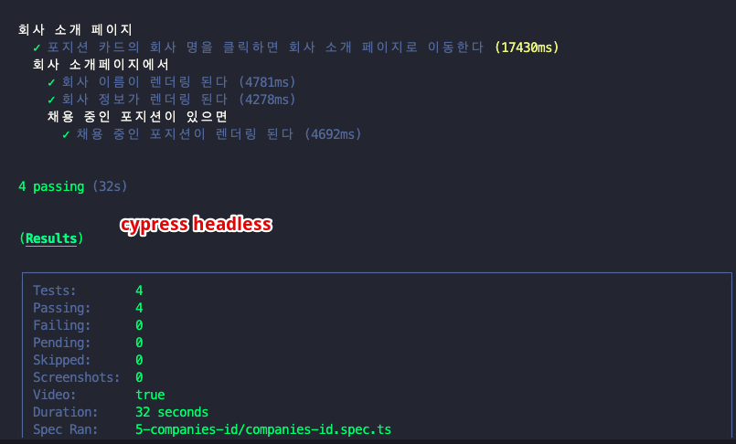
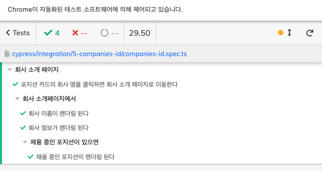
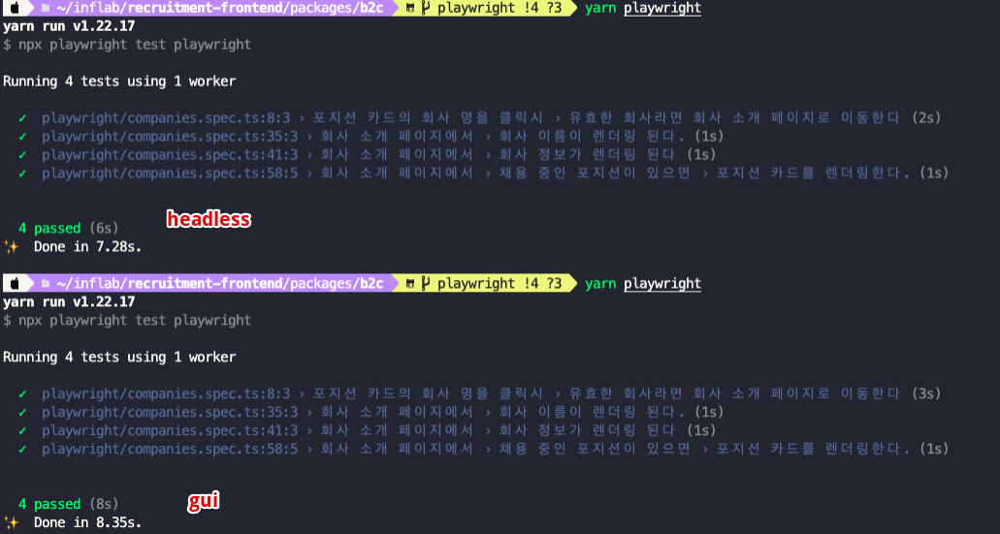

최근들어 실용적인 프론트엔드 테스트에는 e2e 테스트가 맞는 거 같다는 생각이 들지만 cypress의 끔찍하게 느린 속도는 도저히 용납이 되지 않아 고민되던 차에 마이크로소프트에서 개발하는 (정확히는 개발팀이 마이크로소프트로 들어간거지만) Playwright라는 테스트 도구를 알게 되었다. 정확히는 테스트 도구는 아니지만 어쨌든 e2e 테스트 도구로 쓸 수 있다.

여튼 주된 관심사는 어느 블로그에서 **"cypress와는 비교할 수 없을 정도로 더 빠르다"** 라고 평가된 점이었는데, Playwright는 병렬로 테스트를 수행하기 때문에 더 빠르다는 말이 진짜인지, 어느정도로 더 빠른지가 궁금했다. cypress에서는 불가능한 호버 테스트 (css hover가 아닌 javascript hover)도 가능하다는 점도 관심이 갔다.

## Cypress에서는 못 하는 것들이 Playwright에서는 될까?

일단 팀에 도입하자고 주장하려면 실험 결과라는 실체가 필요해서, 간단하게 궁금한 점들을 실험해보려고 한다.

### Q. 얼마나 더 빠를까?

playwright 문법에 익숙하지 않은데 테스트를 똑같이 다시 짜려니까 솔직히 좀 귀찮아서 아주 조금만 짜봤다. 병렬로 돌리니까 더 빠르다는 말을 확인하기 위해서는 더 많은 spec을 작성해서 비교해보는 것이 더 정확하겠지만 이건 조만간 진행할 티켓에서 해보기로...

똑같은 테스트 케이스를 cypress, playwright로 돌렸을 때의 소요 시간을 측정해보았다.

**cypress로 돌렸을 때**  
이건 headless

이건 gui

**playwright로 돌렸을 때**

왜 cypress gui가 cypress headless보다 느린건지 이해할 수 없어 신뢰하기 어려운 실험 결과가 나왔지만 그걸 감안하더라도 playwright가 cypress보다 훨씬 빠른건 맞는거 같다.

물론 vitest나 jest를 이용한 단위테스트나 통합테스트에는 비빌 수 없는 속도긴 하지만 cypress의 끔찍한 속도로부터 탈출할 수 있다면 이정도도 감지덕지가 아닐까? 최근에 cypress 테스트를 통째로 돌리다가 한 30개 넘어가면서부터 테스트가 그냥 셧다운되었는데 playwright는 안 그럴지도 확인이 필요할 거 같다.

확인되면, 위키에 추가하기로

### Q. 특정 테스트만 선택적으로 돌릴 수 있을까?

### Q. 실패한 테스트만 rerun 할 수 있을까?

### Q. javascript hover 테스트가 가능할까?

## 컴포넌트 테스트

이제 playwright에서 컴포넌트 테스트를 지원한다는 소식을 접했다.

기존에 컴포넌트 테스트는 RTL로 작성했기 때문에 cypress와 비교할 건 아니다. RTL로 작성된 테스트와 비교했을 때 속도가 더 느리지만 않는다면 e2e도 컴포넌트 테스트도 모두 playwright 하나로 해결할 수 있다는 점이 끌렸다. playwright 문법에만 익숙해지면 되니까.

그래서 아주 간단하게 동일한 컴포넌트 테스트를 RTL, playwright로 짜서 비교해보았는데 속도차이가 없었다. 다만 이 부분도 테스트가 너무 간단해서 그럴 수 있어 대규모 spec에서도 차이가 없는지 확인이 필요하다.

속도보다도 더 중요한 부분을 발견했는데, playwright의 컴포넌트 테스트가 아직 실험적 기능이다보니 아주 간단한 테스트를 작성하던 중에도 버그를 발견하는 등 불안정한 것 같단 생각이 들었다. 발견한 버그는 이슈리포팅(https://github.com/microsoft/playwright/issues/14339) 했고, 다음 버전에서 수정 예정인듯.

1. tailwind의 [] 표현 (arbitrary value)이 사용된 컴포넌트 테스트시 에러나는 점
2. React의 fragment를 인지하지 못해 에러나는 점 (div로 바꿔주어야 했음)

따라서 당장 활용은 불가능할거 같고 stable될 때까지 좀 더 지켜보기로 했다.
