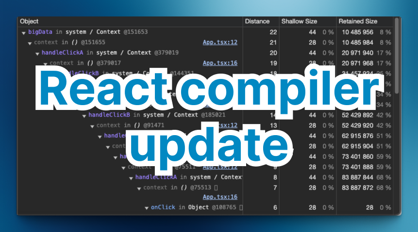

> 원문: [Sneaky React Memory Leaks: How the React compiler won't save you](https://schiener.io/2024-07-07/react-closures-compiler)



몇 주 전에 저는 리액트에서 `useCallback`이나 `useEffect` 같은 메모이제이션 훅을 사용할 때, [클로저가 어떻게 메모리 누수를 일으킬 수 있는 지에 대한 글](https://schiener.io/2024-03-03/react-closures)을 썼습니다. 이 글은 [TLDR WebDev](https://tldr.tech/webdev), https://bytes.dev/, [This Week In React](https://thisweekinreact.com/)와 같은 멋진 뉴스레터 및 X에서 주목을 받았습니다 (응원해 주셔서 감사합니다! 🙏).

당연히 많은 사람들이 제가 보여드린 메모리 누수가 새로운 리액트 컴파일러에서 어떻게 처리될지 궁금해했습니다. 리액트 팀의 답변은 아래와 같았습니다.

<blockquote class="twitter-tweet" data-dnt="true" align="center"><p lang="en" dir="ltr">the compiler will cache these values so they won&#39;t keep getting re-allocated and memory won&#39;t grow infinitely</p>&mdash; Sathya Gunasekaran (@_gsathya) <a href="https://twitter.com/_gsathya/status/1795766442786218435?ref_src=twsrc%5Etfw">May 29, 2024</a></blockquote>
<script async src="https://platform.twitter.com/widgets.js" charset="utf-8"></script>

그럴듯하게 들리죠? 하지만 언제나 그렇듯이, 그 내면에 함정이 있습니다. 이 주제에 대해 자세히 알아보고 이전 글로부터 리액트 컴파일러가 코드를 어떻게 처리하는지 살펴보겠습니다.

**바쁜 분들을 위한 TLDR**: 리액트 컴파일러는 다른 것에 의존하지 않는 값을 캐싱하므로 계속 재할당되지 않습니다. 이렇게 하면 클로저로 인한 메모리 누수를 방지할 수 있습니다. 그러나 다른 값에 의존하는 클로저로 인한 메모리 누수를 방지하지는 못합니다. 여전히 문제를 인지하고 그에 따라 코드를 작성해야 합니다.

## 요약: 클로저 그리고 메모리 누수

이전 글에서 클로저가 어떻게 리액트에서 메모리 누수로 이어질 수 있는지에 대해 설명했습니다. 요점은 다음과 같습니다.

1. 클로저는 **외부 스코프**에서 변수를 캡처합니다. 리액트 컴포넌트에서 이는 종종 상태, 프로퍼티 또는 메모이제이션된 값을 캡쳐하는 것을 의미합니다.
2. 컴포넌트의 모든 클로저는 캡처된 변수가 저장되는 **동일한 딕셔너리 스타일 객체(컨텍스트 객체)를 공유합니다.** (각 내부 클로저가 아닌, 컴포넌트당 하나의 객체)
3. 컨텍스트 객체는 컴포넌트 함수가 호출될 때 한 번 생성되며, **마지막 클로저가 가비지 컬렉터에 의해 수거될 수 있을 때까지 유지됩니다.**
4. 사용하지 않는 것부터 모든 형제 클로저로부터 **캡쳐된 각 변수가** 이 객체에 추가됩니다.
5. 클로저 중 하나를 캐시/메모이제이션하면 다른 클로저가 더 이상 사용되지 않더라도 **전체 컨텍스트 객체**가 유지됩니다.

이는 클로저 중 하나가 큰 배열과 같은 큰 객체를 참조하는 경우 특히 중요합니다. 아래 스크린샷에서 `handleClick`이 "Closure (App)" 스코프에 대해 액세스 권한을 가지고 있음을 명확하게 확인할 수 있습니다. 이 스코프에는 `logLength`에서만 사용되는 `bigData`도 포함됩니다.


또한 깊게 중첩된 `useCallback` 참조 체인과 같은 흥미로운 부수 효과가 발생할 수 있습니다. 아래에서 안타까운 방식으로 상태를 변경하면 메모이제이션된 함수의 긴 `useCallback` 체인이 어떻게 생성되는지 확인할 수 있습니다.


이것은 대체로 함수형 자바스크립트의 근본적인 '문제'이지 리액트의 문제는 아닙니다. 다만 리액트는 클로저와 메모이제이션을 많이 사용하기 때문에 이 문제가 발생할 가능성이 훨씬 더 높습니다. 설계되지 않은 언어에 함수형 프로그래밍 패러다임을 적용하는 것은 단점일 수도 있습니다. (하지만 이는 또 다른 주제입니다.)

## 리액트 컴파일러

새로운 [리액트 컴파일러](https://react.dev/learn/react-compiler)에 대해 들어보셨을 것입니다. 리액트 팀은 코드를 보다 최적화된 버전으로 바꿔줄 새로운 빌드 도구를 열심히 개발하고 있습니다. 아직 개발 중이지만 모든 메모이제이션을 컴파일러에 위임하는 것이 목표입니다. 이렇게 하면 더 이상 `useCallback`를 어디에 넣을지 고민할 필요가 없고 코드를 간결하고 가독성 있게 유지할 수 있습니다.

X에서 클로저 누수에 대해 받았던 응답을 믿어보면, 컴파일러는 "무언가"를 캐싱하여 누수를 방지할 수 있다는 얘기일 겁니다. 하지만 정확히 무엇을 캐싱하는 것일까요? 그리고 어떻게 누수를 방지할 수 있을까요? 알아봅시다.

## 누수가 발생하는 코드

아래는 이전 글의 코드인데, 'Increment A'와 'Increment B' 버튼을 번갈아 클릭하면 가비지 컬렉션이 발생하지 않는 `BigObject`가 새로 할당되는 것을 확인할 수 있습니다.

```tsx
import { useState, useCallback } from 'react';

class BigObject {
  public readonly data = new Uint8Array(1024 * 1024 * 10);
}

export const App = () => {
  const [countA, setCountA] = useState(0);
  const [countB, setCountB] = useState(0);
  const bigData = new BigObject(); // 10MB 데이터

  const handleClickA = useCallback(() => {
    setCountA(countA + 1);
  }, [countA]);

  const handleClickB = useCallback(() => {
    setCountB(countB + 1);
  }, [countB]);

  // 문제를 보여드리기 위해서만 존재합니다
  const handleClickBoth = () => {
    handleClickA();
    handleClickB();
    console.log(bigData.data.length);
  };

  return (
    <div>
      <button onClick={handleClickA}>Increment A</button>
      <button onClick={handleClickB}>Increment B</button>
      <button onClick={handleClickBoth}>Increment Both</button>
      <p>
        A: {countA}, B: {countB}
      </p>
    </div>
  );
};
```

## 리액트 컴파일러 사용 후 런타임 동작

이 코드를 리액트 컴파일러에서 실행하고 메모리 누수를 재현해 보면 메모리 사용량이 일정하게 유지되고 메모리 스냅샷에 `BigObject` 인스턴스가 하나만 할당되어 있는 것을 확인할 수 있습니다.


미래가 밝아 보이죠? 하지만 컴파일된 코드를 자세히 살펴보고 컴파일러가 무엇을 하고 있는지 살펴봅시다.

## 컴파일된 코드 자세히 보기

Vite 프로젝트에 리액트 컴파일러를 추가하고 코드를 실행해 보았습니다. 컴파일러 출력은 약간 장황하지만 관련 부분은 다음과 같습니다.

```tsx
const App = () => {
  const $ = compilerRuntimeExports.c(22);
  const [countA, setCountA] = reactExports.useState(0);
  const [countB, setCountB] = reactExports.useState(0);
  let t0;
  if ($[0] === Symbol.for('react.memo_cache_sentinel')) {
    t0 = new BigObject();
    $[0] = t0;
  } else {
    t0 = $[0];
  }
  const bigData = t0;
  // ...
};
```

훌륭한 [리액트 컴파일러 플레이그라운드](https://playground.react.dev/#N4Igzg9grgTgxgUxALhASwLYAcIwC4AEwBUYCAyngIZ4IA0JZAwlQDasBGVcA1gQL4EAZjAgYCAHRAwE3PFIDcEgHYq4rKmDAEAQmgDmAeQ4ArBHELAVBAligdWaOARlUAJhGWsAngTc0qAgBeAmUEAHcCAFU0ZTwADgBBGBgqbwAKAEYABgAmABYCACoCHILi0uyASiVlfhUVBAAPHHxhKGULNE8CRKwsdKqiawI4TzBCAG0xjrxEhjI8Jmg4xIBdYMYKalp06tqbMeUJgmmVvB0FhCXznQ2Q0m2aBD2akaOTjgMAEQDNsMieiMpnMeEGCgIAHpIZUALI6AgQIR+AINZSHcaEAAWVGUblYCCYjl4iU2jxY7C4vHSg2CAD5huibARFstZol0jNVgQANSlN5M-gMM7stYC96Ygg4vEEolOHgIh7MNicbg8GlDIIMqxMmys26c268-kHATCrkXMW1EbQggAFSxaG0nh8BGaTrw2jwED8CAwmNStAIeCxCFsogcfolx2xuPxhOJCogIc2tK1jOZUrjssTHIFmel8blvB04JGGOOEAJADpWBB9OkvvpftRq-5WwTlPoQ-mBNamTI8LB0elywQADxuNAANzpY5s444UDw3vRnmLPCCwELOfliX4dIAkp0ZBgEHFeuPIUuV5457rmYvl6vEcoN1udwn5ToD8e4Kfz0IHQrxvVd70zBdQJ6ddEw-bMvxLZMsV-E8-UA3QkJA5873nCcsHAiCbESZAiAtfcGB0EjgAtH9cKvfCxyvKdZxGAV+AUEB+CAA)에서 전체 출력을 확인하실 수도 있습니다.

컴파일러는 메모이제이션된 값을 캐시하는 데 사용되는 새로운 변수 `$`를 추가했습니다. 또한 캐시된 값을 무효화하는 참조 검사를 `if()`에 인라인 처리했습니다. 이것이 바로 의존성 배열의 백그라운드에서 일어난 일입니다.

이제 `BigObject`가 한 번만 생성되어 캐시에 저장됩니다. 이렇게 하면 컴포넌트를 렌더링할 때마다 `BigObject`가 더 이상 생성되지 않으므로 메모리 누수를 방지할 수 있습니다.

`BigObject`는 상태나 프로퍼티에 대한 종속성이 없으므로 컴파일러는 안전하게 캐싱할 수 있다고 가정합니다. 이는 원본 코드에서 `const bigData = useMemo(() => new BigObject(), [])`를 작성하는 것과 동일합니다.

> 💡 이것은 리액트에서 _순수 컴포넌트_ 를 작성하는 것이 중요한 이유를 보여줍니다. 각 렌더링은 동일한 프로퍼티와 상태가 주어졌을 때 동일한 출력을 생성해야 합니다. 제 예시에서는 렌더링할 때마다 새로운 `BigObject`를 생성하여 이 규칙을 위반했고, 이 새로운 인스턴스에 의존하여 메모리 누수를 보여주었습니다.

이것이 Sathya가 X에서 응답한 내용입니다. 리액트 컴파일러는 _다른 어느 것에도 의존하지 않는 값_ 을 캐싱하므로 계속 재할당되지 않습니다. 안타깝게도 이렇게 해도 문제는 해결되지 않고 제 예제가 더 이상 작동하지 않는다는 것을 보여줄 뿐입니다. 크롬 개발자 도구에서 가장 긴 거리를 가진 리테이너(retainer)를 보면 쉽게 확인할 수 있습니다.


## 코드를 변경하여 누수를 다시 발생시켜 보기

이제 리액트 컴파일러가 어떻게 작동하는지 이해했으니 코드를 쉽게 변경하는 것으로 사랑스러운 메모리 누수를 다시 발생시킬 수 있습니다.

```tsx
import { useState, useCallback } from 'react';

class BigObject {
  constructor(public state: string) {}
  public readonly data = new Uint8Array(1024 * 1024 * 10);
}

export const App = () => {
  const [countA, setCountA] = useState(0);
  const [countB, setCountB] = useState(0);
  const bigData = new BigObject(`${countA}/${countB}`); // 10MB 데이터

  // 나머지 코드는 동일합니다
  // ...
};
```

이제 `countA`와 `countB` 상태를 `BigObject` 생성자에 전달하면 각 상태 변경에 대해 새 인스턴스가 생성됩니다. 덧붙여서, 이것은 우리가 경험했던 원래 프로덕션 문제와도(첫 번째 글의 발단이 된) 조금 더 가깝습니다.

이제 컴파일된 결과를 확인하면 `countA` 및 `countB` 상태에 대한 종속성을 확인할 수 있습니다.

```tsx
const App = () => {
  const $ = compilerRuntimeExports.c(24);
  const [countA, setCountA] = reactExports.useState(0);
  const [countB, setCountB] = reactExports.useState(0);
  const t0 = `${countA}/${countB}`;
  let t1;
  if ($[0] !== t0) {
    t1 = new BigObject(t0);
    $[0] = t0;
    $[1] = t1;
  } else {
    t1 = $[1];
  }
  const bigData = t1;
  // ...
};
```

그리고 메모리 누수가 다시 발생했습니다. 이제 렌더링할 때마다 `BigObject`가 생성되며 가비지 컬렉터에 의해 수거되지 않습니다. 버튼을 클릭할 때마다 메모리 사용량이 증가합니다.


## 모든 메모이제이션을 제거하면 어떨까요?

프로덕션에서 이 문제에 직면했을 때, `handleClickBoth` 함수에서 볼 수 있는 이러한 상호 참조 클로저를 방지하기 위해 많은 메모이제이션을 제거했습니다. 이 함수는 다른 두 핸들러를 참조하기 때문에 메모이제이션된 값이 실제로는 효과가 없으며, 변경 사항을 추론하기가 훨씬 더 어려워집니다.

이제 리액트 컴파일러를 사용하면 이 책임을 도구에 위임하기 때문에 더욱 주의해야 합니다. 아래 코드에는 메모이제이션이 전혀 없습니다.

```tsx
import { useState } from 'react';

class BigObject {
  constructor(public state: string) {}
  public readonly data = new Uint8Array(1024 * 1024 * 10);
}

export const App = () => {
  const [countA, setCountA] = useState(0);
  const [countB, setCountB] = useState(0);
  const bigData = new BigObject(`${countA}/${countB}`); // 10MB 데이터

  const handleClickA = () => {
    setCountA(countA + 1);
  };

  const handleClickB = () => {
    setCountB(countB + 1);
  };

  // 문제를 보여드리기 위해서만 존재합니다
  const handleClickBoth = () => {
    handleClickA();
    handleClickB();
    console.log(bigData.data.length);
  };

  return (
    <div>
      <button onClick={handleClickA}>Increment A</button>
      <button onClick={handleClickB}>Increment B</button>
      <button onClick={handleClickBoth}>Increment Both</button>
      <p>
        A: {countA}, B: {countB}
      </p>
    </div>
  );
};
```

하지만 메모리 누수는 컴파일러의 메모이제이션 마법에 의해 다시 추가됩니다. 컴파일러가 기본값이 된 후 리액트를 처음 사용하는 개발자라면 이 문제를 인식하고 디버깅하고 수정하기가 매우 어려울 수 있습니다.


## `bind(null, x)`를 사용한 실험적 해결 방법

이전 글에 대한 일부 댓글에서 영감을 받아 이 문제에 대한 접근 방식 하나를 생각해냈습니다. 클로저를 완전히 우회하는 것입니다. 대신 `bind`를 사용하여 필수 값을 함수에 직접 전달해 볼 수 있습니다. `bind`를 사용하면 모든 클로저 간에 공유되는 컨텍스트 객체에 의존할 필요가 없습니다. 이 접근 방식은 좀 더 장황하지만 이러한 종류의 과도한 클로저를 방지하는 좋은 방법일 수 있습니다. DX도 타입스크립트 추론과 함께라면 그렇게 나쁘지 않습니다.

```tsx
import { useState } from 'react';

class BigObject {
  constructor(public state: string) {}
  public readonly data = new Uint8Array(1024 * 1024 * 10);
}

// 클로저를 제거하기 위한 제네릭 binNull 함수
// DX를 향상하기 위한 타입스크립트 추론
function bindNull<U extends unknown[]>(f: (args: U) => void, x: U): () => void {
  return f.bind(null, x);
}

export const App = () => {
  const [countA, setCountA] = useState(0);
  const [countB, setCountB] = useState(0);
  const bigData = new BigObject(`${countA}/${countB}`); // 10MB 데이터

  const handleClickA = bindNull(
    ([count, setCount]) => {
      setCount(count + 1);
    },
    [countA, setCountA] as const
  );

  const handleClickB = bindNull(
    ([count, setCount]) => {
      setCount(count + 1);
    },
    [countB, setCountB] as const
  );

  const handleClickBoth = bindNull(
    ([countA, setCountA, countB, setCountB]) => {
      setCountA(countA + 1);
      setCountB(countB + 1);
      console.log(bigData.data.length);
    },
    [countA, setCountA, countB, setCountB] as const
  );

  return (
    <div>
      <button onClick={handleClickA}>Increment A</button>
      <button onClick={handleClickB}>Increment B</button>
      <button onClick={handleClickBoth}>Increment Both</button>
      <p>
        A: {countA}, B: {countB}
      </p>
    </div>
  );
};
```

이 코드는 메모리 누수가 없고 리액트 컴파일러에서 예상대로 작동합니다. 의도하지 않은 다른 부수 효과가 없을 거라고 확신할 수는 없지만, 문제에 대한 흥미로운 접근 방식이며 생각할 만한 가치가 있습니다. (면책 조항: 저는 `bind`와 그 의미에 대한 전문가는 아닙니다.)

## 결론

리액트 컴파일러는 아마도 98%의 코드베이스의 성능을 향상하고 읽기 쉽게 만들어줄 훌륭한 도구입니다. 나머지 2%의 경우에는 충분하지 않을 수도 있고 코드를 추론하기가 더 어려워질 수도 있습니다.

한 가지 확실한 것은 컴파일러가 클로저로 인한 메모리 누수로부터 여러분을 구해주지 못한다는 것입니다. 제 생각에 이것은 자바스크립트와 함수형 프로그래밍 패러다임의 근본적인 문제입니다. 자바스크립트(적어도 V8)의 클로저는 세분화된 메모리 최적화를 위해 설계되지 않았습니다. 컴포넌트를 빠르게 마운트/언마운트하거나 적은 양의 데이터를 처리하는 경우에는 괜찮지만, 데이터 종속성이 크고 수명이 긴 컴포넌트가 있는 경우에는 문제가 될 수 있습니다.

앞으로의 아이디어는 위의 `bind` 예제에서처럼 클로저의 종속성을 명시하는 방향으로 나아갈 수 있습니다. 어쩌면 이 작업을 훨씬 덜 장황하고 편리하게 만드는 똑똑한 래퍼를 볼 수 있을지도 모릅니다. 하지만 지금은 이 문제를 인식하고 항상 그렇듯이 다음과 같은 모범 사례를 염두에 두어야 합니다.

1. 작은 컴포넌트 작성
2. 순수 컴포넌트 작성
3. 사용자 정의 함수/훅 작성
4. 메모리 프로파일러 사용

이 글을 통해 리액트 컴파일러와 메모리 누수를 처리하는 방법에 대한 통찰력을 얻으셨기를 바랍니다. 질문이나 피드백이 있으시면 언제든지 X 또는 LinkedIn으로 저에게 연락하거나 아래에 댓글을 남겨주세요. 읽어주셔서 감사합니다! 🚀

> 🚀 한국어로 된 프런트엔드 아티클을 빠르게 받아보고 싶다면 [Korean FE Article](https://kofearticle.substack.com/)을 구독해주세요!
