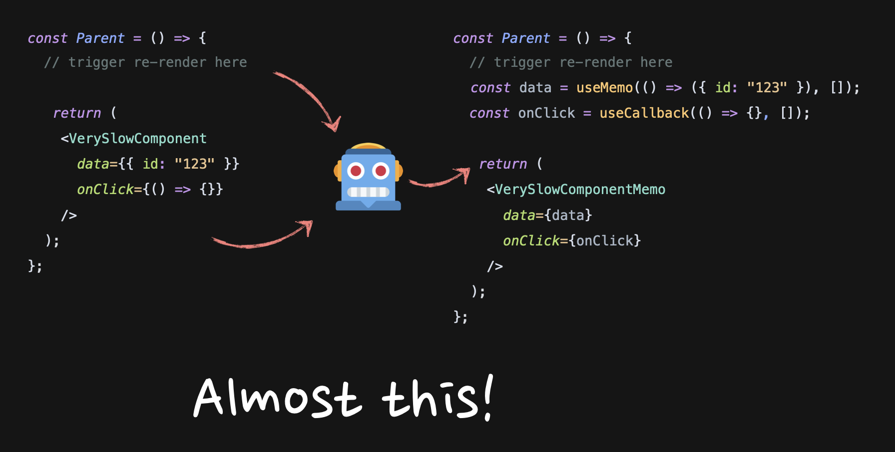
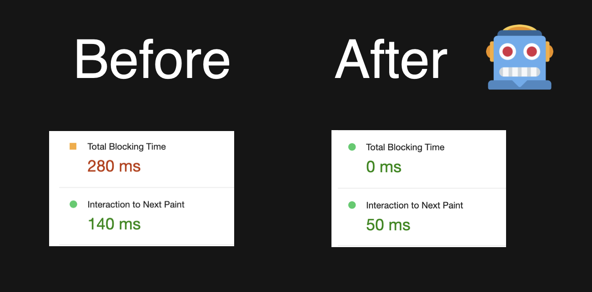

> [원문: How React Compiler Performs on Real Code](https://www.developerway.com/posts/how-react-compiler-performs-on-real-code)

리액트 컴파일러가 초기 로드 및 인터랙션 성능에 미치는 영향을 수치와 함께 살펴봅니다. 이 글에서 사용된 수치는 실제 앱에서 측정되었습니다.

[유튜브: How React Compiler Performs On Real Code](https://www.youtube.com/watch?v=T-rHmWSZajc)


이 글은 제가 "React Advanced" 컨퍼런스에서 발표한 내용을 기반으로 구성되었습니다. 글보다 영상을 선호하신다면 [How React Compiler Performs On React Code](https://www.youtube.com/watch?v=T-rHmWSZajc)을 확인해 보세요.

---

지난 몇 년 동안 리액트 커뮤니티에서 가장 큰 흥분과 기대를 불러일으킨 것 중 하나는 리액트 컴파일러(이전의 리액트 Forget)로 알려진 도구였습니다. 그럴 만한 이유가 있습니다. 컴파일러의 핵심 전제는 리액트 앱의 전반적인 성능을 향상시킬 수 있다는 것입니다. 또 다른 긍정적인 결과로는 리렌더링, 메모이제이션, 그리고 `useMemo` 및 `useCallback` 훅에 대해 더 이상 신경 쓰지 않아도 된다는 점이 있습니다.

하지만 애초에 리액트의 성능에는 어떤 문제가 있었을까요? 그리고 왜 많은 개발자들이 필사적으로 메모이제이션과 그 훅들을 잊고 싶어할까요? 이 약속은 얼마나 현실적일까요?

이 글에서는 이러한 질문에 답해보려 합니다. 컴파일러가 해결하려는 문제, 컴파일러 없이 어떻게 해결되는지, 실제 코드에서 컴파일러가 어떻게 작동하는지를 요약합니다. 이를 위해 제가 한동안 작업해 온 앱에 컴파일러를 적용해 성능을 측정해 보았습니다.

## 리액트의 리렌더링과 메모이제이션 문제

우선, 정확히 어떤 문제가 있는지 살펴봅시다.

대부분의 리액트 앱은 사용자에게 상호작용 UI(사용자 인터페이스)를 표시하도록 작성되었습니다. 사용자가 UI와 상호작용할 때, 우리는 보통 그 상호작용에서 파생된 새로운 정보로 페이지를 업데이트하고 싶어 합니다. 리액트에서는 이를 위해 *리렌더*를 호출합니다.


리액트의 리렌더링은 일반적으로 *연쇄적*입니다. 컴포넌트의 리렌더링이 트리거될 때마다 내부에 중첩된 모든 컴포넌트의 리렌더링이 트리거되고, 이는 다시 내부의 모든 컴포넌트의 리렌더링을 트리거하는 식으로 리액트 컴포넌트 트리의 끝에 도달할 때까지 반복됩니다.


일반적으로 요즘 리액트는 충분히 빠르기 때문에 이 과정을 크게 걱정하지 않아도 됩니다. 그러나 이러한 다운스트림 리렌더링이 일부 무거운 컴포넌트나 너무 자주 리렌더링되는 컴포넌트에 영향을 미치는 경우 성능 문제가 발생할 수 있습니다. 앱이 느려지기 때문입니다.


이 속도 저하를 해결하는 한 가지 방법은 리렌더링의 연쇄적인 발생을 막는 것입니다.


[상태를 하위로 이동시키기](https://www.developerway.com/posts/react-re-renders-guide#part3.2), [컴포넌트를 prop으로 전달하기](https://www.developerway.com/posts/react-re-renders-guide#part3.3), 컨텍스트로 상태를 추출하여 prop drilling을 우회하는 솔루션 등 여러 가지 기법이 준비되어 있습니다. 물론 메모이제이션도 마찬가지입니다.

메모이제이션은 리액트 팀에서 제공한 고차 컴포넌트인 [React.memo](https://react.dev/reference/react/memo)로 시작됩니다. 이를 작동시키기 위해서는 원래 컴포넌트를 이 컴포넌트로 감싸고 그 자리에 "메모이제이션된" 컴포넌트를 렌더링하기만 하면 됩니다.

```tsx
// 느린 컴포넌트를 메모합니다.
const VerySlowComponentMemo = React.memo(VerySlowComponent);

const Parent = () => {
  // 어디선가 리렌더를 트리거 합니다.

  // 원래의 컴포넌트 대신 메모된 컴포넌트를 렌더링합니다.
  return <VerySlowComponentMemo />;
};
```

이제 리액트가 트리에서 이 컴포넌트에 도달하면 멈춰서 프로퍼티(props)가 변경되었는지 확인합니다. 만약 프로퍼티가 변경되지 않았다면 리렌더링이 중단됩니다. 그러나 단 하나의 프로퍼티라도 변경되면, 리액트는 메모이제이션이 발생하지 않았던 것처럼 리렌더링을 계속합니다.

즉, 메모가 제대로 작동하려면 리렌더링 사이에 모든 프로퍼티가 _정확히_ 동일하게 유지되도록 해야 합니다.

문자열이나 부울과 같은 원시 값의 경우 간단합니다. 값을 변경하지 않는 것 외에는 다른 작업을 할 필요가 없습니다.

```tsx
const VerySlowComponentMemo = React.memo(VerySlowComponent);

const Parent = () => {
  // 어디선가 리렌더를 트리거 합니다.

  // "data" 문자열은 리렌더링하더라도 동일합니다.
  // 그러므로 메모이제이션은 기대한대로 동작할 것입니다.
  return <VerySlowComponentMemo data='123' />;
};
```

그러나 객체, 배열 및 함수와 같은 비원시값은 약간의 도움이 필요합니다.

리액트는 리렌더링 간에 참조 [동등성](https://developer.mozilla.org/en-US/docs/Web/JavaScript/Equality_comparisons_and_sameness)(referential equality)을 사용해 변경 여부를 확인합니다. 컴포넌트 내부에서 이러한 비원시값을 선언하면 리렌더링할 때마다 다시 생성되고 참조가 변경되며 메모이제이션이 작동하지 않습니다.

```tsx
const VerySlowComponentMemo = React.memo(VerySlowComponent);

const Parent = () => {
  // 어디선가 리렌더를 트리거 합니다.

  // "data" 객체는 모든 리렌더링 때마다 다시 생성될 것입니다.
  // 메모이제이션이 깨지게 됩니다.
  return <VerySlowComponentMemo data={{ id: '123' }} />;
};
```

이 문제를 해결하기 위해 `useMemo와` `useCallback` 두 가지 훅을 사용합니다. 이 두 훅은 리렌더링 간에 참조를 유지해줍니다. `useMemo`는 보통 객체나 배열과 함께 사용되며, `useCallback`은 함수와 함께 사용됩니다. 이러한 훅으로 프로퍼티를 감싸는 것을 일반적으로 "프로퍼티 메모하기"라고 합니다.

```tsx
const Parent = () => {
  // { id:"123" } 객체의 참조가 지금은 보존됩니다.
  const data = useMemo(() => ({ id: '123' }), []);
  // 함수에 대한 참조가 지금은 보존됩니다.
  const onClick = useCallback(() => {}, []);

  // 여기의 props는 더 이상 리렌더링 사이에서 변경되지 않습니다.
  // 메모이제이션이 정확하게 동작할 것입니다.
  return <VerySlowComponentMemo data={data} onClick={onClick} />;
};
```

이제 리액트가 렌더 트리에서 `VerySlowComponentMemo` 컴포넌트를 만나면 프로퍼티가 변경되었는지 확인하고 아무것도 변경되지 않았음을 알게 되므로 리렌더링을 건너뜁니다. 앱은 더 이상 느리지 않습니다.

이것은 매우 단순화된 설명이지만 이미 상당히 복잡합니다. 상황을 더 악화시키는 것은 메모한 프로퍼티를 연쇄적인 컴포넌트로 전달하는 경우입니다. 이 경우 더욱 복잡해집니다. 프로퍼티를 변경하려면 중간에 참조가 손실되지 않았는지 확인하기 위해 앞뒤로 추적해야 하기 때문입니다.

따라서 아예 메모하지 않거나 만일을 대비해 모든 곳에서 메모해 두는 것이 더 쉽습니다. 하지만 이렇게 하면 아름다웠던 코드가 `useMemo`와 `useCallback`으로 뒤덮여 이해하기 어려운 엉망진창이 되어버립니다.


이 상황을 해결하는 것이 리액트 컴파일러의 주요 관심사입니다.

## 구원자 리액트 컴파일러 🚀

[리액트 컴파일러](https://react.dev/learn/react-compiler)는 리액트 코어 팀에서 개발한 바벨 플러그인으로, 2024년 10월에 [베타 버전](https://react.dev/blog/2024/10/21/react-compiler-beta-release)이 출시되었습니다.

빌드하는 동안 "일반적인" 리액트 코드를 컴포넌트, 프로퍼티, 그리고 훅의 의존성이 기본적으로 메모이제이션 되어있는 코드로 변환하려고 시도합니다. 최종 결과는 모든 것이 `memo`, `useMemo`, `useCallback`으로 감싸진 것처럼 동작하는 "일반적인" 리액트 코드가 됩니다.



거의 다 끝났습니다! 실제로는 훨씬 더 복잡한 변환을 수행하며 가능한 한 효율적으로 코드에 맞게 조정됩니다. 예를 들어 다음과 같은 경우입니다.

```tsx
function Parent() {
  const data = { id: '123' };
  const onClick = () => {};

  return <Component onClick={onClick} data={data} />;
}
```

이 코드는 이렇게 변환됩니다.

```tsx
function Parent() {
  const $ = _c(1);
  let t0;
  if ($[0] === Symbol.for('react.memo_cache_sentinel')) {
    const data = {
      id: '123',
    };
    const onClick = _temp;
    t0 = <Component onClick={onClick} data={data} />;
    $[0] = t0;
  } else {
    t0 = $[0];
  }
  return t0;
}
function _temp() {}
```

`onClick`이 `_temp` 변수로 캐시되지만 `data`는 `if`문 안으로 이동하는 것을 볼 수 있습니다. [컴파일러 플레이그라운드](https://playground.react.dev/#N4Igzg9grgTgxgUxALhAMygOzgFwJYSYAEACgIYwKY4AUAlEcADqYtFFyFg5EAmZOMkQC8jInl7IiTEAEYATAGYZRAL4BuFmw5cehAMIAbPHADWIovREA+Rto1biRSjljEAPPogBbAA6EqPUwjE1NhYANjM1U+ATJw-kEYgHprFlUWEFUgA)에서 컴파일러를 좀 더 사용해 볼 수 있습니다.

작동 원리는 매우 흥미롭기 때문에 더 자세히 알고 싶다면 [컴파일러 심층 분석과 같은 리액트 코어 팀의 동영상](https://www.youtube.com/watch?v=0ckOUBiuxVY&t=9309s&ab_channel=ReactConf)도 있습니다.

하지만 이 글에서는 리액트 컴파일러에 대한 기대가 현실과 일치하는지, 저같은 일반 사용자가 사용할 준비가 되어 있는지에 더 관심이 있습니다.

"컴파일러가 모든 것을 메모이제이션한다"는 말을 들으면 대부분의 사람들은 아래 질문들을 떠올릴 겁니다.

- **초기 로드 성능은 어떨까요?** "모든 것을 기본적으로 메모이제이션하는 것"에 반대하는 주요 주장 중 하나는 모든 것이 메모이제이션되면 리액트가 훨씬 더 많은 작업을 미리 해야 하기 때문에 초기 로드 성능에 부정적인 영향을 미칠 수 있다는 것입니다.

- **성능에 긍정적인 영향을 미칠까요?** 리렌더링은 정말 그렇게 큰 문제일까요?

- **정말 모든 리렌더링을 잡아낼 수 있을까요?** 자바스크립트는 유동적이고 모호한 것으로 악명이 높습니다. 컴파일러는 정말 모든 것을 잡아낼 만큼 똑똑할까요? 다시는 메모이제이션나 리렌더링에 대해 고민할 필요가 없다는 것이 사실일까요?

이 질문에 답하기 위해 몇 가지 예제에서 컴파일러를 실행해 실제로 작동하는지 확인하고, 작업 중인 앱의 몇몇 페이지에서 실행해 보았습니다.

## 리액트 컴파일러를 간단한 예제에 적용해보기

**첫번째 예제**는 다음과 같습니다.

```tsx
const SimpleCase = () => {
  const [isOpen, setIsOpen] = useState(false);

  return (
    <div>
      <button onClick={() => setIsOpen(!isOpen)}>toggle</button>
      {isOpen && <Dialog />}
      <VerySlowComponent />
    </div>
  );
};
```

대화 상자, 이 대화 상자에 대한 상태, 대화 상자를 열 수 있는 버튼, 그 아래 어딘가에 `VerySlowComponent`가 있는 컴포넌트가 있습니다. 리렌더링하는 데 500ms가 걸린다고 가정해 봅시다.

일반적인 리액트 동작은 상태가 변경될 때 모든 것을 다시 렌더링하는 것입니다. 결과적으로 느린 컴포넌트로 인해 대화 상자가 느리게 열릴 것입니다. 메모이제이션을 사용하여 문제를 해결하려면 느린 컴포넌트를를 `memo`로 감싸야 합니다.

```tsx
const VerySlowComponentMemo = React.memo(VerySlowComponent);

const SimpleCase = () => {
  const [isOpen, setIsOpen] = useState(false);

  return (
    <div>
      <button onClick={() => setIsOpen(!isOpen)}>toggle</button>
      {isOpen && <Dialog />}
      <VerySlowComponentMemo />
    </div>
  );
};
```

대신 코드에 대해 컴파일러를 활성화해 보겠습니다. 우선, 리액트 개발자 도구에서 다음과 같은 것을 확인할 수 있습니다.


즉, `Button`와 `VerySlowComponent`가 컴파일러에 의해 메모이제이션되었음을 의미합니다. 그리고 `VerySlowComponent` 내부에 `console.log`를 추가하면, 상태를 변경해도 실행되지 않습니다. 이는 메모이제이션이 실제로 작동하고 있으며, 성능 문제가 해결되었음을 의미합니다. 대화창을 트리거할 때 지연 없이 팝업됩니다.


**두 번째 예시**에서는 느린 컴포넌트에 더 많은 프로퍼티를 추가했습니다.

```tsx
const SimpleCase = () => {
  const [isOpen, setIsOpen] = useState(false);

  return (
    <div>
      <button onClick={() => setIsOpen(!isOpen)}>toggle</button>
      {isOpen && <Dialog />}
      // "data"와 "onClick" props를 전달합니다.
      <VerySlowComponent data={{ id: '123' }} onClick={() => {}} />
    </div>
  );
};
```

수동으로는 `memo`, `useMemo`, `useCallback` 세 가지 도구를 모두 사용하여 메모해야 합니다.

```tsx
const SimpleCase = () => {
  const [isOpen, setIsOpen] = useState(false);
  const data = useMemo(() => ({ id: '123' }), []);
  const onClick = useCallback(() => {}, []);

  return (
    <div>
      <button onClick={() => setIsOpen(!isOpen)}>toggle</button>
      {isOpen && <Dialog />}
      <VerySlowComponentMemo data={data} onClick={onClick} />
    </div>
  );
};
```

컴파일러는 여기서도 완벽하게 작동했으며 결과는 첫 번째 예제와 동일했습니다. 모든 것이 정확하게 메모되고 `Dialog`가 지연 없이 열립니다.

**세 번째 예제**에서는 다음과 같이 느린 컴포넌트에 다른 컴포넌트를 자식으로 전달했습니다.

```tsx
const SimpleCase = () => {
  const [isOpen, setIsOpen] = useState(false);

  return (
    <div>
      <button onClick={() => setIsOpen(!isOpen)}>toggle</button>
      {isOpen && <Dialog />}

      <!-- Acceps Child now -->
      <VerySlowComponent>
        <Child />
      </VerySlowComponent>
    </div>
  );
};
```

이 코드를 메모하는 방법을 바로 떠올릴 수 있나요?  
대부분의 사람들은 다음과 같이 생각할 것입니다.

```tsx
const VerySlowComponentMemo = React.memo(VerySlowComponent);
const ChildMemo = React.memo(Child);

const SimpleCase = () => {
  return (
    <div>
      ...
      <VerySlowComponentMemo>
        <ChildMemo />
      </VerySlowComponentMemo>
    </div>
  );
};
```

안타깝게도 이는 잘못된 방법입니다. 이 트리 형태의 구문은 단순히 `children` 프로퍼티를 위한 문법적 설탕에 불과합니다. 위의 코드는 아래와 같이 쉽게 재작성될 수 있습니다.

```tsx
const VerySlowComponentMemo = React.memo(VerySlowComponent);
const ChildMemo = React.memo(Child);

const SimpleCase = () => {
  return (
    <div>
      ...
      <VerySlowComponentMemo children={<ChildMemo />} />
    </div>
  );
};
```

또한, 여기서 `<ChildMemo />`는 `React.createElement` 함수 호출의 결과로 생성된 요소에 대한 문법적 설탕에 불과합니다. 이는 `type` 속성이 `ChildMemo` 함수를 가리키는 객체입니다.

```tsx
const VerySlowComponentMemo = React.memo(VerySlowComponent);
const ChildMemo = React.memo(Child);

const SimpleCase = () => {
  return (
    <div>
      ...
      <VerySlowComponentMemo children={{ type: ChildMemo }} />
    </div>
  );
};
```

안타깝게도 여기서 우리가 직면한 문제는, 메모이제이션된 컴포넌트에 메모이제이션되지 않은 객체가 프로퍼티로 전달된다는 점입니다. 메모이제이션은 작동하지 않으며, 상태가 변경될 때마다 `VerySlowComponentMemo`가 다시 렌더링됩니다.

이 예제를 메모이제이션하는 올바른 방법은 다른 객체와 동일하게 처리하는 것입니다.

```tsx
const VerySlowComponentMemo = React.memo(VerySlowComponent);
const ChildMemo = React.memo(Child);

const SimpleCase1 = () => {
  const children = useMemo(() => <ChildMemo />, []);

  return (
    <div>
      ...
      <VerySlowComponentMemo>{children}</VerySlowComponentMemo>
    </div>
  );
};
```

메모이제이션되지 않은 세 번째 예제에서 컴파일러를 활성화한 결과는 이전과 정확히 동일했습니다. 컴파일러는 이를 올바르게 메모이제이션했고, 성능 문제가 해결되었습니다.

현재까지 컴파일러는 3전 3승입니다. 🏆🏆🏆

하지만 이런 작은 예제는 "쉽습니다." 컴파일러를 제대로 테스트하기 위해 한동안 작업해 온 [실제 앱](https://www.buckets-ui.com/)에서 실행해 보았습니다.

## 실제 앱에서의 리액트 컴파일러

이 앱은 완전히 새롭게 만들어졌으며, 타입스크립트로 작성되어 있고, 레거시 코드가 전혀 없으며, 오직 훅만 사용됩니다. 그리고 모든 것이 (대체로) 최신의 모범 사례를 따릅니다. 랜딩 페이지와 몇 개의 내부 페이지가 있으며, 전체 코드는 약 15,000줄입니다. 아주 큰 앱은 아니지만 제대로 테스트하기에 충분하다고 생각합니다.

컴파일러를 활성화하기 전에 리액트 팀에서 제공한 [헬스 체크 및 eslint](https://react.dev/learn/react-compiler)를 실행했습니다. 다음은 헬스 체크 결과입니다.

```
Successfully compiled 361 out of 363 components.

Found no usage of incompatible libraries.
```

그리고 ESLint 규칙 위반은 0건이었습니다.

[Lighthouse](https://developer.chrome.com/docs/lighthouse/overview)를 사용해 초기 로드 및 상호작용 성능을 측정했습니다. 모든 측정은 프로덕션 빌드 상태에서 모바일 모드로 CPU를 4배 느리게 한 상태에서 수행되었습니다. 모든 테스트는 5회 반복한 후 평균 값을 추출했습니다.

이제 질문에 답할 시간입니다.

## 초기 로드 성능과 리액트 컴파일러

가장 먼저 측정한 페이지는 앱의 "랜딩" 페이지였습니다. 컴파일러 활성화 전의 통계는 다음과 같습니다.


컴파일러를 활성화하고 작동하는지 확인합니다.


그리고 결과를 측정합니다.


첫 번째 이미지는 활성화 전이고, 두 번째 이미지는 활성화 후입니다. 보시다시피 결과는 거의 동일합니다.

확실히 하기 위해 몇 페이지에서 더 실행해 보았는데 결과는 거의 동일했습니다. 일부 수치는 약간 증가했고 일부는 감소했습니다. 큰 변화는 없었습니다.

컴파일러에 또 하나의 승리를 추가할 수 있을 것 같습니다(🏆🏆🏆🏆). 제가 조사한 첫 번째 질문에 대한 답은, **컴파일러는 초기 로드에 거의 영향을 미치지 않거나 전혀 영향을 미치지 않는다는 것**입니다. 따라서, 이는 좋은 소식입니다. 모든 것을 메모이제이션하더라도 상황이 나빠지지 않습니다.

## 상호작용 성능과 리액트 컴파일러

### 첫 페이지 측정하기

상호작용 성능을 측정하기 위해 '컴포넌트' 페이지부터 시작했습니다. 이 페이지에서는 제가 작업 중인 UI 컴포넌트 라이브러리의 리액트 컴포넌트 미리보기를 보여주고 있습니다. 미리보기는 버튼부터 전체 페이지까지 무엇이든 될 수 있습니다. 저는 '설정' 페이지의 미리 보기를 측정했습니다.

미리보기 페이지에는 '라이트' 및 '다크' 모드 토글이 있습니다. 아래에서 볼 수 있듯이 모드를 전환하면 미리보기가 다시 렌더링되며 녹색 선이 이를 나타냅니다.


컴파일러를 사용하기 전과 후의 상호 작용 성능은 다음과 같습니다.



컴파일러를 활성화하면 총 blocking 시간이 280ms에서 말 그대로 0으로 감소했습니다!

이것은 매우 인상적입니다. 하지만 궁금한 점도 생겼습니다. 정확히 어떻게 이런 일이 발생했을까요? 제가 코드에서 무엇을 잘못했을까요?

이 페이지의 코드는 다음과 같습니다.

```tsx
export default function Preview() {
  const renderCode = useRenderCode();
  const darkMode = useDarkMode();

  return (
    <div
      className={merge(
        darkMode === 'dark' ? 'dark bg-buGray900' : 'bg-buGray25'
      )}
    >
      <LiveProvider code={renderCode.trim()} language='tsx'>
        <LivePreview />
      </LiveProvider>
    </div>
  );
}
```

`LiveProvider` 블록은 문자열로 전달된 전체 "설정" 컴포넌트를 렌더링하는 부분입니다. 이는 처음에 다뤘던 간단한 예제 중 하나와 매우 유사합니다. 몇 개의 프로퍼티를 가진 매우 느린 컴포넌트(`LiveProvider`)입니다.

컴파일러가 이를 감지한 것은 매우 흥미로웠습니다. 하지만 약간 속임수 같기도 했습니다. 😅 더 일반적인 시나리오는 크고 작은 컴포넌트들이 여기저기에 존재하는 경우일 것입니다. 그래서 좀 더 현실적인 페이지를 측정해 보았습니다.

### 두 번째 페이지 측정

다음 페이지에서는 헤더, 푸터, 그리고 그 사이에 카드 목록이 있습니다. 헤더에는 버튼, 입력 필드, 체크박스와 같은 몇 개의 "빠른 필터"가 있습니다. 버튼을 선택하면 버튼이 포함된 모든 카드 목록이 나타납니다. 체크박스를 활성화하면 체크박스가 포함된 카드가 목록에 추가됩니다.

메모이제이션하지 않으면 매우 긴 카드 목록을 포함한 전체 페이지가 다시 렌더링됩니다.


체크박스 카드를 기존 목록에 추가하는 동작의 성능은 컴파일러 활성화 전후 다음과 같습니다.


blocking 시간이 130ms에서 90ms로 감소했습니다. 여전히 꽤 괜찮고, 훨씬 더 현실적입니다! 하지만 해당 페이지의 모든 리렌더링이 제거되었다면, 수치는 훨씬 더 많이 감소할 것으로 예상했습니다. 기존 목록에 몇 개의 카드만 추가하는 것은 거의 즉각적으로 이루어져야 합니다.

여기서 다시 렌더링이 발생하는 상황을 확인했는데, 안타깝게도 그렇습니다. 대부분의 리렌더링은 제거되었지만, 페이지에서 가장 무거운 카드 자체는 여전히 리렌더링됩니다.


코드를 다시 확인해봤는데, 정말 미스터리 합니다. 왜냐하면 이 코드는 리액트에서 가장 표준적인 코드이기 때문입니다. 데이터 배열을 map으로 순회하고, 내부에 `GalleryCard` 아이템을 렌더링하는 식이죠.

```tsx
{
  data?.data?.map((example) => {
    return (
      <GalleryCard
        href={`/examples/code-examples/${example.key}`}
        key={example.key}
        title={example.name}
        preview={example.previewUrl}
      />
    );
  });
}
```

컴파일러 문제를 디버깅할 때 가장 먼저 하는 일은 고전적인 도구로 메모이제이션을 다시 구현하는 것입니다. 이번 경우에는 카드 컴포넌트를 React.memo로 감싸는 것만으로 충분합니다. 만약 코드가 괜찮다면, 기존 카드들은 리렌더링을 멈출 것이며, 이는 컴파일러가 이 컴포넌트를 어떤 이유로 건너뛰었다는 것을 의미합니다.

```tsx
// 이전 어딘가에서
const GalleryCardMemo = React.memo(GalleryCardMemo);

// render 함수 어딘가에서
{
  data?.data?.map((example) => {
    return (
      <GalleryCardMemo
        href={`/examples/code-examples/${example.key}`}
        key={example.key}
        title={example.name}
        preview={example.previewUrl}
      />
    );
  });
}
```

하지만, 그런 일은 일어나지 않았습니다.

이는 컴파일러의 문제가 아니라, 코드 자체에 심각한 문제가 있다는 것을 의미합니다.

우리가 이미 알고 있듯이, 메모이제이션된 컴포넌트에서 단 하나의 프로퍼티라도 변경되면 메모이제이션은 작동하지 않고, 리렌더링이 발생합니다. 그러므로 프로퍼티에 문제가 있을 것입니다. 좀 더 자세히 살펴보니, 프로퍼티 대부분은 원시 문자열이었지만 `example.previewUrl`만 예외였습니다. 이것은 객체였습니다.

```
{
  light: "/public/light/...",
  dark: "/public/dark/...",
};
```

그러면 객체는 다시 렌더링할 때마다 참조를 변경하고 있습니다. 어떻게 된 일 일까요? 이 데이터는 [리액트쿼리 라이브러리](https://tanstack.com/query/latest)를 사용해 REST 엔드포인트를 쿼리하여 가져오는 `data` 변수에서 가져왔습니다.

```tsx
const { data } = useQuery({
  queryKey: ['examples', elements.join(',')],
  queryFn: async () => {
    const json = await fetch(`/examples?elements=${elements.join(',')}`);
    const data = await json.json();
    return data;
  },
});
```

리액트쿼리는 `queryKey`에 제공된 키를 기준으로 `queryFn`에서 반환된 데이터를 캐시합니다. 제 경우에는 선택된 요소에 따라 `elements` 배열을 결합해 키를 변경하고 있었습니다. 따라서 버튼만 선택되면 키는 `button`이 되고, 체크박스가 목록에 추가되면 키는 `button,checkbox`로 바뀝니다.

리액트쿼리가 이 두 키와 해당 키에 대해 반환된 데이터를 완전히 다른 데이터 배열로 간주한다는 것입니다. 이 부분은 이해가 됩니다. 저는 그것들이 동일한 배열이며 단순히 업데이트될 수 있다고 명시하지 않았으니까요.

제가 의심하는 바는, 키가 `button`에서 `button,checkbox`로 변경될 때, 쿼리 라이브러리가 새로운 데이터를 가져와 완전히 새로운 배열로 반환하고, 내부의 모든 객체는 완전히 새로운 참조를 갖는다는 것입니다. 그 결과, 메모이제이션된 `GalleryCard` 컴포넌트는 비원시 프로퍼티 중 하나에 대해 새로운 참조를 받게 되고, 메모이제이션은 작동하지 않으며, 데이터는 기술적으로 동일하지만 여전히 리렌더링됩니다.

이를 확인하는 방법은 매우 간단합니다. 단순히 해당 객체를 원시 프로퍼티로 변환해 참조 변경을 제거하면 됩니다.

```tsx
{
  data?.data?.map((example) => {
    return (
      <GalleryCardMemo
        href={`/examples/code-examples/${example.key}`}
        key={example.key}
        title={example.name}
        // 전체 객체 대신 원시 값들을 전달
        previewLight={example.previewUrl.light}
        previewDark={example.previewUrl.dark}
      />
    );
  });
}
```

실제로 이 작업을 수행한 후 모든 리렌더링이 완전히 중단되었습니다!

마지막 단계는 변경 사항이 실제로 얼마나 영향을 미쳤는지 측정하는 것입니다.


빵! 차단 시간이 0으로 떨어졌고, Interaction to Next Paint는 절반 이상 줄었습니다. 정말 🎤 드롭 상황이네요. 컴파일러는 성능을 약간 향상시켰지만, 저는 훨씬 더 잘 해냈습니다 ✌🏼 💪🏼

이것이 두 번째로 자주 묻는 질문, "컴파일러가 상호작용 성능에 영향을 미칠 수 있나요?"에 대한 답변이 될 수 있다고 생각합니다. 답변은, "가능합니다." 눈에 띄긴 하지만 페이지마다 다르며, 사람의 노력이 들어가면 더 좋은 효과를 만들 수 있습니다.

## 리액트 컴파일러가 모든 리렌더링을 잡아낼 수 있을까요?

이제 마지막 질문에 답할 시간입니다. 컴파일러가 정말 모든 것을 잡아낼 만큼 똑똑할까요? 우리는 이미 여기서 대답이 '아니오'라는 것을 알았습니다.

하지만 조금 더 테스트하기 위해 앱에서 가장 눈에 띄는 리렌더 목록을 수집하고 컴파일러를 활성화한 후 얼마나 많은 리렌더링이 여전히 존재하는지 확인했습니다.

9개의 눈에 띄는 리렌더링 사례를 확인했는데, 예를 들어 "탭이 변경될 때 전체 drawer가 리렌더링되는 경우"와 같은 상황들이 있었습니다. 9개의 사례의 결과는 다음과 같습니다.

- **두 경우는** 모든 리렌더링이 100% 완벽하게 수정되었습니다.
- **두 경우는** 단 하나도 수정되지 않았습니다.
- 나머지는 위에서 조사한 경우처럼 중간 정도였습니다.

그런데 아무것도 수정되지 않은 경우는 컴파일러가 이 줄 때문에 컴포넌트를 건너뛴 경우였습니다.

```tsx
const filteredData = fuse.search(search);
```

이 줄 하나만으로요. `filteredData` 변수는 어디에서도 사용되지 않았습니다. `fuse`는 외부 퍼지 검색 라이브러리입니다. 따라서 이 동작의 가장 가능성 있는 이유는 라이브러리가 컴파일러와 호환되지 않는 무언가를 수행하고 있으며, 이는 제 통제 밖이라는 것입니다.

결국, 컴파일러가 모든 리렌더링을 잡을 수 있는지에 대한 답은 명확합니다. 절대 아닙니다. 항상 컴파일러 자체 또는 메모이제이션 규칙과 호환되지 않는 외부 의존성이 있을 것입니다.

또는 컴파일러가 처리 방법을 모르는 이상한 레거시 코드가 있을 수도 있습니다.

아니면, 제가 가지고 있었던 것처럼 _잘못된_ 것은 아니지만 메모이제이션에 최적화되지 않은 코드일 수 있습니다.

## 간단 요약

조사의 결과와 결론을 빠르게 요약해 보겠습니다.


- **초기 로드 성능** - 부정적인 영향은 없었습니다.
- **인터랙션 성능** - 일부는 많이, 일부는 약간 개선되었습니다.
- **모든 리렌더를 포착할 수 있나요?** - 아니요, 앞으로도 그럴 일은 없을 것입니다.

"곧 메모이제이션을 안 쓰게 될까요?"라는 질문에 대한 대답은 "아니오"인가요? 꼭 그렇지는 않습니다! 상황에 따라 다릅니다.

앱의 성능이 세상에서 가장 중요한 것이 아니거나, "그럭저럭 괜찮다, 더 나아질 수 있지만 신경 쓰기 귀찮다"는 수준이라면, 컴파일러를 활성화하는 것만으로도 약간 나아지거나 저비용으로 충분히 괜찮아질 것입니다. "충분히 괜찮다"의 정의는 여러분에게 달려 있습니다. 하지만 대부분의 경우 컴파일러를 켜고 메모이제이션을 잊어도 괜찮을 것이라고 생각합니다.

하지만! "충분히 괜찮다"에 만족할 수 없고, 앱에서 **1밀리초라도** 더 쥐어짜야 한다면, 다시 수동 메모이제이션의 세계로 돌아오셔야 합니다.

여러분에게는 "아니요"라는 답이 나올 것입니다. 죄송합니다. 지금 알아야 하는 모든 것에 더해, 컴파일러가 무엇을 하고 있는지, 어떻게 작동하는지까지 알아야 합니다. 그러니 일이 조금 더 복잡해질 것입니다.

하지만 이 모든 것을 실제로 알아야 할 필요성을 느끼는 사람은 거의 없을 것이라고 생각합니다.

그리고 만약 여러분이 그런 사람이 되고 싶다면, 저는 이 주제에 대한 [많은 글](https://www.developerway.com/tags/performance)을 썼고, [유튜브 영상](https://www.youtube.com/playlist?list=PL6dw1BPCcLC4n-4o-t1kQZH0NJeZtpmGp)도 많이 올렸으며, 리렌더링과 이를 제거하는 방법에 절반을 할애한 [책](https://advanced-react.com/)도 썼습니다. 한번 확인해보세요 😉

> 🚀 한국어로 된 프런트엔드 아티클을 빠르게 받아보고 싶다면 [Korean FE Article](https://kofearticle.substack.com/)을 구독해주세요!
