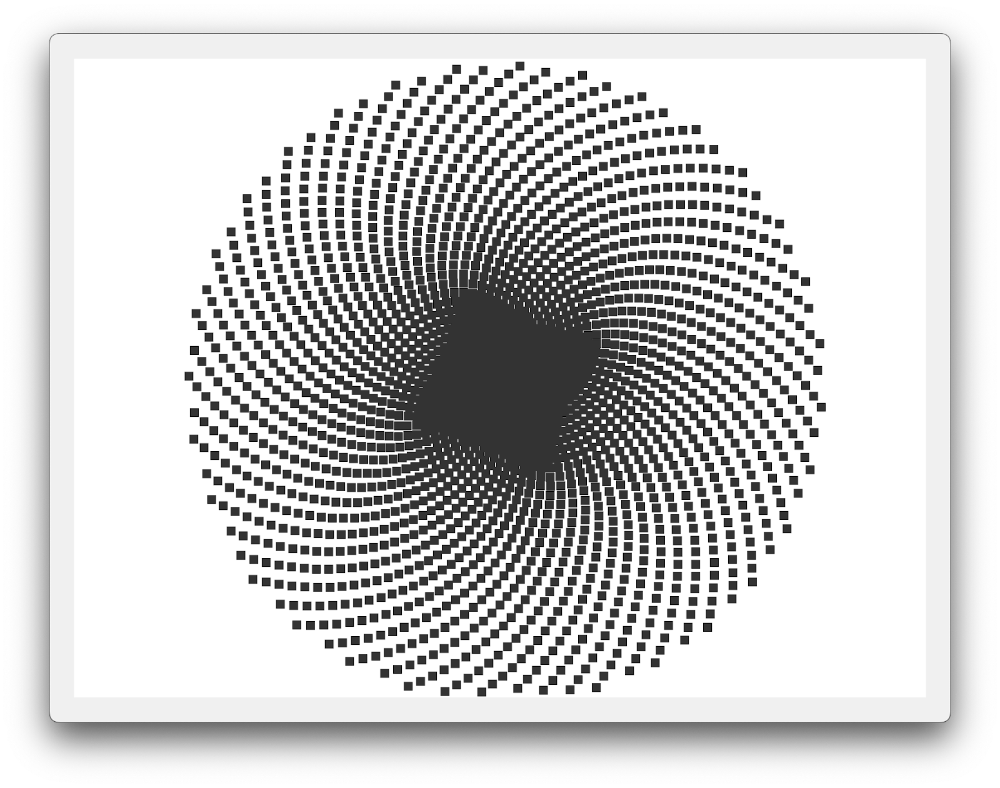
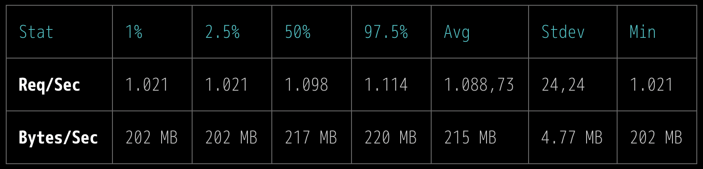
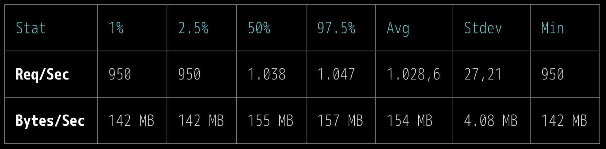
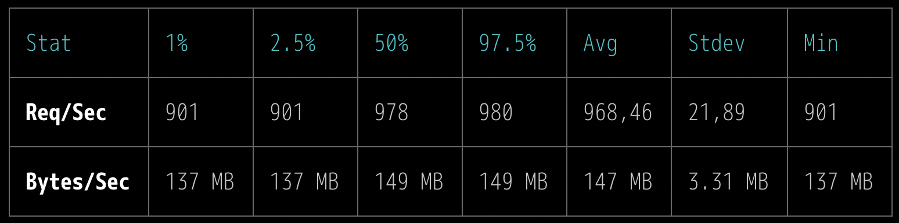
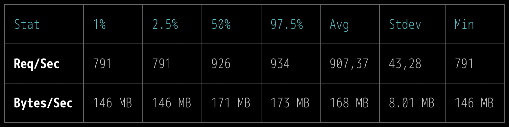
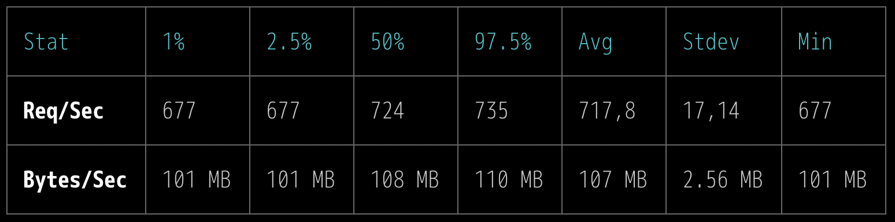
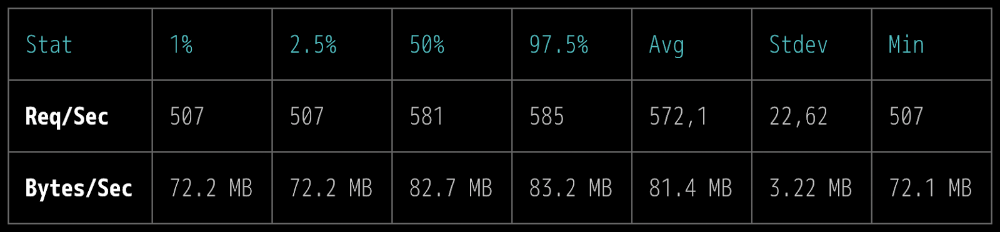

> 원문 : [An SSR Performance Showdown](https://blog.platformatic.dev/ssr-performance-showdown)

> 💡 **노트**: 첫 번째 버전의 벤치마크에서 몇 가지 실수가 있었으며, 이는 [Theo Browne의 이 트윗](https://x.com/t3dotgg/status/1828641333894095358)에 요약되어 있습니다. 먼저 이러한 오류에 대해 사과드리며, [Rich Harris](https://github.com/Rich-Harris), [Ryan Carniato](https://github.com/ryansolid), [Dan Abramov](https://github.com/gaearon), [Balázs Németh](https://github.com/zsilbi), [Dominic Gannaway](https://x.com/trueadm)의 수정에 대해 진심으로 감사의 말씀을 전합니다. 또한 Preact 버전에 기여해주신 [Jovi De Croock](https://github.com/JoviDeCroock)에게도 감사를 표합니다.

서버 사이드 렌더링(SSR)은 Node.js로 고성능 웹 애플리케이션을 구축할 때 종종 간과되는 측면입니다.

컨설팅을 하면서 Node.js 성능 문제를 디버깅하는 데 중점을 두는 경우가 많았습니다. 이러한 상황에서 문제의 원인은 거의 항상 SSR이었습니다. SSR은 CPU에 큰 부담을 주는 작업으로, Node.js의 이벤트 루프를 차단하는 주요 원인이 될 수 있습니다. 따라서 프런트엔드 스택을 선택할 때 이 점을 반드시 고려해야 합니다.

저희는 오늘날 가장 인기 있는 라이브러리에서 SSR 성능이 어떤 상태인지 알아보기로 했습니다. 특히 Fastify와 깔끔하게 통합할 수 있는 라이브러리를 집중적으로 살펴보았습니다.

이를 위해 많은 요소를 포함한 복잡한 샘플 문서를 생성하여 테스트 페이지를 매우 크게 만들고, 각 라이브러리의 성능을 정확하게 측정할 수 있는 충분한 실행 시간을 확보해야 했습니다.

그래서 LLM에게 10x10px 타일로 된 div를 사용하여 컨테이너에 나선형을 그리는 코드를 작성해 달라고 요청했습니다.

```js
<script>
const wrapper = document.getElementById('wrapper')
const width = 960
const height = 720
const cellSize = 5

function drawSpiral() {
  let centerX = width / 2
  let centerY = height / 2
  let angle = 0
  let radius = 0
  const step = cellSize

  while (radius < Math.min(width, height) / 2) {
    let x = centerX + Math.cos(angle) * radius
    let y = centerY + Math.sin(angle) * radius

    if (x >= 0 && x <= width - cellSize && y >= 0 && y <= height - cellSize)
    {
      const tile = document.createElement('div')
      tile.className = 'tile'
      tile.style.left = `${x}px`
      tile.style.top = `${y}px`
      wrapper.appendChild(tile)
    }

    angle += 0.2
    radius += step * 0.015
  }
}
drawSpiral()
</script>
```

이후, 테스트하려는 모든 라이브러리를 사용한 버전을 생성하도록 요청했으며, 원래 예제의 DOM 메서드에 의존하지 않고 각 라이브러리의 렌더링 엔진을 사용하도록 구현을 수정했습니다.

다음은 **2398**개의 `<div>` 요소를 포함한 샘플 문서의 모습입니다.



[Fastify의 Vite 통합 설정](https://github.com/fastify/fastify-vite)은 다양한 프레임워크의 SSR 성능을 조사하기 위한 완벽한 테스트 환경을 제공합니다.

이 글에서는 SSR을 수행하는 데 필요한 최소한의 보일러 플레이트를 살펴보고 5가지 주요 프런트엔드 라이브러리의([React](https://react.dev/), [Vue](https://vuejs.org/), [Solid](https://www.solidjs.com/), [Svelte](https://svelte.dev/), [Preact](https://preactjs.com/)) 성능을 비교해 보았습니다. 또한 더 간단한 대안으로 [fastify-html](https://github.com/mcollina/fastify-html)([ghtml](https://github.com/gurgunday/ghtml)을 Fastify로 랩핑한 버전) 및 [@fastify/view](https://www.npmjs.com/package/@fastify/view)를 통한 [ejs](https://npmjs.com/package/ejs)도 살펴봤습니다.

우리는 [Next.js](http://next.js/), [Astro](https://astro.build/), [Qwik](https://qwik.dev/) 와 같은 도구들, 그리고 다른 완전한 프레임워크들을 고려하지 않기로 했습니다. 그 이유는 이들이 독립적인 렌더링 메서드를 제공하지 않기 때문입니다.

[@fastify/vite](https://fastify-vite.dev/) 기반 테스트의 경우 다음과 같은 보일러 플레이트를 사용했습니다.

```ts
import Fastify from 'fastify';
import FastifyVite from '@fastify/vite';

const server = Fastify();
await server.register(FastifyVite /* options */);

await server.vite.ready();
await server.listen({ port: 3000 });
```

모든 테스트는 프로덕션 빌드, 즉 `vite build`를 실행한 후에 실행되었습니다.

예외가 있다면 Vite가 필요하지 않은 **fastify-html** 및 **ejs** 테스트입니다.

모든 예제가 포함된 [저장소](https://github.com/platformatic/ssr-performance-showdown)를 확인하세요.

## 일관성 보장

모든 예시가 동일한 특성을 공유하도록 했습니다.

- 클라이언트 측 반응성 기능을 사용하지 않습니다.

- React 및 Solid의 경우처럼 해당 프레임워크에 부적절한 경우를 제외하고 모든 스타일 바인딩은 템플릿 리터럴을 사용하여 수행됩니다.

- `x` 및 `y` 값은 `toFixed(2)`로 만들어집니다.

- `<style>` 태그는 document 셀에만 존재합니다.

테스트는 2020년형 맥북 에어 M1, 8GB RAM, 맥OS 벤츄라에서의 노드 v22에서 실행되었습니다.

## fastify-html

이상값(outlier)부터 시작하겠습니다. [ghtml](https://github.com/gurgunday/ghtml)를 래핑하는 Fastify 플러그인 [fastify-html](https://github.com/mcollina/fastify-html)는 초당 1088개의 요청을 전달합니다. 앞서 언급했듯이 이 설정은 특별한 구문이나 변환이 필요하지 않으므로 Vite가 필요하지 않다는 점에서 다른 모든 설정과 다릅니다.



fastify-html이 이 테스트에 기준점으로 추가되었습니다. 이 라이브러리는 다른 라이브러리의 고급 기능이 없는 단순한 HTML 템플릿 라이브러리의 래퍼에 불과하기 때문에 다른 모든 라이브러리와 제대로 비교하기는 어렵습니다. 더 단순하기 때문에 이미 더 나은 성능을 발휘할 것으로 예상했고, 그저 다른 모든 기능을 갖춘 라이브러리들이 얼마나 뒤처지는지를 알아보고 싶었습니다.

사용된 보일러 플레이트는 아래에서 확인할 수 있습니다. document 셸을 렌더링하는 레이아웃 함수를 등록하는 데 `createHtmlFunction`(@fastify/vite 모방)가 사용되는 것을 주목하세요.

```ts
import Fastify from 'fastify';
import fastifyHtml from 'fastify-html';
import { createHtmlFunction } from './client/index.js';

const server = Fastify();
await server.register(fastifyHtml);

server.addLayout(createHtmlFunction(server));
```

참고로, 구식 [EJS](https://npmjs.com/package/ejs)([@fastify/view](https://www.npmjs.com/package/@fastify/view) 기반)를 사용한 테스트도 추가했습니다. **초당 443개의 요청을 처리할 수 있었습니다.**

## Vue

2위를 차지한 Vue는 **초당 1028건의 요청을 처리하며**, 뛰어난 SSR 성능과 완전한 라이브러리 생태계를 원하는 경우 최고의 선택일 것입니다.



동기식 서버 사이드 렌더링을 위해 사용된 Vue API는 [`renderToString()`](https://vuejs.org/api/ssr#rendertostring)입니다.

```ts
import { renderToString } from 'vue/server-renderer';

// ...

await server.register(FastifyVite, {
  async createRenderFunction({ createApp }) {
    return async () => ({
      element: await renderToString(createApp()),
    });
  },
});
```

## Svelte

3위는 **Svelte 5**(아직 출시 전)로, **초당 968건의 요청을 처리하여** 매우 인상적인 성능을 보여주었습니다. 특히 풍부한 기능을 고려했을 때 더욱 놀라운 결과입니다.

Svelte는 자체적인 non-JSX [templating 구문](https://svelte.dev/docs/logic-blocks)이 있으며 엔진이 매우 효율적이어서 성숙한 라이브러리 에코시스템을 갖춘 프레임워크가 필요하고 SSR 성능 저하를 원하지 않는 경우 탁월한 선택이 될 수 있습니다.



서버 사이드 렌더링을 위해 사용된 Svelte API는 Svelte 5의 [`render()`](https://svelte-5-preview.vercel.app/docs/imports#svelte-server-render)입니다.

```ts
await server.register(FastifyVite, {
  root: import.meta.url,
  createRenderFunction({ Page }) {
    return () => {
      const { body: element } = render(Page);
      return { element };
    };
  },
});
```

`render()` 함수는 head 및 body의 속성도 반환합니다.

## Solid

4위는 **초당 907건의 요청을 처리하는** [SolidJS](https://www.solidjs.com/)가 차지했습니다. Svelte보다 매우 근소한 차이로 뒤처집니다. Solid는 [React의 매우 유망한 대안이지만, 아직 생태계가 성숙하지 않은 상태입니다.](https://www.youtube.com/watch?v=hw3Bx5vxKl0)

우리가 주목한 한 가지는 SolidJS가 실제로 수화(Hydration) 과정의 일부로 ID를 사용하는 데 어려움을 겪고 있다는 것입니다. Vue와 Solid 각각에서 생성된 마크업을 비교해 보세요.

```
<div class="tile" style="left: 196.42px; top: 581.77px">
<div data-hk=1c2397 class="tile" style="left: 196.42px; top: 581.77px">
```

이는 성능 저하의 상당 부분이 유선으로 전송해야 하는 이 추가 조각에서 발생한다는 것을 의미합니다. 하지만 저희는 수화 등의 클라이언트 기능을 활성화한 정상적인 실제 상황에서 프레임워크가 어떻게 작동하는지 정확히 검증하고 싶었습니다.



보일러 플레이트의 경우, @fastify/vite의 `createRenderFunction` 훅을 사용하여 Solid 컴포넌트 함수(`createApp`)를 캡처했습니다.

```ts
import { renderToString } from 'solid-js/web';

// ...

await server.register(FastifyVite, {
  root: import.meta.url,
  createRenderFunction({ createApp }) {
    return () => {
      return {
        element: await renderToString(createApp),
      };
    };
  },
});
```

## Preact

React의 인기 동생으로 5위를 차지한 Preact는 **초당 717건의 요청을 처리합니다.** Preact는 React와 매우 유사하지만, 더 빠르고 가볍게 만드는 [많은 차이점](https://preactjs.com/guide/v10/differences-to-react/)이 있습니다.



동기식 서버 사이드 렌더링에 사용되는 Preact API는 [`renderToString()`](https://www.npmjs.com/package/preact-render-to-string)입니다.

```ts
import { renderToString } from 'preact-render-to-string';

// ...

await server.register(FastifyVite, {
  root: import.meta.url,
  createRenderFunction({ createApp }) {
    return () => {
      return {
        element: renderToString(createApp()),
      };
    };
  },
});
```

## React

React 19 RC는 초당 572건의 요청을 처리하며 6위를 차지했습니다.



동기식 서버 사이드 렌더링에 사용되는 React API는 [`renderToString()`](https://react.dev/reference/react-dom/server/renderToString)입니다.

```ts
import { renderToString } from 'react-dom/server';

// ...

await server.register(FastifyVite, {
  root: import.meta.url,
  createRenderFunction({ createApp }) {
    return () => {
      return {
        element: renderToString(createApp()),
      };
    };
  },
});
```

## 마무리


💡 그렇다면 이 결과는 무엇을 의미할까요?

맨 위에는 fastify-html과 Vue가 있고 그 뒤를 Svelte와 Solid가 바짝 뒤쫓고 있습니다. 아마도 Vue와 Svelte가 SSR 성능과 생태계 성숙도 사이에서 가장 좋은 절충안을 제시할 것입니다.

앞서 언급했듯이, 본격적인 프런트엔드 프레임워크를 없애고 최소한의 템플릿을 고수함으로써 성능에서 어떤 이점을 얻을 수 있는지 보여주기 위해 fastify-html 테스트가 기준선으로 추가되었습니다.

> 🚀 한국어로 된 프런트엔드 아티클을 빠르게 받아보고 싶다면 [Korean FE Article](https://kofearticle.substack.com/)을 구독해주세요!
