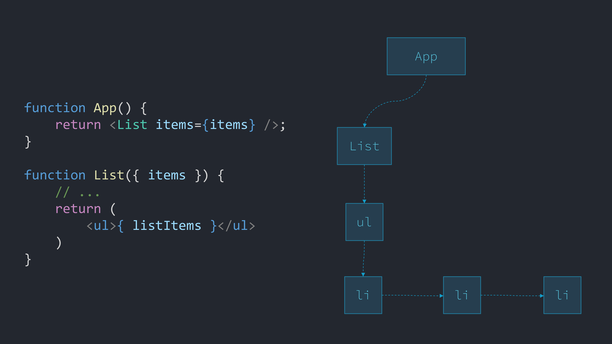
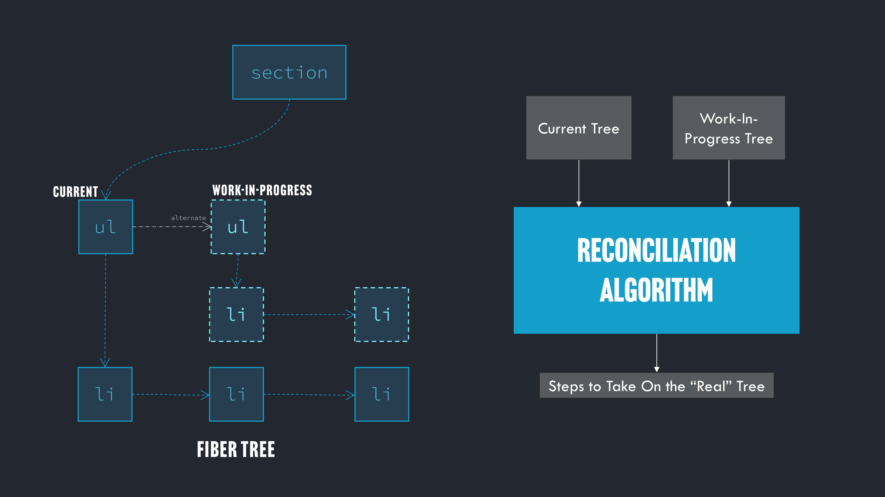

> 원문: [Understanding React Compiler](https://tonyalicea.dev/blog/understanding-react-compiler/)

리액트의 핵심 아키텍처는 사용자가 제공한 함수(즉, 컴포넌트)를 반복해서 호출합니다. 이 사실은 멘탈 모델을 단순화하여 인기를 얻었지만 성능 문제가 발생할 수 있는 지점을 만들기도 했습니다. 일반적으로 함수가 비용이 큰 작업을 수행하면 앱이 느려집니다.

따라서 개발자는 어떤 함수를 언제 다시 실행해야 하는지 수동으로 리액트에 알려줘야 했기 때문에 성능 튜닝은 골칫거리가 되었습니다. 리액트 팀은 이제 리액트 컴파일러라는 도구로 개발자들의 코드를 다시 작성하여 개발자가 수작업으로 해오던 성능 튜닝을 자동화했습니다.

리액트 컴파일러는 코드에 무엇을 한 걸까요? 내부적으로 어떻게 작동할까요? 꼭 사용해야 할까요? 자세히 알아봅시다.

> 리액트의 내부를 자세히 살펴봄으로써 리액트에 대한 완전하고 정확한 멘탈 모델을 얻으려면 리액트의 소스 코드를 파헤치는 저의 새로운 강의 [Understanding React](https://dontimitateunderstand.com/p/understanding-react)를 확인해 보세요. 저는 리액트의 내부를 깊이 이해하는 것은 수년간의 리액트 경험이 있는 개발자에게도 큰 도움이 된다는 것을 알게 되었습니다.

## 컴파일러, 트랜스파일러 및 옵티마이저

컴파일러, 트랜스파일러, 옵티마이저라는 용어는 현대 자바스크립트 생태계에서 자주 쓰이는 용어입니다. 이 용어들은 무엇일까요?

### 트랜스파일

트랜스파일러는 코드를 분석하여 기능적으로 동등한 코드를 다른 프로그래밍 언어로 출력하거나 동일한 프로그래밍 언어로 조정된 버전의 코드를 출력하는 프로그램입니다.

리액트 개발자들은 수년간 트랜스파일러를 사용하여 JSX를 자바스크립트 엔진이 실제로 실행하는 코드로 변환해왔습니다. JSX는 본질적으로 중첩된 함수 호출의 트리(이는 다시 중첩된 객체의 트리를 구축함)를 만들기 위한 축약형 표현입니다.

중첩된 함수 호출을 작성하는 것은 번거롭고 오류가 발생하기 쉬우므로 JSX를 사용하면 개발자의 작업이 더 쉬워지며, JSX를 분석하고 해당 함수 호출로 변환하려면 트랜스파일러가 필요합니다.

예를 들어 JSX를 사용하여 다음 리액트 코드를 작성했다고 해봅시다.

> 이 블로그 게시물의 모든 코드는 읽기 쉽도록 의도적으로 과하게 단순화되었습니다.

```tsx
function App() {
  return <Item item={item} />;
}

function Item({ item }) {
  return (
    <ul>
      <li>{item.desc}</li>
    </ul>
  );
}
```

트랜스파일 후에는 이렇게 됩니다.

```tsx
function App() {
  return _jsx(Item, {
    item: item,
  });
}

function Item({ item }) {
  return _jsx('ul', {
    children: _jsx('li', {
      children: item.desc,
    }),
  });
}
```

이게 실제로 브라우저에 전송되는 코드입니다. HTML과 같은 구문이 아니라 리액트가 'props'라고 부르는 일반 자바스크립트 객체를 전달하는 중첩된 함수 호출입니다.

> 트랜스파일 결과는 JSX 내에서 if 문을 쉽게 사용할 수 없는 이유를 보여줍니다. 함수 호출 내부에서는 if 문을 사용할 수 없습니다.

[바벨](https://babeljs.io/repl)을 사용하여 JSX의 트랜스파일 결과물을 빠르게 생성하고 검사할 수 있습니다.

### 컴파일 및 최적화

그렇다면 트랜스파일러와 컴파일러의 차이점은 무엇일까요? 그것은 누구에게 물어보느냐에 따라, 그리고 그들의 교육과 경험에 따라 다릅니다. 컴퓨터 공학을 전공했다면 주로 당신이 작성한 코드를 기계어(프로세서가 실제로 이해하는 바이너리 코드)로 변환하는 프로그램으로서 컴파일러를 접해 보셨을 것입니다.

그러나 "트랜스파일러"는 "소스 간 컴파일러"라고도 합니다. 옵티마이저는 "최적화 컴파일러"라고도 합니다. 트랜스파일러와 옵티마이저는 컴파일러의 한 종류입니다!

이름을 짓는 것은 어렵기 때문에 트랜스파일러, 컴파일러 또는 옵티마이저를 구성하는 것이 무엇인지에 대해 의견이 분분할 수 있습니다. 중요한 것은 트랜스파일러, 컴파일러, 옵티마이저는 코드가 포함된 텍스트 파일을 가져와서 분석하고 기능적으로 동일하지만 다른 코드의 새 텍스트 파일을 생성하는 프로그램이라는 점입니다. 이러한 프로그램은 코드를 개선하거나 다른 사람의 코드를 호출하여 코드의 일부를 래핑함으로써 이전에는 없었던 기능을 추가할 수 있습니다.

> **컴파일러, 트랜스파일러, 옵티마이저는 코드가 포함된 텍스트 파일을 가져와서 분석하고 기능적으로는 동일하지만 다른 코드를 생성하는 프로그램입니다.**

마지막 부분이 리액트 컴파일러가 하는 일입니다. 컴파일러는 사용자가 작성한 것과 기능적으로 동일한 코드를 생성하지만, 그 코드의 일부를 리액트 개발자가 작성한 코드에 대한 호출로 감싸줍니다. 이렇게 하면 작성자가 의도한 것에 더해서 더 많은 것도 수행하는 것으로 코드가 재작성됩니다. "더 많은 것"이 정확히 무엇인지 잠시 후에 살펴보겠습니다.

### 추상 구문 트리(Abstract Syntax Trees, AST)

코드가 "분석" 되었다는 말은 코드의 텍스트가 문자 단위로 구문 분석되고, 이를 기반으로 코드를 조정하거나, 다시 작성하거나, 기능을 추가하는 등의 작업을 수행하는 알고리즘이 실행된다는 것을 의미합니다. 이 구문 분석 과정은 일반적으로 추상 구문 트리라고 불리는 결과를 낳습니다.

멋지게 들리지만 실제로는 코드를 표현하는 데이터 트리에 불과합니다. 작성한 코드보다 트리를 분석하는 것이 더 쉽습니다.

예를 들어 코드에 다음과 같은 줄이 있다고 가정해 보겠습니다.

```tsx
const item = { id: 0, desc: 'Hi' };
```

해당 코드 줄의 추상 구문 트리는 다음과 같이 보일 수 있습니다.

```tsx
{
    type: VariableDeclarator,
    id: {
        type: Identifier,
        name: Item
    },
    init: {
        type: ObjectExpression,
        properties: [
            {
                type: ObjectProperty,
                key: id,
                value: 0
            },
            {
                type: ObjectProperty,
                key: desc,
                value: 'Hi'
            }
        ]
    }
}
```

생성된 데이터 구조는 당신이 작성한 코드를 설명하며, 이를 작게 정의된 조각들로 나눕니다. 각 조각은 그것이 어떤 유형인지에 대한 정보와 조각에 연관된 값들을 포함합니다. 예를 들어 `desc: 'Hi'` 는 'desc'라는 `key`와 'Hi'라는 `value`를 가진 `ObjectProperty`입니다.

이것은 트랜스파일러나 컴파일러 등에서 당신의 코드가 어떻게 처리되는지 상상할 때 가져야 할 멘탈 모델입니다. 사람들이 당신의 코드(텍스트 자체)를 받아들이고, 그것을 데이터 구조로 변환한 다음 분석과 작업을 수행하는 프로그램을 작성한 것입니다.

생성되는 코드는 궁극적으로 이 AST와 다른 중간 언어에서 비롯됩니다. 이 데이터 구조를 반복하면서 텍스트를 출력(같은 언어 또는 다른 언어로 된 새 코드 또는 어떤 방식으로든 조정된)하는 것을 상상할 수 있습니다.

리액트 컴파일러의 경우 AST와 중간 언어를 모두 사용하여 작성한 코드로부터 새로운 리액트 코드를 생성합니다. 리액트 컴파일러도 리액트 자체와 마찬가지로 *다른 사람의 코드*에 불과하다는 점을 기억하는 것이 중요합니다.

컴파일러, 트랜스파일러, 옵티마이저 등 이러한 도구를 신비한 블랙박스라고 생각하지 마세요. 대신 시간만 있다면 여러분이 직접 만들 수 있는 것들로 생각하세요.

## 리액트의 핵심 아키텍처

리액트 컴파일러 자체로 넘어가기 전에 몇 가지 개념을 더 명확히 해야 합니다.

리액트의 핵심 아키텍처가 인기를 끌게 한 이유이기도 하지만, 잠재적인 성능 문제의 원인이 될 수도 있다고 말씀드린 것을 기억하시나요? JSX를 작성할 때 실제로는 중첩된 함수 호출을 작성하고 있다는 것을 살펴보았습니다. 그러나 여러분은 그 함수를 리액트에 넘겨주고, 리액트가 언제 호출할지 결정합니다.

큰 리스트를 처리하기 위한 리액트 앱의 시작점을 살펴봅시다. `App` 함수가 몇 가지 항목을 가져오고 `List` 함수가 이를 처리하여 보여준다고 가정해 봅시다.

```tsx
function App() {
  // TODO: items를 여기서 패칭합니다
  return <List items={items} />;
}

function List({ items }) {
  const pItems = processItems(items);
  const listItems = pItems.map((item) => <li>{item}</li>);
  return <ul>{listItems}</ul>;
}
```

우리의 함수는 자식을 포함하는 `ul` 객체(여기서는 여러 개의 `li` 객체가 될 것입니다)와 같은 일반 자바스크립트 객체를 반환합니다. `ul`과 `li`와 같은 객체 중 일부는 리액트에 내장되어 있습니다. 다른 객체들은 `List`와 같이 우리가 생성하는 객체들입니다.

궁극적으로 리액트는 이러한 모든 객체에서 파이버(Fiber) 트리라고 불리는 트리를 만듭니다. 트리의 각 노드를 파이버 또는 파이버 노드라고 합니다. UI를 표현하기 위해 노드로 구성된 자체 자바스크립트 객체 트리를 만드는 것을 "가상 DOM 만들기"라고 합니다.



리액트는 실제로 트리의 각 노드에서 두 개의 분기를 유지합니다. 하나의 분기는 트리의 해당 분기의 "현재(current)" 상태를 나타내며 DOM과 일치합니다. 다른 하나는 트리의 해당 분기의 "작업 진행 중(work-in-progress)" 상태를 나타내는데, 이는 함수가 다시 실행될 때 반환된 트리와 일치합니다.



그런 다음 리액트는 두 트리를 비교하여 실제 DOM에 어떤 변경이 필요한지 결정하고 DOM이 작업 진행 중 상태의 트리와 일치되게 만듭니다. 이 과정을 "재조정(reconciliation)"이라고 합니다.

따라서 앱에 추가하는 다른 기능에 따라, 리액트는 UI를 업데이트해야 한다고 생각할 때마다 `List` 함수를 반복해서 호출할 수 있습니다. 이것은 우리의 멘탈 모델을 상당히 간단하게 만듭니다. UI를 업데이트해야 할 때마다(예를 들어 버튼 클릭과 같은 사용자 동작에 대한 응답으로) UI를 정의하는 함수가 다시 호출되고, 리액트는 실제 DOM을 우리의 함수가 말하는 UI 모습과 일치시키기 위해 어떻게 업데이트할지 결정합니다.

하지만 `processItems` 함수가 느리면 `List`에 대한 모든 호출이 느려지고, 앱 전체가 느려질 것입니다!

## 메모이제이션

프로그래밍에서 비용이 큰 함수의 반복 호출을 처리하기 위한 해결책은 함수의 출력을 캐싱하는 것입니다. 이 과정을 메모이제이션이라고 합니다.

메모이제이션이 작동하려면 함수가 "순수"해야 합니다. 즉, 함수에 동일한 입력을 전달하면 _항상_ 동일한 출력을 얻을 수 있어야 합니다. 이 조건이 성립하면 출력값을 입력값의 묶음과 관련된 것으로 저장할 수 있습니다.

다음에 비용이 큰 함수를 호출할 때 입력값을 살펴보고 캐시를 확인하여 해당 입력값으로 함수를 이미 실행했었는지 확인한 다음, 실행했었다면 함수를 다시 호출하지 않고 캐시에서 저장된 출력값을 가져오는 코드를 작성할 수 있습니다. 마지막으로 해당 입력값을 사용했을 때와 출력값이 동일하다는 것을 알기 때문에 함수를 다시 호출할 필요가 없습니다.

이전에 사용한 `processItems` 함수가 메모이제이션되게 구현한 경우 다음과 같이 보일 수 있습니다.

```tsx
function processItems(items) {
  const memOutput = getItemsOutput(items);
  if (memOutput) {
    return memOutput;
  } else {
    // ...비용이 큰 처리를 실행합니다
    saveItemsOutput(items, output);
    return output;
  }
}
```

`saveItemsOutput` 함수가 `items`와 함수의 연관된 출력을 모두 저장하는 객체를 저장한다고 상상할 수 있습니다. `getItemsOutput` 함수는 `items`가 이미 저장되어 있는지 확인하고, 만약 저장되어 있다면 더 이상 작업을 하지 않고 관련해서 캐싱된 출력값을 반환합니다.

함수를 반복해서 호출하는 리액트의 아키텍처에서 메모이제이션은 앱이 느려지는 것을 방지하는 중요한 기술입니다.

## 훅 저장소

리액트 컴파일러를 이해하기 위해 먼저 이해해야 할 리액트 아키텍처가 하나 더 있습니다.

리액트는 앱의 "상태(state)"가 변경되면 함수를 다시 호출할 것입니다. 이는 UI 생성이 의존하는 데이터가 변경되는 것을 의미합니다. 예를 들어, "showButton"이라는 데이터가 true 또는 false일 수 있으며, 이 데이터 값에 따라 UI에서 버튼을 표시하거나 숨겨야 합니다.

리액트는 클라이언트 디바이스에 상태를 저장합니다. 어떻게 저장할까요? `items` 목록을 렌더링하고 상호 작용하는 리액트 앱을 예로 들어보겠습니다. 선택한 `item`을 저장하고, 렌더링을 위해 클라이언트 측에서 `items`를 처리하고, 이벤트를 처리하며, 목록을 정렬한다고 가정해 보겠습니다. 앱은 아래와 같이 보일 것입니다.

```tsx
function App() {
  // TODO: items 데이터를 가져옵니다.
  return <List items={items} />;
}

function List({ items }) {
  const [selItem, setSelItem] = useState(null);
  const [itemEvent, dispatcher] = useReducer(reducer, {});
  const [sort, setSort] = useState(0);

  const pItems = processItems(items);
  const listItems = pItems.map((item) => <li>{item}</li>);
  return <ul>{listItems}</ul>;
}
```

자바스크립트 엔진에서 `useState` 및 `useReducer` 행이 실행될 때 실제로 어떤 일이 벌어질까요? `List` 컴포넌트에서 생성된 파이버 트리의 노드에는 데이터를 저장하기 위해 몇 가지 자바스크립트 객체가 더 첨부되어 있습니다. 이러한 각 객체는 연결 리스트(linked list)라는 데이터 구조로 서로 연결되어 있습니다.

> 그런데 많은 개발자들이 리액트에서 상태 관리의 핵심 단위가 `useState`라고 생각합니다. 하지만 그렇지 않습니다! `useState`는 `useReducer`를 간단히 호출하기 위한 래퍼일 뿐입니다.

<!-- 링크 수정 -->
<iframe src="https://tonyalicea.dev/assets/blogvideos/ReactCompiler_Hooks.mp4" width="600" height="400"></iframe>

따라서 `useState`와 `useReducer`를 호출하면 리액트는 앱이 실행되는 동안 유지되는 파이버 트리에 상태를 첨부합니다. 그러므로 함수가 계속 다시 실행되더라도 상태는 계속 유지됩니다.

> 훅이 저장되는 방식은 반복 또는 조건문 안에서 훅을 호출할 수 없다는 "훅의 규칙"에 대해서도 설명합니다. 훅을 호출할 때마다 리액트는 연결 리스트의 다음 항목으로 이동합니다. 따라서 훅을 호출하는 횟수가 일정해야 하며, 그렇지 않으면 리액트가 연결 리스트에서 잘못된 항목을 바라볼 수 있습니다.

궁극적으로 훅은 사용자의 디바이스 메모리에 데이터(및 함수)를 저장하도록 설계된 객체일 뿐입니다. 이것은 리액트 컴파일러가 실제로 무엇을 하는지 이해하는 데 핵심적입니다. 하지만 살펴볼 것이 더 있습니다.

## 리액트의 메모이제이션

리액트는 메모이제이션이라는 개념과 훅 저장소라는 개념을 결합한 것입니다. 파이버 트리의 일부인 전체 함수(`List`) 또는 그 안에서 호출하는 개별 함수(`processItems`)의 결과를 메모할 수 있습니다.

캐시는 어디에 저장될까요? 상태와 마찬가지로 파이버 트리에 저장됩니다! 예를 들어 `useMemo` 훅은 `useMemo`를 호출하는 노드에 입력과 출력을 저장합니다.

따라서 리액트는 이미 비용이 큰 함수의 결과를 파이버 트리의 일부인 자바스크립트 객체의 연결 리스트에 저장하는 아이디어를 가지고 있습니다. 한 가지, 유지 관리 측면을 제외하고는 훌륭합니다.

메모이제이션이 어떤 입력에 의존하는지 명시적으로 리액트에 알려줘야 하기 때문에 리액트의 메모이제이션은 번거로울 수 있습니다. `processItems`에 대한 호출은 다음과 같습니다.

```tsx
const pItems = useMemo(processItems(items), [items]);
```

끝에 있는 배열은 '종속성' 목록으로, 변경될 경우 함수가 다시 호출되어야 함을 리액트에 알려주는 입력값입니다. 이러한 입력값을 올바르게 입력하지 않으면 제대로 메모이제이션 되지 않습니다. 이는 유지하기 힘든 소모적인 일이 됩니다.

## 리액트 컴파일러

리액트 컴파일러를 살펴봅시다. 리액트 코드의 텍스트를 분석하고 JSX 변환을 위해 준비된 새 코드를 생성하는 프로그램입니다. 하지만 이 새 코드에는 몇 가지 추가 사항이 있습니다.

이 경우 리액트 컴파일러가 앱에 어떤 작업을 수행하는지 살펴보겠습니다. 컴파일 전에는 다음과 같이 생겼습니다.

```tsx
function App() {
  // TODO: 여기서 일부 항목을 패칭합니다
  return <List items={items} />;
}

function List({ items }) {
  const [selItem, setSelItem] = useState(null);
  const [itemEvent, dispatcher] = useReducer(reducer, {});
  const [sort, setSort] = useState(0);

  const pItems = processItems(items);
  const listItems = pItems.map((item) => <li>{item}</li>);
  return <ul>{listItems}</ul>;
}
```

컴파일 후에는 이렇게 됩니다.

```tsx
function App() {
  const $ = _c(1);

  let t0;

  if ($[0] === Symbol.for('react.memo_cache_sentinel')) {
    t0 = <List items={items} />;
    $[0] = t0;
  } else {
    t0 = $[0];
  }

  return t0;
}

function List(t0) {
  const $ = _c(6);

  const { items } = t0;
  useState(null);
  let t1;

  if ($[0] === Symbol.for('react.memo_cache_sentinel')) {
    t1 = {};
    $[0] = t1;
  } else {
    t1 = $[0];
  }

  useReducer(reducer, t1);
  useState(0);
  let t2;

  if ($[1] !== items) {
    const pItems = processItems(items);
    let t3;

    if ($[3] === Symbol.for('react.memo_cache_sentinel')) {
      t3 = (item) => <li>{item}</li>;

      $[3] = t3;
    } else {
      t3 = $[3];
    }

    t2 = pItems.map(t3);
    $[1] = items;
    $[2] = t2;
  } else {
    t2 = $[2];
  }

  const listItems = t2;
  let t3;

  if ($[4] !== listItems) {
    t3 = <ul>{listItems}</ul>;
    $[4] = listItems;
    $[5] = t3;
  } else {
    t3 = $[5];
  }

  return t3;
}
```

정말 많네요! 이제 다시 작성된 `List` 함수를 조금 더 자세히 살펴보고 이해해 보겠습니다.

다음에서 시작해보죠.

```tsx
const $ = _c(6);
```

이 `_c` 함수("캐시"의 "c"를 생각하세요)는 훅을 사용하여 저장되는 배열을 생성합니다. 리액트 컴파일러는 `Link` 함수를 분석한 결과, 성능을 극대화하기 위해 여섯 가지를 저장해야 한다고 결정했습니다. 함수가 처음 호출되면 이 여섯 가지의 결과를 각각 해당 배열에 저장합니다.

캐시가 작동하는 곳은 함수에 대한 후속 호출입니다. 예를 들어, `processItems`를 호출하는 영역을 살펴봅시다.

```tsx
if ($[1] !== items) {
  const pItems = processItems(items);
  let t3;

  if ($[3] === Symbol.for('react.memo_cache_sentinel')) {
    t3 = (item) => <li>{item}</li>;
    $[3] = t3;
  } else {
    t3 = $[3];
  }

  t2 = pItems.map(t3);
  $[1] = items;
  $[2] = t2;
} else {
  t2 = $[2];
}
```

함수를 호출하고 `li`를 생성하는 `processItems`의 전체 작업은 배열의 두 번째 위치(`$[1]`)에 있는 캐시가 마지막으로 함수를 호출했을 때와 동일한 입력( `List`에 전달된 `items` 값)인지 확인하는 검사로 마무리됩니다.

두 값이 같으면 캐시 배열의 세 번째 위치(`$[2]`)가 사용됩니다. 여기에는 `items`가 매핑될 때 생성된 모든 `li` 목록이 저장됩니다. 리액트 컴파일러의 코드는 "이 함수를 마지막으로 호출했을 때와 동일한 `items` 목록을 제공하면 지난번에 캐시에 저장한 `li`목록을 제공합니다"라고 말하는 것과 같습니다.

전달된 `items`가 다른 경우 `processItems`를 호출합니다. 이 경우에도 캐시를 사용하여 _하나의_ item이 어떻게 생겼는지 저장합니다.

```tsx
if ($[3] === Symbol.for('react.memo_cache_sentinel')) {
  t3 = (item) => <li>{item}</li>;
  $[3] = t3;
} else {
  t3 = $[3];
}
```

`t3 =` 줄이 보이시나요? `li`를 반환하는 화살표 함수를 다시 만드는 대신 _함수 자체를_ 캐시 배열의 네 번째 위치(`$[3]`)에 저장합니다. 이렇게 하면 다음에 `List`가 호출될 때 자바스크립트 엔진이 작은 함수를 생성하는 작업을 줄일 수 있습니다. 이 함수는 절대 변경되지 않으므로 초기 if 문은 기본적으로 "캐시 배열의 이 위치가 비어 있으면 캐싱하고, 그렇지 않으면 캐시에서 가져옵니다"라고 말하는 것과 같습니다.

이런 식으로 리액트는 값을 캐싱하고 함수 호출의 결과를 자동으로 메모이제이션합니다. 출력되는 코드는 우리가 작성한 코드와 기능적으로 동일하지만, 값을 캐싱하는 코드가 포함되어 있으므로 리액트에서 함수를 반복해서 호출할 때 성능이 저하되는 것을 방지할 수 있습니다.

하지만 리액트 컴파일러는 개발자가 일반적으로 메모이제이션를 통해 수행하는 것보다 더 세분화된 수준에서 캐싱을 자동으로 수행합니다. 즉, 개발자가 종속성이나 메모이제이션을 수동으로 관리할 필요가 없어집니다. 코드를 작성하기만 하면 리액트 컴파일러가 캐싱을 활용하여 더 빠른 코드를 새로 생성합니다.

한 가지 주목할 점은 리액트 컴파일러가 여전히 JSX를 생성하고 있다는 점입니다. _실제로_ 실행되는 코드는 JSX 트랜스파일링 후의 리액트 컴파일러의 결과물입니다.

실제로 자바스크립트 엔진에서 실행되는 `List` 함수(브라우저 또는 서버로 전송)는 다음과 같습니다.

```tsx
function List(t0) {
  const $ = _c(6);
  const { items } = t0;
  useState(null);
  let t1;
  if ($[0] === Symbol.for('react.memo_cache_sentinel')) {
    t1 = {};
    $[0] = t1;
  } else {
    t1 = $[0];
  }
  useReducer(reducer, t1);
  useState(0);
  let t2;
  if ($[1] !== items) {
    const pItems = processItems(items);
    let t3;
    if ($[3] === Symbol.for('react.memo_cache_sentinel')) {
      t3 = (item) =>
        _jsx('li', {
          children: item,
        });
      $[3] = t3;
    } else {
      t3 = $[3];
    }
    t2 = pItems.map(t3);
    $[1] = items;
    $[2] = t2;
  } else {
    t2 = $[2];
  }
  const listItems = t2;
  let t3;
  if ($[4] !== listItems) {
    t3 = _jsx('ul', {
      children: listItems,
    });
    $[4] = listItems;
    $[5] = t3;
  } else {
    t3 = $[5];
  }
  return t3;
}
```

리액트 컴파일러는 값 캐싱을 위한 배열과 이를 위해 필요한 모든 if 문을 추가했습니다. JSX 트랜스파일러는 JSX를 중첩 함수 호출로 변환했습니다. 여러분이 작성한 코드와 자바스크립트 엔진이 실행하는 코드 사이에는 중요하지 않은 차이가 있습니다. 우리는 다른 사람의 코드가 우리의 원래 의도와 일치하는 것을 만들어낼 것이라고 신뢰하고 있습니다.

## 장치 메모리를 위한 프로세서 주기 트레이딩

메모이제이션 및 캐싱은 일반적으로 처리량을 메모리로 교환하는 것을 의미합니다. 프로세서가 비용이 큰 연산을 실행하는 부담을 줄이는 대신 메모리에 저장할 공간을 사용하는 것입니다.

리액트 컴파일러를 사용하는 경우, 이는 기기의 메모리에 "가능한 한 많이 저장"하라는 의미입니다. 코드가 브라우저의 사용자 기기에서 실행되는 경우, 설계 관점에서 고려해야 합니다.

아마도 이것은 많은 리액트 앱에서 실제 문제가 되지는 않을 것입니다. 하지만 앱에서 많은 양의 데이터를 처리하는 경우, 실험 단계를 벗어나 리액트 컴파일러를 사용하는 경우 기기 메모리 사용량은 최소한 알고 있어야 하며 계속 주시해야 합니다.

## 추상화 및 디버깅

모든 형태의 컴파일은 작성하는 코드와 실제로 실행되는 코드 사이의 추상화 계층에 해당합니다.

앞서 살펴본 것처럼 리액트 컴파일러의 경우 실제로 브라우저로 전송되는 내용을 이해하려면 코드를 가져와서 리액트 컴파일러를 통해 실행한 다음 해당 코드를 가져와서 JSX 트랜스파일러를 통해 실행해야 합니다.

코드에 추상화 계층을 추가하는 데는 단점이 있습니다. 코드를 디버깅하기 더 어렵게 만들 수 있습니다. 그렇다고 해서 사용하지 말아야 한다는 뜻은 아닙니다. 하지만 디버깅해야 하는 코드는 내 코드뿐만 아니라 도구가 생성하는 코드도 포함한다는 점을 명심해야 합니다.

추상화 계층에서 생성된 코드를 디버깅하는 능력에 실질적인 차이를 만드는 것은 추상화에 대한 정확한 멘탈 모델을 갖는 것입니다. 리액트 컴파일러의 작동 방식을 완전히 이해하면 작성된 코드를 디버깅할 수 있게 되어 개발 환경이 개선되고 개발 스트레스를 줄일 수 있습니다.

## 더 자세히 알아보기

이 블로그 게시물이 도움이 되었다면 16.5시간 분량의 [Understanding React](https://understandingreact.com/) 강의에서 리액트의 모든 기능에 대해 자세히 살펴보는 것도 좋을 것입니다. 평생 수강할 수 있고 모든 소스 코드와 수료증을 받을 수 있습니다.

저는 리액트의 모든 소스 코드와 리액트 컴파일러의 모든 소스 코드를 한 줄 한 줄 읽었습니다. 왜 그랬을까요? 리액트를 내부 수준에서, 뒷단에서 설명할 수 있기 위해서였습니다.

리액트 자체는 웹의 기본을 기반으로 한 거대한 추상화 계층입니다. 많은 추상화가 그렇듯이, 리액트를 사용하는 대부분의 개발자는 작동 방식에 대한 부정확한 멘탈 모델을 가지고 있으며, 이는 리액트 기반 애플리케이션을 빌드하고 디버깅하는 방식에 큰 영향을 미칩니다. 하지만 리액트를 깊이 _이해할 수 있습니다_.

이미 등록한 수강생에게는 무료로 리액트 19 기능 및 리액트 컴파일러에 대한 새로운 콘텐츠가 추가됩니다. [강의를 확인하시면](https://understandingreact.com/) 많은 부분을 무료로 시청하실 수 있습니다. 여기 첨부해두겠습니다.

<iframe width="560" height="315" src="https://www.youtube.com/embed/-XKvVyC6si0?si=XFHzcDrleTvB34l-" title="YouTube video player" frameborder="0" allow="accelerometer; autoplay; clipboard-write; encrypted-media; gyroscope; picture-in-picture; web-share" referrerpolicy="strict-origin-when-cross-origin" allowfullscreen></iframe>

다른 사람이 코드를 작성하는 것을 모방하는 것이 아니라 자신이 하고있는 일을 진정으로 이해하는 여정에 동참해 주시길 바랍니다.

-- Tony

> 🚀 한국어로 된 프런트엔드 아티클을 빠르게 받아보고 싶다면 [Korean FE Article](https://kofearticle.substack.com/)을 구독해주세요!
